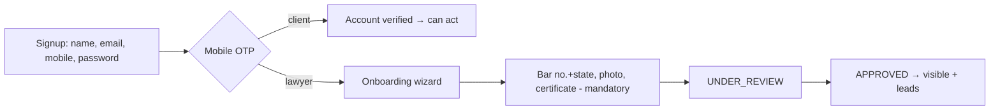

# 02 — Business Rules

Authoritative rules for roles, verification, subscriptions, leads, and documents. These rules are the
contract the backend modules must enforce; controllers and services should treat this document as the
source of truth for behaviour.

## Signup & Onboarding Flow

Two distinct verification gates — never conflate them:

- **Account verified** = mobile OTP passed (`User.mobileVerified = true`). The user can log in and use their dashboard.
- **Professionally verified** = admin approved bar details (`Lawyer.verificationStatus = APPROVED`). Only this gate controls public search visibility and lead routing.

### Rules

1. **Mobile OTP is mandatory at signup for both roles** (CLIENT and LAWYER). A 6-digit OTP is sent **WhatsApp-first with SMS fallback** (WhatsApp is far cheaper in India); the user cannot proceed past signup until it is verified. Email verification is **soft/async** (a free verification link) and must not block login or progress.
   - **OTP is used only at signup verification — never on login.** Login is **password-only** for both roles, so there is no per-login SMS/WhatsApp cost (~1 OTP per user lifetime, plus resends). Password reset uses a free email link, not OTP.
2. **Clients are OTP'd, but browsing is never gated.** Public search, profiles, and document browsing stay unauthenticated for SEO. A client only needs a verified account at the point of action — submitting a lead or buying a document.
3. **Lawyer onboarding is a resumable wizard after OTP:**
   - Signup → mobile OTP → account exists with `verificationStatus = PENDING` and trial started.
   - Wizard collects, as **mandatory to submit for review**: full name (as per Bar Council), **Bar Council enrollment number** (text) **+ state**, **profile photo**, and **Bar Council certificate**. There is **no separate ID-card upload** — enrollment is verified against the certificate. Practice area, city, languages, and bio complete the profile.
   - Submit → `UNDER_REVIEW` → admin approves → `APPROVED`.
4. **Mandatory photo/bar enforced at the review gate, not account creation.** A lawyer account exists after OTP even with an incomplete profile (so progress can be saved); `profileImageUrl` stays nullable in the DB but is **required before `APPROVED`** at the app layer. `certificateImageUrl` is required.
5. **Login is never blocked on professional verification.** A PENDING/UNDER_REVIEW lawyer can log in and see a "verification pending" dashboard; they are simply hidden from search and receive no leads until APPROVED.



See [08-lawyer-module.md](./08-lawyer-module.md) for the wizard and [16-security.md](./16-security.md) for OTP hardening.

## User Roles

LawMitran has three roles (`Role` enum: `CLIENT | LAWYER | ADMIN`).

### Client

- Default role on self-registration.
- Can search, view profiles, bookmark lawyers, submit leads, buy/generate documents, rate closed leads.
- Cannot access any lawyer- or admin-only resource.

### Lawyer

- Self-registers as `LAWYER`, then must complete a verification submission before going public.
- Receives leads, manages a public profile, manages subscription, views a lead inbox/dashboard.
- Only **APPROVED** lawyers appear in public search; only **non-EXPIRED** lawyers receive new leads.

### Super Admin

- **Cannot self-register** — `ADMIN` accounts are provisioned internally (registration rejects role `ADMIN`).
- Verifies/suspends lawyers, manages subscription plans and document templates, views reports/analytics.

## Business Rules

### 1. Lawyer Verification

- A lawyer provides their Bar Council enrollment number (text), uploads the Bar Council certificate (required), and completes profile details. No ID-card upload is collected.
- Verification state machine (`VerificationStatus`):

```
PENDING → UNDER_REVIEW → APPROVED
                       → REJECTED
APPROVED/any → SUSPENDED   (admin action, e.g. fraud or complaint)
```

- A lawyer is **publicly visible only when `verificationStatus = APPROVED`**.
- Every review action is recorded in an append-only `Verification` trail (document type, reviewer, comments, timestamp).
- `SUSPENDED` immediately removes the lawyer from search and stops lead routing.

### 2. Subscription Rules

- Subscription state lives on the `Lawyer` (`subscriptionStatus`: `TRIAL | ACTIVE | EXPIRED | CANCELLED`).
- A lawyer must have a **non-EXPIRED** subscription to receive new leads.
- An `EXPIRED` lawyer **stays visible in search** (good for SEO and the lawyer's credibility) but **stops receiving leads** until they renew.
- `CANCELLED` behaves like `EXPIRED` for routing; the record is retained for history.
- Plan pricing is admin-managed via `SubscriptionPlanPrice`.

### 3. Lead Routing

- A lead is created from a client's requirement (practice area + description + location context).
- Eligibility filter for routing: `verificationStatus = APPROVED` **AND** `subscriptionStatus ≠ EXPIRED/CANCELLED` **AND** practice area + location match.
- Premium-plan lawyers are prioritised in routing/ranking (see [15-search-and-matching.md](./15-search-and-matching.md)).
- The lawyer contacts the client off-platform; there is no in-app messaging.

### 4. Lead Expiry

- A `NEW` lead that is not actioned within the SLA window (target: **72 hours**) is flagged stale.
- Stale leads may be re-routed to the next eligible lawyer or surfaced to admin (Phase 2+).
- Lead lifecycle: `NEW → ASSIGNED → CONTACTED → CLOSED` (see [14-lead-management.md](./14-lead-management.md)).

### 5. Document Purchase

- Document templates are browsable publicly; **purchase/generation requires login**.
- Payment is captured (Razorpay) before the final PDF is released for download.
- Purchased documents are stored against the buyer and re-downloadable from their portal.

### 6. Trial Period

- Every new lawyer gets a **30-day free trial** (`subscriptionStatus = TRIAL`, `trialStartDate`/`trialEndDate` set on creation).
- During trial the lawyer has full ACTIVE-equivalent privileges (receives leads once APPROVED).
- On `trialEndDate`, status transitions to `EXPIRED` unless a paid plan is active.

### 7. Premium Listing

- Premium-plan lawyers receive ranking boosts in search and priority in lead routing.
- Premium status is derived from the active plan; it never bypasses the verification gate.

## Rule Enforcement Matrix

| Rule | Enforced in | Guarded by |
|---|---|---|
| No self-registered ADMIN | `auth` service | role check at registration |
| Only APPROVED in search | `lawyers`/`search` query | `verificationStatus` filter |
| EXPIRED excluded from routing | `leads` service | `subscriptionStatus` filter |
| Public browse, gated submit | controllers | `@Public()` vs default `JwtAuthGuard` |
| Trial → Expired on end date | `subscriptions` scheduler | `trialEndDate` check |
| Pay before download | `documents`/`payments` | `PaymentStatus = PAID` check |

---
**Related:** [13-subscription-module.md](./13-subscription-module.md) · [14-lead-management.md](./14-lead-management.md) · [16-security.md](./16-security.md)
