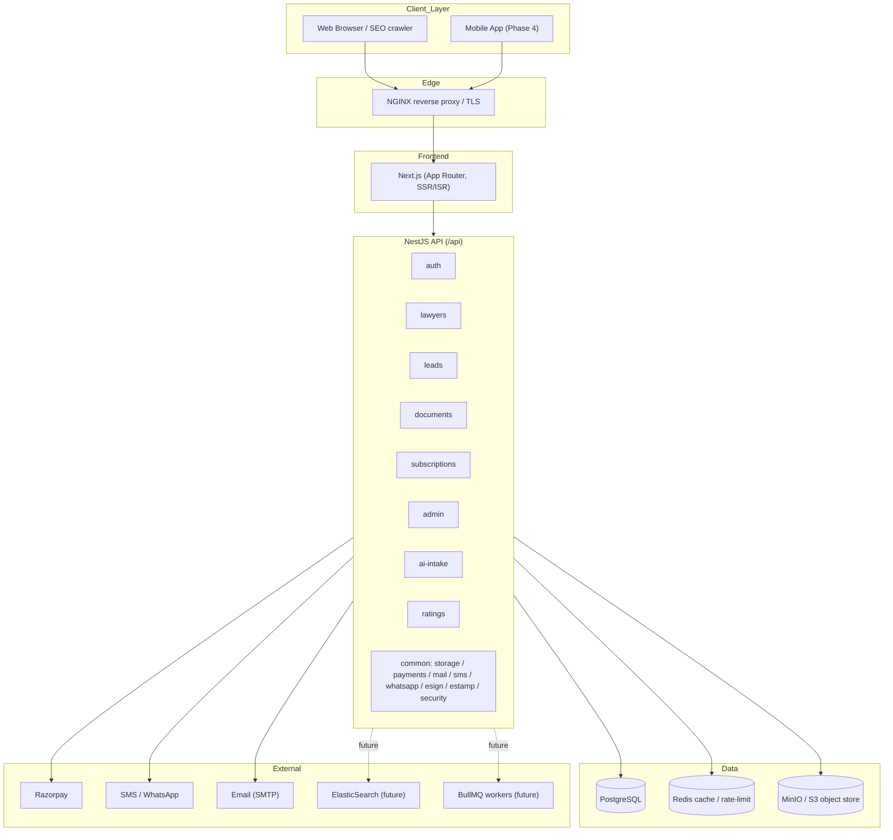
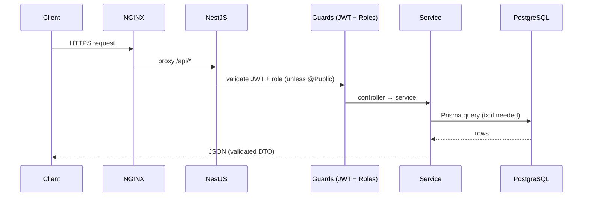

# 03 — System Architecture

## Overview

LawMitran is a **modular monolith**: a single NestJS API organised into feature modules, backed by
PostgreSQL, with object storage, cache, and external service integrations. The frontend is a Next.js
(App Router) application. The whole stack runs under Docker Compose in dev and on AWS in production.

## Architecture Diagram

## Layers

### Frontend — Next.js

- App Router with SSR/ISR for SEO-critical public pages (lawyer profiles, search, document store).
- Client components for authenticated dashboards (lawyer inbox, client portal, admin console).
- Tailwind CSS + shadcn/ui. See [06-frontend-guidelines.md](./06-frontend-guidelines.md).
- Talks to the backend over REST at `/api`.

### Backend — NestJS

- Global prefix `/api`; Swagger UI at `/api/docs`.
- Global `JwtAuthGuard` + `RolesGuard` (every route authenticated unless `@Public()`).
- Global `ValidationPipe({ whitelist: true, transform: true })` — DTOs strip unknown props and coerce types.
- Feature modules under `src/modules`; cross-cutting services under `src/common`.
- See [07-backend-guidelines.md](./07-backend-guidelines.md).

### Database — PostgreSQL (via Prisma)

- Single relational store; Prisma schema is the canonical data model.
- See [04-database-design.md](./04-database-design.md).

### Storage — MinIO / AWS S3

- File uploads (Bar Council certs, profile photos, generated/purchased documents) via `@aws-sdk/client-s3`.
- MinIO in dev (`S3_FORCE_PATH_STYLE=true`), S3 in prod, configured through `S3_*` env vars.

### Cache — Redis

- Response/listing caches, OTP throttling, rate-limit counters, session-adjacent ephemera.

### Future — ElasticSearch & BullMQ

- **ElasticSearch:** full-text + geo + faceted lawyer/document search at scale (replaces SQL search).
- **BullMQ:** async jobs — notifications, lead re-routing, PDF generation, subscription expiry sweeps.

## Cross-cutting Common Services

| Service | Purpose |
|---|---|
| `storage` | S3/MinIO uploads & signed URLs |
| `payments` (`razorpay`) | Order creation, payment capture/verification |
| `mail` | Transactional email (verification, receipts) |
| `sms` | Mobile OTP and lead alerts |
| `whatsapp` | Lead/notification delivery over WhatsApp |
| `esign` / `estamp` | Document e-signing and e-stamping for the marketplace |
| `recaptcha` | Bot protection on public forms |
| `security` | Rate limiting, input sanitisation, security headers |

## Request Lifecycle

## Environments

| Env | Stack | Notes |
|---|---|---|
| Development | Docker Compose (Postgres, Redis, MinIO, backend, frontend, NGINX) | path-style S3, hot reload |
| QA / Staging | AWS, smaller instances | mirrors prod, seeded test data |
| Production | AWS (ECS/EC2 + RDS + S3 + ElastiCache) | autoscaling, monitoring, backups |

See [17-devops.md](./17-devops.md) for pipelines and infrastructure detail.

---
**Related:** [04-database-design.md](./04-database-design.md) · [07-backend-guidelines.md](./07-backend-guidelines.md) · [17-devops.md](./17-devops.md)
