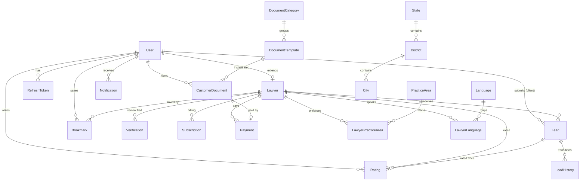

# 04 — Database Design

> **Vision target schema.** This is the intended data model. The current `schema.prisma` implements a
> leaner subset (User, RefreshToken, Lawyer, Verification, Subscription, SubscriptionPlanPrice,
> Payment, Lead, Rating). Normalized location/practice-area/notification/audit tables and the document
> marketplace entities below are the planned target; "Today" notes flag differences.

## Enums

```
Role                 : CLIENT | LAWYER | ADMIN
VerificationStatus   : PENDING | UNDER_REVIEW | APPROVED | REJECTED | SUSPENDED
SubscriptionStatus   : TRIAL | ACTIVE | EXPIRED | CANCELLED
LeadStatus           : NEW | ASSIGNED | CONTACTED | CLOSED
PaymentStatus        : CREATED | PAID | FAILED
DocumentStatus       : DRAFT | GENERATED | PAID | DELIVERED
NotificationChannel  : EMAIL | SMS | WHATSAPP | IN_APP
```

> **Today:** `LeadStatus` is `NEW | CONTACTED | CLOSED` (no `ASSIGNED`); `DocumentStatus` and
> `NotificationChannel` are not yet defined.

## Entity Catalogue

### Identity & Access

#### User
Core account for every persona.

| Field | Type | Notes |
|---|---|---|
| id | uuid | PK |
| email | string | unique |
| mobile | string | unique |
| passwordHash | string | bcrypt/argon2 |
| role | Role | default CLIENT |
| emailVerified | bool | + token + expiry |
| mobileVerified | bool | + OTP code + expiry |
| createdAt / updatedAt | datetime | |

Relations: `Lawyer?` (1:1), `Lead[]` (as client), `RefreshToken[]`, `Rating[]`, `CustomerDocument[]`, `Bookmark[]`, `Notification[]`.

#### RefreshToken
Single-use refresh tokens stored as SHA-256 hashes.

| Field | Type | Notes |
|---|---|---|
| id | uuid | PK |
| userId | uuid | FK → User |
| tokenHash | string | SHA-256 of raw token |
| expiresAt | datetime | |
| revoked | bool | default false |

### Lawyer Domain

#### Lawyer
1:1 extension of a `User` with role LAWYER. Carries verification **and** subscription state.

| Field | Type | Notes |
|---|---|---|
| id | uuid | PK |
| userId | uuid | unique FK → User |
| fullName | string | |
| barCouncilNumber | string | unique |
| barCouncilState | string | |
| practiceAreas | string[] | *Today:* denormalized array → target: `LawyerPracticeArea` |
| experienceYears | int | |
| city | string | *Today:* string → target: `City` FK |
| profileImageUrl | string? | |
| certificateImageUrl | string | required |
| verificationStatus | VerificationStatus | default PENDING; + approvedBy/approvedAt |
| subscriptionStatus | SubscriptionStatus | default TRIAL; + trialStartDate/trialEndDate |

Index: `(city, verificationStatus)`. Relations: `Verification[]`, `Subscription[]`, `Lead[]`, `Rating[]`, `Payment[]`, `LawyerPracticeArea[]`, `LawyerLanguage[]`.

#### Verification
Append-only review trail for submitted documents.

| Field | Type | Notes |
|---|---|---|
| id | uuid | PK |
| lawyerId | uuid | FK → Lawyer |
| documentType | string | e.g. BAR_CERT, ID_CARD |
| documentUrl | string | S3 key |
| status | VerificationStatus | per-document |
| reviewedBy / reviewedAt | | admin reference |
| comments | string? | reviewer notes |

### Subscriptions & Payments

#### Subscription
Billing history per lawyer.

| Field | Type | Notes |
|---|---|---|
| id | uuid | PK |
| lawyerId | uuid | FK → Lawyer |
| planName | string | |
| amount | Decimal(10,2) | |
| startDate / endDate | datetime | |
| status | SubscriptionStatus | |

Index: `(lawyerId, status)`.

#### SubscriptionPlanPrice
Admin-managed price list.

| Field | Type | Notes |
|---|---|---|
| planName | string | PK |
| amount | Decimal(10,2) | |
| updatedAt | datetime | |

#### Payment
Razorpay payment records (subscriptions and documents).

| Field | Type | Notes |
|---|---|---|
| id | uuid | PK |
| lawyerId | uuid | FK → Lawyer |
| planName | string | |
| amount | Decimal(10,2) | |
| durationDays | int | |
| provider | string | default "razorpay" |
| providerOrderId | string | unique |
| providerPaymentId | string? | |
| status | PaymentStatus | default CREATED |

Index: `(lawyerId, status)`.

### Leads & Ratings

#### Lead
Connects a client `User` to a `Lawyer`.

| Field | Type | Notes |
|---|---|---|
| id | uuid | PK |
| clientId | uuid | FK → User |
| lawyerId | uuid | FK → Lawyer |
| practiceArea | string | |
| description | string | |
| status | LeadStatus | default NEW |

Index: `(lawyerId, status)`. Relation: `Rating?`, `LeadHistory[]` (target).

#### LeadHistory *(target)*
Audit of every lead status transition.

| Field | Type | Notes |
|---|---|---|
| id | uuid | PK |
| leadId | uuid | FK → Lead |
| fromStatus / toStatus | LeadStatus | |
| changedBy | uuid | user/admin |
| note | string? | |
| createdAt | datetime | |

#### Rating *(your outline calls this "Review")*
Client rating on a closed lead.

| Field | Type | Notes |
|---|---|---|
| id | uuid | PK |
| leadId | uuid | unique FK → Lead |
| lawyerId | uuid | FK → Lawyer |
| clientId | uuid | FK → User |
| score | int | 1–5 |
| comment | string? | |

Index: `(lawyerId)`.

### Document Marketplace *(target)*

#### DocumentCategory
Rent & Lease, Property, Employment, Business, Consumer, Family, Affidavits, Legal Notices.

| Field | Type | Notes |
|---|---|---|
| id | uuid | PK |
| name | string | |
| slug | string | unique, SEO |
| description | string? | |

#### DocumentTemplate
A purchasable/generatable template.

| Field | Type | Notes |
|---|---|---|
| id | uuid | PK |
| categoryId | uuid | FK → DocumentCategory |
| title | string | |
| price | Decimal(10,2) | |
| schemaJson | json | input fields for generation |
| bodyTemplate | text | placeholder-based body |
| active | bool | |

#### CustomerDocument
An instance generated/purchased by a user.

| Field | Type | Notes |
|---|---|---|
| id | uuid | PK |
| userId | uuid | FK → User |
| templateId | uuid | FK → DocumentTemplate |
| inputJson | json | filled values |
| pdfUrl | string? | S3 key once generated |
| status | DocumentStatus | DRAFT→GENERATED→PAID→DELIVERED |
| paymentId | uuid? | FK → Payment |

### Reference Data *(target — normalization)*

| Entity | Key fields | Purpose |
|---|---|---|
| **PracticeArea** | id, name, slug | canonical practice-area list |
| **LawyerPracticeArea** | lawyerId, practiceAreaId | M:N join (replaces `practiceAreas` array) |
| **State** | id, name, code | Indian states/UTs |
| **District** | id, stateId, name | districts within a state |
| **City** | id, districtId, name | cities (replaces `Lawyer.city` string) |
| **Language** | id, name, code | supported languages |
| **LawyerLanguage** | lawyerId, languageId | languages a lawyer practises in |

### Platform

| Entity | Key fields | Purpose |
|---|---|---|
| **Bookmark** | id, userId, lawyerId | client's saved/favourite lawyers |
| **Notification** | id, userId, channel, type, payloadJson, readAt | multi-channel notifications |
| **AuditLog** | id, actorId, action, entity, entityId, metaJson, createdAt | immutable security/audit trail |

## Complete ER Diagram



## Implementation Spec (AI-ready Prisma)

> This section is the **actionable target schema** for an AI/codegen agent. The blocks below are
> drop-in `schema.prisma` definitions that extend the current schema. Apply them, then run
> `npx prisma migrate dev` and `npx prisma generate`. Field names match the conventions already in the
> repo (uuid PKs, `createdAt`/`updatedAt`, `Decimal(10,2)` for money).

### 1. Enum change — add `ASSIGNED` to `LeadStatus`

```prisma
enum LeadStatus {
  NEW
  ASSIGNED   // routed/assigned to eligible lawyer(s)
  CONTACTED
  CLOSED
}
```

New enums for marketplace + notifications:

```prisma
enum DocumentStatus {
  DRAFT
  GENERATED
  PAID
  DELIVERED
}

enum NotificationChannel {
  EMAIL
  SMS
  WHATSAPP
  IN_APP
}

enum Gender {
  MALE
  FEMALE
  OTHER
}

enum DeliveryType {
  DIGITAL    // PDF download only
  ESTAMP     // PDF on e-stamp paper
  PHYSICAL   // printed + stamped, couriered
}

enum UserStatus {
  ACTIVE
  SUSPENDED
  DELETED    // soft delete — record retained, excluded everywhere
}

enum TemplateStatus {
  DRAFT
  PUBLISHED
  ARCHIVED
}
```

Admin soft-delete & moderation — add to `User`:

```prisma
// ADD to User:
model User {
  // ...existing fields...
  status    UserStatus @default(ACTIVE)
  deletedAt DateTime?
  // index so every public/auth query can filter out non-active users cheaply
  @@index([status])
}
```

> **Never hard-delete a `User`** — it's referenced by `Lead`, `Rating`, `Payment`, `Bookmark`,
> `LeadHistory`. "Delete" sets `status = DELETED` + `deletedAt`; on suspend/delete, revoke the user's
> `RefreshToken`s. All public/auth/search queries filter `status = ACTIVE`.

Document template lifecycle & versioning — add to `DocumentTemplate`:

```prisma
// ADD to DocumentTemplate:
model DocumentTemplate {
  // ...existing fields...
  status  TemplateStatus @default(DRAFT)
  version Int            @default(1)
  // editing a PUBLISHED template creates a new version row; old versions stay
  // so already-purchased CustomerDocuments keep their exact template.
}
```

Search-filter support for the results page (Gender + Courts filters). Add `gender` and a courts
relation to `Lawyer`:

```prisma
model Court {
  id      String        @id @default(uuid())
  name    String        @unique   // e.g. "Supreme Court", "Delhi High Court"
  code    String        @unique   // e.g. "SC", "HC-DEL"
  type    String        // SUPREME | HIGH | DISTRICT | TRIBUNAL | CONSUMER ...
  lawyers LawyerCourt[]
}

model LawyerCourt {
  lawyerId String
  lawyer   Lawyer @relation(fields: [lawyerId], references: [id])
  courtId  String
  court    Court  @relation(fields: [courtId], references: [id])

  @@id([lawyerId, courtId])
  @@index([courtId])
}
```

```prisma
// ADD to Lawyer:
model Lawyer {
  // ...existing fields...
  gender Gender?
  courts LawyerCourt[]
  bio    String?       @db.Text   // "About" section on the public profile page
  // Optional denormalized rating columns for fast sort/filter:
  ratingAvg   Decimal? @db.Decimal(3, 2)
  ratingCount Int      @default(0)
}
```

> `ratingAvg`/`ratingCount` are optional denormalized aggregates of `Rating` to make `ratingMin`
> filtering and `sort=rating` cheap; recompute on each new `Rating`. The `By Activity` sort uses an
> activity/responsiveness signal (Phase 3) and falls back to relevance until available.

### 2. Reference data — normalize location & practice area

```prisma
model State {
  id        String     @id @default(uuid())
  name      String
  code      String     @unique
  districts District[]
  createdAt DateTime   @default(now())
}

model District {
  id      String @id @default(uuid())
  stateId String
  state   State  @relation(fields: [stateId], references: [id])
  name    String
  cities  City[]

  @@unique([stateId, name])
}

model City {
  id         String   @id @default(uuid())
  districtId String
  district   District @relation(fields: [districtId], references: [id])
  name       String
  lawyers    Lawyer[]

  @@unique([districtId, name])
  @@index([name])
}

model PracticeArea {
  id      String                @id @default(uuid())
  name    String                @unique
  slug    String                @unique
  lawyers LawyerPracticeArea[]
}

model LawyerPracticeArea {
  lawyerId       String
  lawyer         Lawyer       @relation(fields: [lawyerId], references: [id])
  practiceAreaId String
  practiceArea   PracticeArea @relation(fields: [practiceAreaId], references: [id])
  proficiency    Int?         // 0–100, drives the strength bar on the profile page
  skills         String[]     // e.g. ["Divorce","Child Custody","Court Marriage"]

  @@id([lawyerId, practiceAreaId])
  @@index([practiceAreaId])
}

model Language {
  id      String           @id @default(uuid())
  name    String           @unique
  code    String           @unique
  lawyers LawyerLanguage[]
}

model LawyerLanguage {
  lawyerId   String
  lawyer     Lawyer   @relation(fields: [lawyerId], references: [id])
  languageId String
  language   Language @relation(fields: [languageId], references: [id])

  @@id([lawyerId, languageId])
}
```

**`Lawyer` model changes** (migrate the denormalized fields):

```prisma
// REMOVE: practiceAreas String[]
// REMOVE: city         String
// ADD:
model Lawyer {
  // ...existing fields...
  cityId        String?
  city          City?                @relation(fields: [cityId], references: [id])
  practiceAreas LawyerPracticeArea[]
  languages     LawyerLanguage[]

  @@index([cityId, verificationStatus]) // replaces @@index([city, verificationStatus])
}
```

> **Migration order:** seed `State/District/City`, `PracticeArea`, `Language` first; backfill each
> lawyer's old `city` string → `cityId` and `practiceAreas[]` → `LawyerPracticeArea` rows; then drop
> the old string columns. Do the backfill in a Prisma migration script before removing columns.

### 3. Lead audit trail

```prisma
model LeadHistory {
  id         String     @id @default(uuid())
  leadId     String
  lead       Lead       @relation(fields: [leadId], references: [id])
  fromStatus LeadStatus?
  toStatus   LeadStatus
  changedBy  String     // userId or adminId
  note       String?
  createdAt  DateTime   @default(now())

  @@index([leadId])
}
```

Add `history LeadHistory[]` to the `Lead` model.

### 4. Document marketplace

```prisma
model DocumentCategory {
  id          String             @id @default(uuid())
  name        String
  slug        String             @unique
  description String?
  templates   DocumentTemplate[]
}

model DocumentTemplate {
  id            String             @id @default(uuid())
  categoryId    String
  category      DocumentCategory   @relation(fields: [categoryId], references: [id])
  title         String
  keywords      String[]           // powers "Search Legal Documents"
  price         Decimal            @db.Decimal(10, 2)
  schemaJson    Json               // input fields for generation
  bodyTemplate  String             // placeholder-based body
  requiresStamp Boolean            @default(false) // needs e-stamp paper
  stampBasis    String?            // how stamp duty is computed (state/value rule)
  active        Boolean            @default(true)
  documents     CustomerDocument[]
  createdAt     DateTime           @default(now())
  updatedAt     DateTime           @updatedAt

  @@index([categoryId, active])
}

model CustomerDocument {
  id            String          @id @default(uuid())
  userId        String
  user          User            @relation(fields: [userId], references: [id])
  templateId    String
  template      DocumentTemplate @relation(fields: [templateId], references: [id])
  inputJson     Json
  pdfUrl        String?         // S3 key once generated
  status        DocumentStatus  @default(DRAFT)
  // Stamp / sign / delivery (LegalDesk-style)
  deliveryType  DeliveryType    @default(DIGITAL)
  eStamped      Boolean         @default(false)
  eSigned       Boolean         @default(false)
  stampDuty     Decimal?        @db.Decimal(10, 2)
  deliveryFee   Decimal?        @db.Decimal(10, 2)
  deliveryAddress Json?         // for PHYSICAL delivery
  paymentId     String?
  createdAt     DateTime        @default(now())
  updatedAt     DateTime        @updatedAt

  @@index([userId, status])
}
```

Add `documents CustomerDocument[]` to the `User` model.

### 5. Platform — bookmarks, notifications, audit

```prisma
model Bookmark {
  id        String   @id @default(uuid())
  userId    String
  user      User     @relation(fields: [userId], references: [id])
  lawyerId  String
  lawyer    Lawyer   @relation(fields: [lawyerId], references: [id])
  createdAt DateTime @default(now())

  @@unique([userId, lawyerId])
  @@index([lawyerId])
}

model Notification {
  id        String              @id @default(uuid())
  userId    String
  user      User                @relation(fields: [userId], references: [id])
  channel   NotificationChannel
  type      String              // e.g. LEAD_NEW, DOC_READY, PAYMENT_RECEIPT
  payloadJson Json?
  readAt    DateTime?
  createdAt DateTime            @default(now())

  @@index([userId, readAt])
}

model AuditLog {
  id        String   @id @default(uuid())
  actorId   String?  // null for system actions
  action    String   // e.g. LAWYER_APPROVED, PLAN_UPDATED
  entity    String   // e.g. Lawyer, Subscription
  entityId  String
  metaJson  Json?
  createdAt DateTime @default(now())

  @@index([entity, entityId])
  @@index([actorId])
}
```

Add the back-relations to `User` and `Lawyer` (`bookmarks`, `notifications`, and on `Lawyer`
`bookmarkedBy Bookmark[]`).

### 6. Apply

```bash
# from backend/
npx prisma migrate dev --name normalize-location-practicearea-and-marketplace
npx prisma generate
```

After migration, update the affected services (`lawyers`, `leads`, `documents`) and search queries to
read from the normalized tables instead of the old string fields, and to write `LeadHistory` on every
lead status transition.

## Design Conventions

- UUID primary keys everywhere.
- `createdAt` / `updatedAt` on mutable entities.
- Money as `Decimal(10,2)`; never floats.
- State machines stored as enums; transitions audited (`Verification`, `LeadHistory`, `AuditLog`).
- Composite indexes on the hottest filters: `(city, verificationStatus)`, `(lawyerId, status)`.

---
**Related:** [02-business-rules.md](./02-business-rules.md) · [05-api-design.md](./05-api-design.md) · [07-backend-guidelines.md](./07-backend-guidelines.md)
