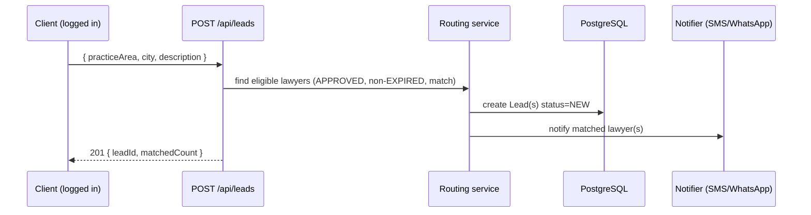

# 05 — API Design

## Conventions

- **Base prefix:** all routes are under `/api`.
- **Docs:** Swagger UI at `/api/docs` (OpenAPI generated from decorators).
- **Auth:** global `JwtAuthGuard` + `RolesGuard`. Every route requires a valid access JWT **unless**
  decorated `@Public()`. Role-restricted routes use `@Roles(Role.X)`.
- **Validation:** global `ValidationPipe({ whitelist: true, transform: true })`. Unknown body props are
  stripped; types are coerced. Every request body is a DTO with `class-validator` decorators.
- **Auth header:** `Authorization: Bearer <accessToken>`.
- **Responses:** JSON. Standard error envelope `{ statusCode, message, error }` (Nest default).
- **Pagination:** `?page=1&limit=20`, responses `{ data, meta: { page, limit, total, totalPages } }`.
- **Public-by-default routes** (SEO): lawyer search, lawyer profile, document category/template browsing.

### HTTP status usage

| Code | Meaning |
|---|---|
| 200 / 201 | success / created |
| 400 | validation error |
| 401 | missing/invalid token |
| 403 | authenticated but wrong role / not allowed |
| 404 | not found |
| 409 | conflict (duplicate email/mobile/bar number) |
| 429 | rate limit exceeded |

## Authentication

> Implemented today.

| Method | Path | Auth | Body | Purpose |
|---|---|---|---|---|
| POST | `/api/auth/register` | Public, rate-limited 5/min | RegisterDto | Register CLIENT or LAWYER (ADMIN rejected). Sends **one mobile OTP** (both roles) + a free email-verify link. Duplicate email/mobile → **field-specific 409** (`{ message, fields }`) |
| POST | `/api/auth/login` | Public, 10/min | LoginDto | **Password-only** login (mobile _or_ email + password); no OTP. Gated on `mobileVerified` |
| POST | `/api/auth/refresh` | Public, 20/min | RefreshDto | Rotate token pair (single-use refresh) |
| POST | `/api/auth/logout` | Auth | RefreshDto | Revoke presented refresh token |
| POST | `/api/auth/verify-email` | Public, 10/min | VerifyEmailDto | Confirm email via token (**soft** — does not block login) |
| POST | `/api/auth/mobile/send-otp` | Public, 5/min | SendMobileOtpDto | Send mobile OTP — **WhatsApp-first, SMS fallback**; 30s resend cooldown |
| POST | `/api/auth/mobile/verify-otp` | Public, 10/min | VerifyMobileOtpDto | Verify mobile OTP (hashed, 5-min TTL, 5-attempt lockout) |
| POST | `/api/auth/forgot-password` | Public, 5/min | ForgotPasswordDto | Email a reset link (enumeration-neutral reply) |
| POST | `/api/auth/reset-password` | Public, 5/min | ResetPasswordDto | Set new password via token; revokes all sessions |

Access and refresh tokens are separate JWTs (different secrets/expiry). Refresh tokens are persisted as
SHA-256 hashes and are single-use.

## Users

| Method | Path | Auth | Purpose |
|---|---|---|---|
| GET | `/api/users/me` | Auth | Current user profile |
| PATCH | `/api/users/me/password` | Auth | Change password (verifies current; revokes other sessions) |
| POST | `/api/users/me/mobile/change` | Auth | Request mobile change — **sends OTP to the new number** |
| POST | `/api/users/me/mobile/verify` | Auth | Verify OTP and switch the mobile number |
| POST | `/api/users/me/avatar` | Auth | Upload / change profile picture |
| DELETE | `/api/users/me` | Auth | Delete account (soft delete; revoke sessions) |
| GET | `/api/users/me/notifications` | Auth | List notifications (latest 50) |
| PATCH | `/api/users/me/notifications/:id/read` | Auth | Mark one read |
| PATCH | `/api/users/me/notifications/read-all` | Auth | Mark all read |
| POST | `/api/users/me/bookmarks/:lawyerId` | CLIENT | Bookmark a lawyer |
| DELETE | `/api/users/me/bookmarks/:lawyerId` | CLIENT | Remove bookmark |
| GET | `/api/users/me/documents` | Auth | Purchased/generated documents |

## SEO

| Method | Path | Auth | Purpose |
|---|---|---|---|
| GET | `/api/seo/sitemap` | Public | URL feed (approved lawyer slugs + `lastmod`, cities, practice areas) for building XML sitemaps |
| GET | `/api/seo/landing/:city/:practice` | Public | Editable landing copy (title/intro/FAQ) for a city × practice page, with generated fallback |
| PATCH | `/api/seo/admin/landing/:city/:practice` | ADMIN | Create/update landing copy |

> Full SEO/URL strategy in [24-seo-and-landing-pages.md](./24-seo-and-landing-pages.md). Lawyer slugs are
> generated at approval (`Lawyer.slug`, unique).

## Reports (two-sided) & moderation

| Method | Path | Auth | Purpose |
|---|---|---|---|
| POST | `/api/reports` | CLIENT/LAWYER | Report a user you were in contact with (`{ reportedUserId, leadId?, reason, details? }`) |
| GET | `/api/admin/reports?status=` | ADMIN | Moderation queue |
| PATCH | `/api/admin/reports/:id` | ADMIN | Review → `ACTIONED`/`DISMISSED` (+ optional `suspendReportedUser`); writes `AuditLog` |

## Lawyers

| Method | Path | Auth | Purpose |
|---|---|---|---|
| GET | `/api/lawyers` | Public | Search verified lawyers (filters + pagination) |
| GET | `/api/lawyers/:id` | Public | Full public profile (bio, practice areas + skills, languages, courts, rating) |
| GET | `/api/lawyers/slug/:slug` | Public | **SEO-friendly** profile by slug (`/lawyer/:slug`) |
| GET | `/api/lawyers/:id/reviews` | Public | Paginated ratings/reviews for the profile |
| POST | `/api/lawyers` | LAWYER | Create/complete lawyer profile |
| PATCH | `/api/lawyers/me` | LAWYER | Update own profile |
| POST | `/api/lawyers/me/verification` | LAWYER | Submit verification documents (photo + certificate) |
| GET | `/api/leads/lawyer/me` | LAWYER | Lead inbox |
| GET | `/api/lawyers/me/dashboard` | LAWYER | Dashboard metrics |

Search filters (results page, see [15-search-and-matching.md](./15-search-and-matching.md)):
`practiceArea`, `city`/`state`, `court`, `experienceMin`/`experienceMax`, `language`, `gender`,
`ratingMin`, `sort` (`activity` | `rating` | `experience` | `relevance`), `page`, `limit`. Filters
combine with `AND`; multi-value params use `IN`. Only `verificationStatus = APPROVED` is returned.

Example:

```
GET /api/lawyers?city=bangalore&practiceArea=family&court=high-court
    &experienceMin=10&language=en,hi&gender=MALE&ratingMin=4&sort=activity&page=1&limit=20
```

Each result item: `{ id, fullName, profileImageUrl, city, experienceYears, ratingAvg, ratingCount,
practiceAreas[], premium, verified }`. The "Contact now" CTA on a result opens the **lead form**
(`POST /api/leads`) — it does not expose contact details directly.

`GET /api/lawyers/:id` returns the full public profile (bio, grouped practice areas with skills +
proficiency, languages, courts, rating) — only when `verificationStatus = APPROVED`, else 404. A public
profile **never** exposes a lawyer's raw contact; in the lead-gen model the **lawyer** reaches out to the
client after a lead. The lawyer reveals the **client's** contact from their inbox via
`POST /api/leads/:id/reveal-contact` — subscription-gated (TRIAL/ACTIVE) and audit-logged. Full layout:
[08-lawyer-module.md → Public Profile Page](./08-lawyer-module.md#public-profile-page-ui--backend-spec).

## Leads

| Method | Path | Auth | Purpose |
|---|---|---|---|
| POST | `/api/leads` | CLIENT | Submit a legal requirement (routes to eligible lawyers; enforces plan lead-cap) |
| GET | `/api/leads/me` | CLIENT | Client's lead history |
| GET | `/api/leads/lawyer/me` | LAWYER | Lawyer's lead inbox |
| PATCH | `/api/leads/:id/status` | LAWYER (owner) | Advance status (CONTACTED/CLOSED) |
| POST | `/api/leads/:id/reveal-contact` | LAWYER (owner) | Reveal client contact — **subscription-gated** (TRIAL/ACTIVE only), logged to `AuditLog` |
| POST | `/api/leads/:id/confirm-contact` | CLIENT (owner) | Client confirms the lawyer made contact (`clientConfirmedAt`) |
| PATCH | `/api/leads/:id/withdraw` | CLIENT (owner) | Withdraw requirement → `CLOSED` |
| POST | `/api/leads/:id/rating` | CLIENT | Rate a closed lead |

## Documents

| Method | Path | Auth | Purpose |
|---|---|---|---|
| GET | `/api/documents/categories` | Public | List categories (landing tiles) |
| GET | `/api/documents/templates?q=&category=` | Public | Search / browse templates ("Search Legal Documents") |
| GET | `/api/documents/templates/:id` | Public | Template detail + input schema + stamp/pricing |
| POST | `/api/documents/generate` | Auth | Generate draft from template inputs |
| POST | `/api/documents/:id/options` | Auth | Set e-stamp / e-sign / delivery method (+ address) |
| POST | `/api/documents/:id/purchase` | Auth | Create payment order (price + stamp duty + delivery) |
| GET | `/api/documents/:id/download` | Auth (owner, PAID) | Signed URL to final PDF |

## Admin

> All under `@Roles(Role.ADMIN)`.

| Method | Path | Purpose |
|---|---|---|
| GET | `/api/admin/lawyers?status=UNDER_REVIEW` | Verification queue |
| PATCH | `/api/admin/lawyers/:id/verification` | Approve / reject / suspend |
| GET | `/api/admin/users` | Manage users |
| GET/PATCH | `/api/subscriptions/admin/plans` (+ `/tiers/:days`) | Manage plan prices, lead caps &amp; duration tiers |
| GET/POST/PATCH | `/api/admin/templates` | Manage document templates |
| GET | `/api/admin/reports` | Reports & analytics |

## Subscriptions & Payments

| Method | Path | Auth | Purpose |
|---|---|---|---|
| GET | `/api/subscriptions/plans/tiers` | Public | Active duration tiers + prices (30d/3m/6m/1y) — powers the pricing page |
| GET | `/api/subscriptions/me` | LAWYER | Current subscription/trial status |
| POST | `/api/subscriptions/checkout` | LAWYER | Create Razorpay order for `{ planName, durationDays }` (price from tier) |
| POST | `/api/subscriptions/checkout/verify` | LAWYER | Verify signature, activate (`endDate = start + durationDays`) |
| POST | `/api/subscriptions/cancel` | LAWYER | Cancel active subscription |
| GET | `/api/subscriptions/admin/plans` | ADMIN | List base plan prices + lead caps |
| PATCH | `/api/subscriptions/admin/plans/:planName` | ADMIN | Set base price / `monthlyLeadCap` |
| PATCH | `/api/subscriptions/admin/plans/:planName/tiers/:durationDays` | ADMIN | Set a duration-tier price/label/active |
| POST | `/api/payments/webhook` | Public (signature-verified) | Razorpay webhook events |

> Renewal reminders (T-30/T-15/expiry) and trial/subscription expiry run as scheduled jobs, not endpoints —
> see [13-subscription-module.md](./13-subscription-module.md).

## Example: Lead submission flow



## Swagger Conventions

- Decorate controllers with `@ApiTags('lawyers')` etc.; DTOs with `@ApiProperty`.
- Document auth with `@ApiBearerAuth()`; mark public routes accordingly.
- Group by module tag; keep operation IDs stable for client generation.
- Every endpoint documents request DTO, success shape, and error codes.

---
**Related:** [04-database-design.md](./04-database-design.md) · [07-backend-guidelines.md](./07-backend-guidelines.md) · [16-security.md](./16-security.md)
