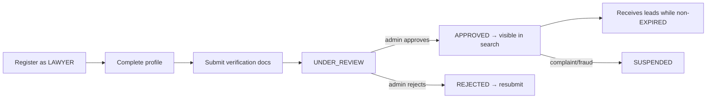

# 08 — Lawyer Module

Everything about the lawyer-facing experience: onboarding, verification, profile, leads, subscription,
dashboard.

## Lifecycle Overview



## Registration

- Lawyer self-registers with `role = LAWYER` (email + mobile + password).
- Email verification + mobile OTP required before profile submission counts as complete.
- A 30-day trial starts on lawyer creation (`subscriptionStatus = TRIAL`, `trialStartDate`/`trialEndDate`).

## Onboarding Wizard (post-OTP)

After mobile OTP, the lawyer completes a **resumable 3-step wizard** (`lawyer-onboarding` UI). The account
already exists at `verificationStatus = PENDING` with the trial running, so progress can be saved and resumed.

| Step | Fields | Required to submit? |
|---|---|---|
| 1 · Bar details | Full name (per Bar Council), **Bar Council enrollment number** (text), **bar council state**, **experience**, gender | name, enrollment number, state, experience required |
| 2 · Photo & docs | **Profile photo**, **Bar Council certificate** | both required (no ID-card upload) |
| 3 · Practice & review | **Primary practice area**, **city**, languages, bio | practice area + city required |

- Mandatory fields are enforced **at submission** (the review gate), not at account creation.
- Uploads go to S3/MinIO via the storage service; only S3 keys are stored.
- Submitting moves the lawyer to `UNDER_REVIEW` and appends `Verification` rows for each document.
- `POST /api/lawyers/me/verification` is the submit endpoint.

## Verification

- Lawyer submits: full name, **Bar Council enrollment number** (text) + state, experience, city, practice areas, profile image, and **Bar Council certificate (required)**. No ID-card upload is collected — the enrollment number is verified against the certificate.
- Files upload to S3/MinIO via the storage service; only the S3 keys are stored.
- Each submitted document creates an append-only `Verification` row.
- Admin reviews in the verification queue and sets `APPROVED` / `REJECTED` (with comments) / `UNDER_REVIEW`.
- **Only `APPROVED` lawyers appear in public search.** `SUSPENDED` removes them immediately.

State machine: `PENDING → UNDER_REVIEW → APPROVED | REJECTED`; `APPROVED → SUSPENDED` by admin.

## Profile

- Public profile (SEO, unauthenticated): name, photo, practice areas, city/state, experience, languages, rating, verification badge.
- Private fields (contact details) are revealed to a client only through a lead.
- Editable by the lawyer via `PATCH /api/lawyers/me`; significant changes may re-trigger review.

### Public Profile Page (UI + Backend Spec)

The public profile (`/lawyers/:id` or `/<advocate-slug>`) is the page behind each search card,
modeled on the reference design.

#### Layout

```
Home / Lawyers in <City> / <Advocate Name>           ← breadcrumb

┌──────────┐   Advocate Rajesh K.S                  [ CONTACT THIS LAWYER ]
│  photo   │   ★ 4.7 | 200+ user ratings
│          │   ────────────────────────────────────────────────────────
│ ✅Verified│   📍 Location: SC Road, Bangalore   💬 Languages: English, Hindi, Kannada, Telugu
└──────────┘   💼 Experience: 20 years

About
<bio paragraphs — practice approach, courts, Bar Council enrolment>

Practice Areas
  Family Law            ▰▰▰▰▰▰▰▰▱▱   ← strength/proficiency bar
    Divorce, Family, Wills / Trusts, Child Custody, Domestic Violence,
    Succession Certificate, Court Marriage, Dowry Case
  Property Law          ▰▰▰▰▰▰▱▱▱▱
    ...
```

#### Sections

| Section | Fields | Source |
|---|---|---|
| Header | photo, name, **Verified** badge, star `ratingAvg` + `ratingCount` | `Lawyer`, `Rating` aggregate |
| Meta row | location (city/state), languages, experience years | `Lawyer`, `LawyerLanguage` |
| About | bio / practice description | `Lawyer.bio` |
| Practice Areas | grouped areas, each with skill tags + a proficiency/strength bar | `LawyerPracticeArea` (+ `proficiency`, `skills`) |
| Courts | courts the lawyer appears in (optional block) | `LawyerCourt` |
| Reviews | rating list + comments (paginated) | `Rating` |
| CTA | primary "Contact this lawyer" | → lead form |

#### Contact CTA — LawMitran semantics

> The reference shows **"VIEW CONTACT NUMBER - 7899****03"** (masked phone reveal). LawMitran is a
> **lead-generation** model, so the primary CTA is **"Contact this lawyer" → submit a requirement**,
> which creates a `Lead` routed to that lawyer (`POST /api/leads`, login required). The lawyer then
> contacts the client. A masked-number reveal is **optional** and, if offered, is gated: the user must
> be logged in and submit a lead first; the number is only shown for non-`EXPIRED` lawyers and the
> reveal is logged. The default model never exposes the raw number on the public page.

#### Backend — Endpoint

`GET /api/lawyers/:id` (public) returns the full profile:

```json
{
  "id": "uuid",
  "fullName": "Advocate Rajesh K.S",
  "profileImageUrl": "https://.../photo.jpg",
  "verified": true,
  "ratingAvg": 4.7,
  "ratingCount": 213,
  "city": "Bangalore",
  "state": "Karnataka",
  "experienceYears": 20,
  "languages": ["English", "Hindi", "Kannada", "Telugu"],
  "bio": "Advocate Rajesh K.S has been practicing ...",
  "practiceAreas": [
    { "name": "Family Law", "proficiency": 90,
      "skills": ["Divorce", "Child Custody", "Domestic Violence", "Court Marriage"] }
  ],
  "courts": ["Karnataka High Court", "Bangalore District Court"]
}
```

Rules:

- Only returns the profile when `verificationStatus = APPROVED` (else 404 publicly).
- Contact details (`User.mobile`/`email`) are **never** in this payload.
- Optional reveal endpoint: `POST /api/lawyers/:id/contact-reveal` (auth + prior lead) → returns masked/last-digits or full number per policy; writes an `AuditLog` entry.
- Reviews fetched separately/paginated: `GET /api/lawyers/:id/reviews?page=&limit=`.
- New `Lawyer.bio`, `LawyerPracticeArea.proficiency`/`skills`, and `LawyerCourt` fields are in [04-database-design.md → Implementation Spec](./04-database-design.md#implementation-spec-ai-ready-prisma).

## Documents (verification uploads)

- Profile photo and Bar Council certificate (the enrollment number is captured as text and verified against the certificate; no ID-card upload).
- Stored in S3/MinIO; served to admins via short-lived signed URLs only.
- Never publicly accessible.

## Practice Areas

- Selected from a canonical list (target: `PracticeArea` + `LawyerPracticeArea`; today a string array on `Lawyer`).
- Drives search filtering and lead matching.

## Locations

- City/state today are strings; target normalizes to `State → District → City`.
- Used for location-based search and lead routing.

## Subscription

- Trial → paid plan (Basic/Premium) via Razorpay.
- Routing eligibility requires `subscriptionStatus ≠ EXPIRED/CANCELLED`.
- An expired lawyer stays visible but stops receiving leads. See [13-subscription-module.md](./13-subscription-module.md).

## Lead Inbox

- `GET /api/lawyers/me/leads` — leads routed to this lawyer, filterable by status.
- Lawyer advances status: `NEW → CONTACTED → CLOSED` (`PATCH /api/leads/:id/status`).
- Lawyer contacts the client directly (phone/WhatsApp/email) — no in-app messaging.
- New-lead alerts via SMS/WhatsApp/email.

## Dashboard

- KPIs: new vs contacted vs closed leads, conversion rate, average rating, subscription status & days remaining, profile completeness, verification status.
- Calls to action: complete verification, renew subscription, respond to stale leads.

## Endpoints

| Method | Path | Auth | Purpose |
|---|---|---|---|
| POST | `/api/lawyers` | LAWYER | Create/complete profile |
| PATCH | `/api/lawyers/me` | LAWYER | Update profile |
| POST | `/api/lawyers/me/verification` | LAWYER | Submit verification documents |
| GET | `/api/lawyers/me/leads` | LAWYER | Lead inbox |
| PATCH | `/api/leads/:id/status` | LAWYER | Advance lead status |
| GET | `/api/lawyers/me/dashboard` | LAWYER | Dashboard metrics |
| POST | `/api/payments/subscription/order` | LAWYER | Start plan purchase |

---
**Related:** [02-business-rules.md](./02-business-rules.md) · [13-subscription-module.md](./13-subscription-module.md) · [14-lead-management.md](./14-lead-management.md)
