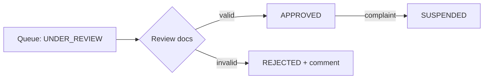

# 10 — Admin Module

The Super Admin console for trust, operations, and platform management. All routes are `@Roles(Role.ADMIN)`.

## Access

- `ADMIN` accounts are provisioned internally — **self-registration as ADMIN is rejected**.
- Admins authenticate like any user but pass `RolesGuard` for admin routes.

## Dashboard

Operational snapshot:

- Verification queue size (lawyers `UNDER_REVIEW` / `PENDING`).
- New lawyer signups, active subscriptions, trials ending soon, expired subscriptions.
- Leads created (today/7d/30d), lead conversion, document sales/revenue.
- Flags: complaints, suspended lawyers, failed payments.

## Lawyer Approvals (Verification)

- `GET /api/admin/lawyers?status=UNDER_REVIEW` — verification queue.
- Open a lawyer: view profile + uploaded Bar Council certificate / ID (signed URLs).
- `PATCH /api/admin/lawyers/:id/verification` — set `APPROVED` / `REJECTED` (with comments) / `SUSPENDED`.
- Every action appends to the `Verification` trail and the `AuditLog`.
- Approving makes the lawyer publicly visible; suspending removes them immediately.

## User Management (CRUD rules)

Admin has full CRUD over users — with guardrails so records and integrity are preserved:

- **Create / Read / Update:** `GET /api/admin/users` (search/filter), `GET /api/admin/users/:id`,
  `POST /api/admin/users` (provision staff/test accounts), `PATCH /api/admin/users/:id`.
- **Delete = soft delete, never hard delete.** `User` is referenced by `Lead`, `Rating`, `Payment`,
  `Bookmark`, `LeadHistory` — a physical delete would break those and destroy financial/audit records
  you may be legally required to keep. "Delete" sets `status = DELETED` / `deletedAt` (see
  [04-database-design.md](./04-database-design.md)); deactivated users are excluded everywhere and their
  **refresh tokens are revoked** so they're logged out immediately.
- **Account status** (`UserStatus`: `ACTIVE | SUSPENDED | DELETED`): suspend/reactivate; suspended users
  can't log in or act. Suspending a lawyer also removes them from search and stops leads.
- **Passwords are never readable.** Admin can **trigger a password reset** (email link), never view or set
  a raw password.
- Every admin write is recorded in `AuditLog` (actor, action, entity, timestamp).

Admins also view account state, verification/subscription status, and lead activity, and can reset
verification or handle disputes from the user detail view.

## Lawyer Approval (truthy ≠ verified)

A lawyer is `APPROVED` only after a **human review** — automated "all fields filled" checks gate the
*submission*, but never auto-approve.

- **Automated pre-checks (gate submission):** required fields present, **bar number format + uniqueness**,
  valid file types/sizes, and **duplicate detection** (same bar number / mobile / email).
- **Human verification (required for `APPROVED`):** the admin opens the **Bar Council certificate** (and
  ID, if provided) via signed URL and confirms the lawyer is genuine before approving.
- **Decisions:** Approve → `APPROVED`; Reject → `REJECTED` **with a reason** the lawyer sees so they can
  resubmit; Suspend → `SUSPENDED`. Each appends a `Verification` row and an `AuditLog` entry.
- Approving sets `approvedBy`/`approvedAt` and makes the lawyer publicly visible.

## Document Templates (category-wise CRUD)

Admins manage the **document catalog** — categories and templates — not customers' purchased documents.

- `GET/POST/PATCH /api/admin/categories` — manage `DocumentCategory` (name, slug, description).
- `GET/POST/PATCH /api/admin/templates` — create/maintain `DocumentTemplate`: category, title, price,
  input schema (`schemaJson`), body template, `requiresStamp`, and lifecycle.
- **Lifecycle, not hard delete:** templates use a **`DRAFT → PUBLISHED → ARCHIVED`** state plus an
  `active` flag — never physically deleted, because purchased `CustomerDocument`s reference them.
- **Versioning:** editing a published template creates a **new version** so already-purchased documents
  keep the exact template they were generated from. Admins **never** edit a customer's `CustomerDocument`.
- Used by the marketplace ([11-document-marketplace.md](./11-document-marketplace.md)).

## Subscription Plans

- `GET/POST/PATCH /api/admin/plans` — manage `SubscriptionPlanPrice` (plan name + amount).
- Changes affect new purchases; existing subscriptions keep their billed terms.
- See [13-subscription-module.md](./13-subscription-module.md).

## Reports & Analytics

- Lawyer funnel: signups → verified → subscribed → receiving leads.
- Lead funnel: created → contacted → closed; conversion by city/practice area.
- Revenue: subscriptions vs document sales; trials converting to paid.
- Trust metrics: rejection rate, suspensions, complaint volume.
- Export to CSV; deeper analytics in Phase 3.

## Endpoints

| Method | Path | Purpose |
|---|---|---|
| GET | `/api/admin/lawyers?status=` | Verification queue / lawyer search |
| PATCH | `/api/admin/lawyers/:id/verification` | Approve / reject / suspend |
| GET | `/api/admin/users` | User management |
| GET/POST/PATCH | `/api/admin/plans` | Subscription plan prices |
| GET/POST/PATCH | `/api/admin/templates` | Document templates |
| GET | `/api/admin/reports` | Reports & analytics |

---
**Related:** [02-business-rules.md](./02-business-rules.md) · [08-lawyer-module.md](./08-lawyer-module.md) · [13-subscription-module.md](./13-subscription-module.md)
