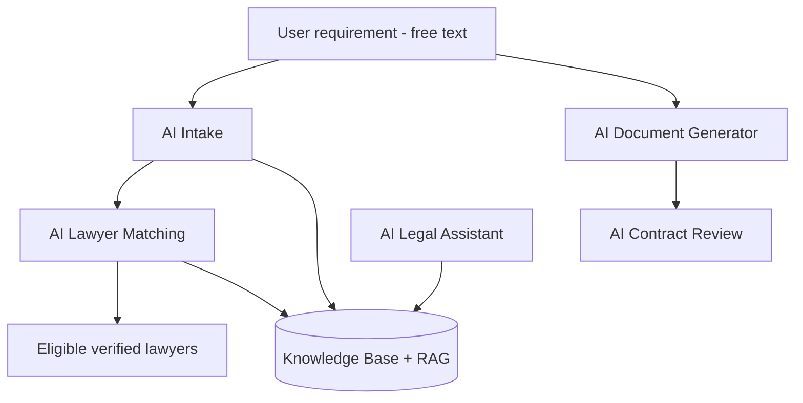

# 12 — AI Module

> **Phase 3 vision.** Today only an `ai-intake` module stub exists. This describes the intended AI layer.

AI augments — never bypasses — the core rules: verification gating and subscription-based routing still
apply to every AI-assisted flow.

## Components

### AI Intake

- Turns a free-text problem ("my landlord won't return my deposit") into structured fields: practice
  area, urgency, location, summary.
- Output feeds lead creation and matching; user confirms before submission.

### AI Lawyer Matching

- Ranks eligible (`APPROVED`, non-`EXPIRED`) lawyers by semantic fit to the intake, plus rating,
  experience, location proximity, and premium boost.
- Explainable: surfaces *why* a lawyer matched (areas, location, experience).

### AI Document Generator

- Conversational generation of marketplace documents — asks for the inputs a template needs and
  drafts the body. Falls back to the structured template form.
- Always routes through the paid generation workflow ([11-document-marketplace.md](./11-document-marketplace.md)).

### AI Contract Review

- Upload a contract; AI flags risky clauses, missing protections, and plain-language summaries.
- Positioned as informational, with a clear "not legal advice" disclaimer and an upsell to contact a lawyer.

### AI Legal Assistant

- General Q&A chatbot grounded in the knowledge base (RAG), scoped to Indian law and platform help.
- Hands off to lawyer discovery / lead submission when a user needs real representation.

## Prompt Management

- Versioned, reviewable prompt templates per feature (intake, matching, generation, review, assistant).
- Centralised config; A/B-able; guardrail/system prompts separated from task prompts.
- Logged (without PII) for evaluation and regression testing.

## Knowledge Base & RAG

- Curated corpus: Indian statutes/sections (IPC/BNS references), practice-area explainers, document
  guides, platform FAQs.
- Chunked + embedded into a vector store; retrieval augments generation for grounded, citable answers.
- Refreshed as laws/templates change; admin-curated to control quality.

## Safety & Guardrails

- Every AI output carries a "not a substitute for legal advice" disclaimer.
- No fabricated citations — answers grounded in the KB or abstained.
- PII minimisation in prompts/logs; respect the same auth/role boundaries as the rest of the API.

---
**Related:** [11-document-marketplace.md](./11-document-marketplace.md) · [14-lead-management.md](./14-lead-management.md) · [15-search-and-matching.md](./15-search-and-matching.md)
