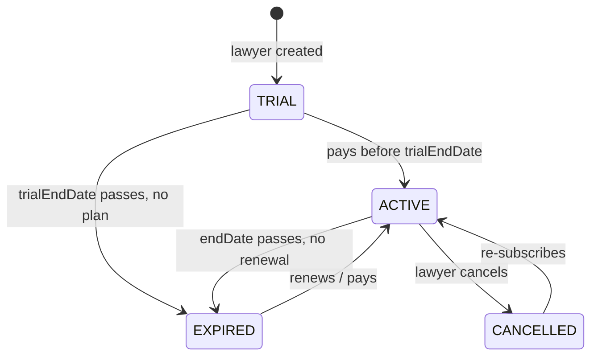
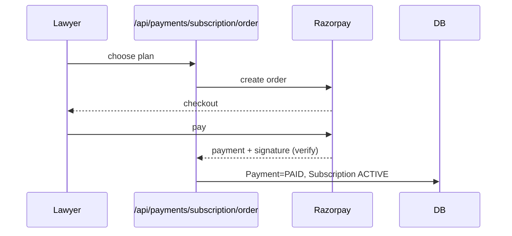

# 13 — Subscription Module

Lawyer monetization: trials, plans, billing, renewal, expiry, and the restrictions that follow.

## States

`SubscriptionStatus`: `TRIAL → ACTIVE → EXPIRED → CANCELLED` (state lives on the `Lawyer`).



## Free Trial (configurable length)

- Starts automatically on lawyer creation (`trialStartDate` = now, `trialEndDate` = now + trial length).
- **Trial length is configurable via `TRIAL_DAYS` (default 30).** Set `TRIAL_DAYS=15` for a shorter, more
  urgent trial. *Guidance:* keep **30 days** for early stage — lead volume can be slow at first, so a
  lawyer needs enough time to actually receive and convert leads to feel the value; shorten to 15 later if
  data shows lawyers convert quickly.
- Full privileges: once `APPROVED`, the lawyer receives leads **and can reveal client contacts** during
  the trial.
- On `trialEndDate` with no active paid plan → `EXPIRED` (leads stop, contact reveal locks).

## Plans

| Plan | Audience | Monthly lead cap | Key benefits |
|---|---|---|---|
| **Basic** | Solo / early-stage | **25 leads/month** | Verified listing, standard lead routing, dashboard |
| **Premium** | Growth-focused | **Unlimited** | Everything in Basic + ranking boost, priority lead routing, premium badge |

### Monthly lead cap

Each plan limits how many **new** leads a lawyer receives per calendar month; this is a core upgrade
lever (Basic capped, Premium unlimited). The cap lives on `SubscriptionPlanPrice.monthlyLeadCap`
(`null` = unlimited) so admins can tune it.

- **Enforcement:** on lead creation the routing layer resolves the lawyer's cap and counts their leads
  since the start of the month; at/over the cap, the lawyer stops receiving new leads (the client is
  routed to another available lawyer — same non-dead-end principle as [20-winback-expired-contact.md](./20-winback-expired-contact.md)).
- **TRIAL** lawyers are treated as **unlimited** for the trial period.
- The count resets on the 1st of each month.

- Premium ranking/priority is detailed in [15-search-and-matching.md](./15-search-and-matching.md).

### Duration tiers (term pricing)

Each plan is sold in four durations; longer terms are discounted to push annual commitment
(PathLegal-style). Prices are admin-managed via `SubscriptionPlanTier` (`planName` + `durationDays` →
`amount`); `SubscriptionPlanPrice` is retained as the reference base monthly price.

| Plan | 30 days | 3 months (90d) | 6 months (180d) | 1 year (365d) |
|---|---|---|---|---|
| **Basic** | ₹499 | ₹1,349 | ₹2,549 | ₹4,790 |
| **Premium** | ₹1,499 | ₹4,049 | ₹7,649 | ₹14,390 |

> Indicative seed values (`prisma/seed.ts`); admin can change any tier. The purchased term sets
> `Subscription.endDate = startDate + durationDays`. Prices are exclusive of GST. The checkout reads the
> price from the matching tier — a client never sets the amount.

```prisma
model SubscriptionPlanTier {
  id           String   @id @default(uuid())
  planName     String   // BASIC | PREMIUM
  durationDays Int      // 30, 90, 180, 365
  label        String   // "3 months"
  amount       Decimal  @db.Decimal(10, 2)
  active       Boolean  @default(true)
  updatedAt    DateTime @updatedAt
  @@unique([planName, durationDays])
  @@index([planName, active])
}
```

## Billing

- Payments via Razorpay (`payments`/`razorpay` service).
- Flow: create order (`Payment` status `CREATED`) → user pays → verify signature → `Payment = PAID` →
  create/extend `Subscription` (start/end dates) and set `Lawyer.subscriptionStatus = ACTIVE`.
- Webhooks reconcile out-of-band payment events; signatures verified before trust.
- **GST:** tier prices are GST-exclusive; **18% GST** is added at checkout and shown to the lawyer
  (base + GST = total). A GST invoice should be issued — invoicing is specced in
  [21-improvement-backlog.md](./21-improvement-backlog.md#1c-gst--invoicing).



## Renewal

- Lawyer renews before `endDate` to stay `ACTIVE` continuously.
- Renewal extends `Subscription.endDate`; a new `Subscription`/`Payment` record is created for history.

### Renewal reminders (implemented)

A daily cron (`sendRenewalReminders`, 9am) notifies lawyers whose paid subscription **or free trial** ends
soon, over **email + WhatsApp**:

- Reminder offsets are configurable via `RENEWAL_REMINDER_DAYS` (default `30,15,0`) — i.e. **30 days
  before, 15 days before, and on expiry day**. Each subscription matches a given offset on exactly one
  calendar day, so no de-dupe tracking is needed.
- Copy escalates: *"Your subscription ends in 30/15 days — renew before it ends to avoid interruption"*,
  then on day 0 *"Your subscription has ended — renew to keep receiving leads."* Trials get the equivalent
  *"free trial ends…"* wording nudging them to pick a plan.
- Sends go through `MailService` + `WhatsappService` (WhatsApp is the cheap primary in India).

## Expiry & Grace Period

- At `endDate` (or `trialEndDate`) status → `EXPIRED`.
- **Optional grace period** (target: a few days) where the lawyer is warned but routing may still pause.
- An `EXPIRED` lawyer **remains visible in search** (SEO/credibility) but **receives no new leads**.
- **Win-back:** while expired, their **Contact** action is gated; client interest is **held** and the
  lawyer gets a "N clients tried to reach you — renew to unlock" digest. On renewal, held leads are
  released. Full plan: [20-winback-expired-contact.md](./20-winback-expired-contact.md).

## Restrictions by State

| State | In search? | Receives leads? | Reveal client contact? | Notes |
|---|---|---|---|---|
| TRIAL | Yes (if APPROVED) | Yes | **Yes** | Full access for 30 days |
| ACTIVE | Yes | Yes | **Yes** | Premium gets boost/priority |
| EXPIRED | Yes | **No** | **No** | Locked → prompt to subscribe/renew (win-back) |
| CANCELLED | Yes | **No** | **No** | Locked → prompt to subscribe; history retained |

Routing eligibility always also requires `verificationStatus = APPROVED`.

### Contact reveal is subscription-gated

- **Revealing a client's contact details requires an active plan — `subscriptionStatus ∈ {TRIAL, ACTIVE}`**
  (trial counts as full access). `EXPIRED`/`CANCELLED`/no-plan lawyers see that leads exist but the
  contact is **locked**, and the dashboard shows a **subscription prompt describing the benefits**
  (unlock contacts, more/unlimited leads, search visibility, priority routing, premium badge, GST invoice).
- **Pending lawyers can pre-subscribe.** A lawyer with `verificationStatus = PENDING/UNDER_REVIEW` isn't
  visible and gets no leads yet, but may **buy a subscription while under review** so they're active the
  moment they're approved — the dashboard surfaces this as "get set up while we review you."

## Endpoints

| Method | Path | Auth | Purpose |
|---|---|---|---|
| GET | `/api/subscriptions/plans/tiers` | Public | List active duration tiers + prices (powers the pricing page) |
| POST | `/api/subscriptions/checkout` | LAWYER | Create a Razorpay order for `{ planName, durationDays }` — price comes from the matching tier |
| POST | `/api/subscriptions/checkout/verify` | LAWYER | Verify payment & activate (`endDate = start + durationDays`) |
| POST | `/api/subscriptions/cancel` | LAWYER | Cancel active subscription |
| GET | `/api/subscriptions/me` | LAWYER | Current subscription status |
| GET | `/api/subscriptions/admin/plans` | ADMIN | List base plan prices |
| PATCH | `/api/subscriptions/admin/plans/:planName` | ADMIN | Set base monthly price |
| PATCH | `/api/subscriptions/admin/plans/:planName/tiers/:durationDays` | ADMIN | Set price/label/active for a duration tier |

---
**Related:** [02-business-rules.md](./02-business-rules.md) · [08-lawyer-module.md](./08-lawyer-module.md) · [14-lead-management.md](./14-lead-management.md)
