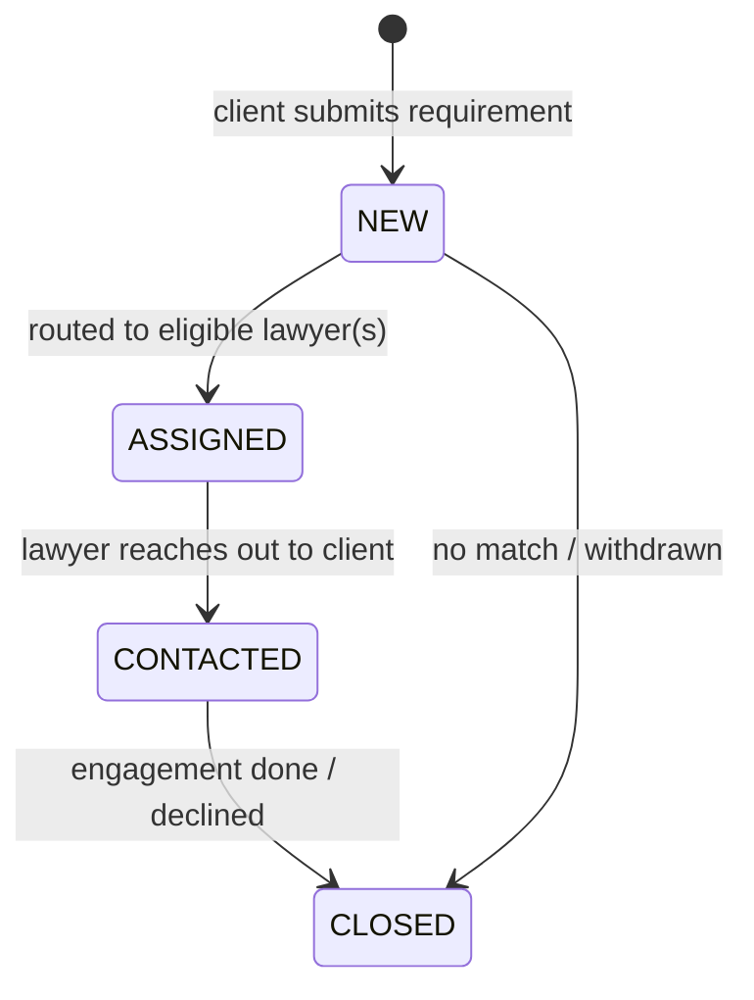
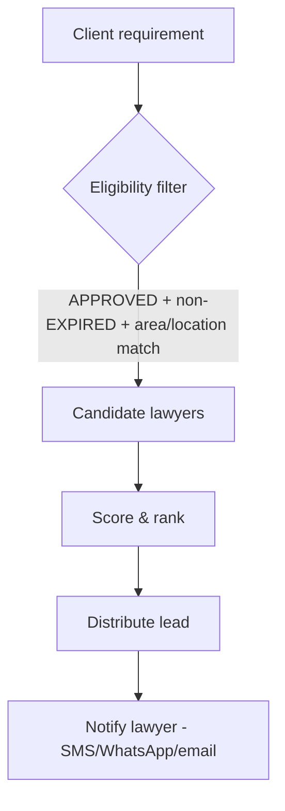

# 14 — Lead Management

The heart of LawMitran: turning a client's requirement into a qualified introduction for an eligible lawyer.

## Lead Lifecycle

`LeadStatus`: `NEW → ASSIGNED → CONTACTED → CLOSED`.

```prisma
enum LeadStatus {
  NEW
  ASSIGNED   // routed/assigned to eligible lawyer(s)
  CONTACTED
  CLOSED
}
```

> **Implementation note:** the original schema shipped without `ASSIGNED`. Adding it (plus the
> `LeadHistory` model) is specified in
> [04-database-design.md → Implementation Spec](./04-database-design.md#implementation-spec-ai-ready-prisma).
> Every transition must be written to `LeadHistory`.



| Status | Meaning |
|---|---|
| **NEW** | Created from a client requirement, not yet routed |
| **ASSIGNED** | Routed/assigned to one or more eligible lawyers |
| **CONTACTED** | A lawyer has contacted the client |
| **CLOSED** | Resolved (hired, declined, expired, or withdrawn) |
| **HELD** | Client reached an **expired-subscription** lawyer; intent captured but withheld until the lawyer renews (then released to `NEW`). See [20-winback-expired-contact.md](./20-winback-expired-contact.md). |

Every transition is recorded in `LeadHistory` (from/to status, actor, note, timestamp).

## Lead Distribution



**Eligibility filter** (hard rules):

- `verificationStatus = APPROVED`
- `subscriptionStatus ≠ EXPIRED` and `≠ CANCELLED`
- **under the plan's monthly lead cap** — a lawyer at/over `SubscriptionPlanPrice.monthlyLeadCap`
  (Basic = 25, Premium/Trial = unlimited) receives no further leads this month (see
  [13-subscription-module.md → Monthly lead cap](./13-subscription-module.md#monthly-lead-cap))
- practice area matches the requirement
- location matches (city/state) where relevant

**Distribution strategy** (configurable):

- *Direct:* client picks a lawyer from a profile → single-lawyer lead.
- *Broadcast/round-robin:* a homepage requirement routes to the top-N matched lawyers.
- Premium lawyers get priority in ranking and routing.

## Lead Scoring

Candidates ranked by a weighted score:

- Practice-area match strength.
- Location proximity (same city > same district > same state).
- Lawyer rating and review count.
- Experience (years).
- **Premium boost** for premium-plan lawyers.
- Responsiveness (historical contact/close rate) — Phase 3.

## Duplicate Detection

- Detect repeat submissions from the same client for the same matter (same practice area + similar
  description within a short window) to avoid spamming lawyers.
- Strategy: hash/normalise (clientId + practiceArea + city + description fingerprint); collapse or flag
  duplicates instead of creating new leads.

## Lead Expiry / SLA

- A `NEW`/`ASSIGNED` lead unactioned within the SLA window (target **72h**) is flagged stale.
- Stale leads may be re-routed to the next candidate or surfaced to admin.
- Closed/expired leads remain for history and analytics.

## Notifications

- Lawyer: new-lead alert (SMS/WhatsApp/email + in-app).
- Client: status updates (assigned, contacted, closed) and a prompt to rate after close.

## Ratings

- After `CLOSED`, the client may rate the lawyer once per lead (`Rating`, score 1–5 + comment).
- Ratings feed lawyer ranking and the public profile.

## Endpoints

| Method | Path | Auth | Purpose |
|---|---|---|---|
| POST | `/api/leads` | CLIENT | Submit requirement (routes to eligible lawyers) |
| GET | `/api/leads/me` | CLIENT | Client lead history |
| GET | `/api/leads/lawyer/me` | LAWYER | Lawyer lead inbox |
| PATCH | `/api/leads/:id/status` | LAWYER | Advance status |
| POST | `/api/leads/:id/confirm-contact` | CLIENT | Confirm the lawyer actually reached out (sets `clientConfirmedAt`, moves to `CONTACTED`) |
| PATCH | `/api/leads/:id/withdraw` | CLIENT | Withdraw the requirement → `CLOSED` (`closedReason=WITHDRAWN`) |
| POST | `/api/leads/:id/rating` | CLIENT | Rate closed lead |

> **Client-confirmed contact.** `PATCH /status → CONTACTED` is set by the *lawyer*; to keep conversion
> metrics honest, the client's `confirm-contact` records `clientConfirmedAt`. Only client-confirmed
> contacts should count as real conversions. Every transition (status change, confirm, withdraw) writes
> a `LeadHistory` row.

---
**Related:** [02-business-rules.md](./02-business-rules.md) · [13-subscription-module.md](./13-subscription-module.md) · [15-search-and-matching.md](./15-search-and-matching.md)
