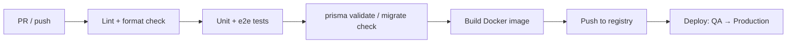

# 17 — DevOps

Build, ship, and run LawMitran across development, QA, and production.

## Docker

- Backend: multi-stage Dockerfile (build → prune → run), runs `node dist/main.js`.
- Frontend: Next.js standalone build image (once scaffolded).
- Images are environment-agnostic; configuration via env vars only.

## Docker Compose (dev)

Local stack brings up the whole platform:

| Service | Purpose |
|---|---|
| `postgres` | primary database |
| `redis` | cache, rate-limit counters, OTP throttling |
| `minio` | S3-compatible object storage (path-style) |
| `backend` | NestJS API |
| `frontend` | Next.js app |
| `nginx` | reverse proxy / TLS termination |

```bash
docker compose up -d
```

## CI/CD — Separate Pipelines

Frontend and backend have **independent** pipelines (GitHub Actions) so they deploy on their own cadence.

### Backend Pipeline



Steps: `npm ci` → `npm run lint --workspace backend` → `npm run test --workspace backend` →
`npm run test:e2e --workspace backend` → `prisma migrate deploy` (target env) → build/push image → deploy.

### Frontend Pipeline


## Environments

| Env | Purpose | Infra |
|---|---|---|
| **Development** | Local dev | Docker Compose |
| **QA / Staging** | Integration + UAT | AWS (smaller), seeded data |
| **Production** | Live | AWS, autoscaled |

Promotion: merge to `main` → deploy to QA → manual approval → Production.

## AWS (Production)

- **Compute:** ECS/Fargate (or EC2) for backend + frontend containers.
- **Database:** RDS PostgreSQL (Multi-AZ, automated backups, PITR).
- **Cache:** ElastiCache (Redis).
- **Storage:** S3 (private buckets, signed URLs, lifecycle rules).
- **Edge:** CloudFront/CDN + NGINX/ALB; ACM TLS certificates.
- **Secrets:** SSM Parameter Store / Secrets Manager.
- **Future:** managed ElasticSearch (OpenSearch), BullMQ workers on dedicated tasks.

## Database Migrations

- Schema changes via Prisma migrations; `prisma migrate deploy` runs in the pipeline before app rollout.
- Never hand-edit production DB; migrations are reviewed in PRs.

## Monitoring

- Health checks (`/health`) for load balancer + uptime monitoring.
- Metrics: latency, error rate, throughput, DB connections, queue depth (future).
- Alerts on error spikes, failed payments, verification queue backlog, expiry sweep failures.

## Logging

- Structured JSON logs shipped to a central store (CloudWatch / ELK).
- Correlation ids across requests and async jobs; no secrets/PII.
- Retention and access controls per compliance needs.

## Backups & DR

- Automated RDS snapshots + point-in-time recovery; periodic S3 backup/replication.
- Documented restore runbook; DR target RPO/RTO defined per environment.

---
**Related:** [03-system-architecture.md](./03-system-architecture.md) · [16-security.md](./16-security.md) · [18-roadmap.md](./18-roadmap.md)
