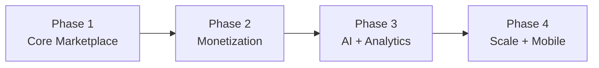

# 18 — Roadmap

Phased delivery from core marketplace to scaled, AI-assisted platform.

## Phase 1 — Core Marketplace (MVP)

Goal: prove the loop **requirement → matched verified lawyers → lawyer contacts client.**

- Authentication: register/login, email verification, mobile OTP, JWT access + refresh rotation.
- Lawyer registration & profile.
- Verification workflow (document upload + admin approve/reject/suspend).
- Public lawyer search (verified only) + homepage search & top-rated showcase.
- Lead submission + lawyer lead inbox.
- 30-day trial; routing excludes expired subscriptions.
- Ratings on closed leads.
- **Launch compliance & trust (from [21-improvement-backlog.md](./21-improvement-backlog.md)):** BCI
  information-platform framing + footer disclaimer, DPDP consent capture at signup, client-PII handling
  (contact shown only after submit / masking), client-confirmed "contacted" status, basic client
  dashboard.

**Status today:** auth + ratings implemented; lawyers/leads/admin modules to be built.

## Phase 2 — Monetization & Operations

Goal: revenue and admin tooling.

- Document marketplace: categories, templates, generation, purchase, PDF, storage.
- Subscriptions: Basic/Premium plans, billing, renewal, expiry, grace period.
- Payments: Razorpay orders, verification, webhooks.
- Admin: dashboard, approvals queue, user management, plan & template management, reports.
- **From backlog ([21](./21-improvement-backlog.md)):** GST invoicing, SMS DLT + WhatsApp BSP onboarding,
  report/review moderation, lawyer re-verification, cold-start (claim-profile, provisional listing,
  referrals), hybrid pricing + lead caps, document↔lawyer cross-sell, geo + keyword search.

## Phase 3 — Intelligence

Goal: smarter intake, matching, and assistance.

- AI Intake (free text → structured requirement).
- AI Lawyer Matching (semantic ranking + explainability).
- AI Document Generator (conversational template fill).
- AI Contract Review (clause flagging).
- AI Legal Assistant (RAG over knowledge base).
- **Client membership** — freemium plan bundling the AI chatbot + document generation with quotas; keeps
  find-a-lawyer free. See [23-client-membership.md](./23-client-membership.md).
- Notifications (multi-channel) and analytics.

## Phase 4 — Scale

Goal: reach and resilience.

- Mobile app (client + lawyer).
- ElasticSearch for full-text, geo, faceted search.
- Microservices extraction for hot paths (search, notifications, documents).
- AI Contract Review at scale.
- Case tracking (post-introduction engagement lifecycle).
- **Multi-professional expansion** — "Find Professionals" (CA/CS/GST) on a generalized `Professional`
  model, with per-body verification and its own advertising-rule review. See
  [25-multi-professional-expansion.md](./25-multi-professional-expansion.md).

## At a Glance

| Phase | Theme | Headline outcomes |
|---|---|---|
| 1 | Core | Verified discovery + leads live |
| 2 | Money | Documents + subscriptions + admin |
| 3 | Intelligence | AI intake/matching/docs/assistant + analytics |
| 4 | Scale | Mobile, ElasticSearch, microservices, case tracking |

---
**Related:** [01-product-vision.md](./01-product-vision.md) · [11-document-marketplace.md](./11-document-marketplace.md) · [12-ai-module.md](./12-ai-module.md)
