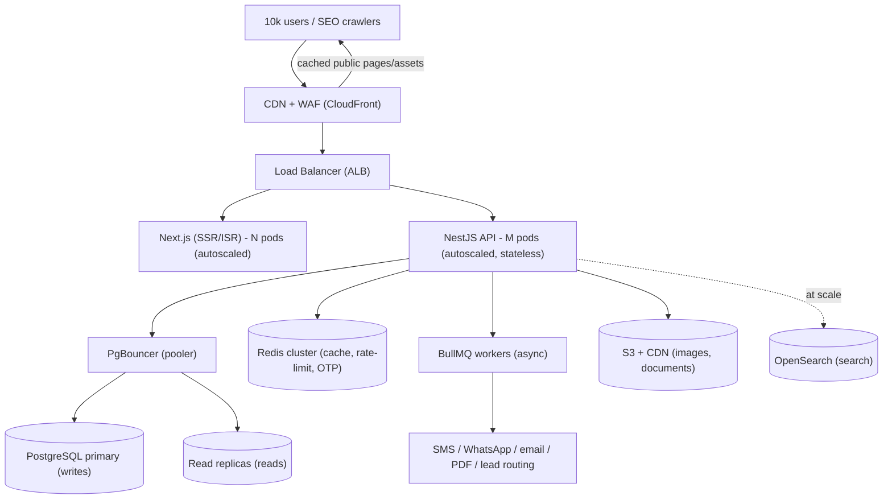

# 19 — Scalability Plan (10,000+ concurrent users)

Goal: serve **≥10,000 concurrent users** with p95 API latency under ~300 ms and public pages under ~1 s,
with headroom to grow. The good news: LawMitran's design is already scale-friendly — JWT auth is
**stateless**, most traffic is **public reads** (search, profiles, document browsing), and those can be
cached at the edge. The plan below is mostly about caching, horizontal scale, and database hygiene, not
a rewrite.

## What "10,000 concurrent" actually means

Concurrent users ≠ requests per second. Real users think and read between clicks.

| Assumption | Value |
|---|---|
| Concurrent users | 10,000 |
| Avg active request rate | ~1 request / 6 s per active user |
| **Peak app requests** | **~1,500–2,500 req/s** |
| Read : write ratio | ~95 : 5 (search/profiles vs leads/signups/payments) |
| Cacheable share (public pages) | ~70–85% |

So the API must comfortably handle ~2–3k req/s, but with caching + CDN the **origin** sees a fraction of
that. This is a moderate load — reachable with a handful of app instances and one well-tuned database.

## Scale Architecture

## Tier-by-tier plan

### 1. Edge / CDN (biggest win)
- Put **CloudFront** (or Cloudflare) in front of everything. Cache static assets aggressively and
  **public pages via ISR** (homepage showcase, lawyer search results, profile pages, document catalog).
- Most of the 10k are browsing public, SEO-indexed pages — serve them from edge cache so they never
  touch the API. A profile page cached for 60–300 s collapses thousands of hits into one origin fetch.
- Add a **WAF** for bot/abuse protection and basic rate limiting at the edge.

### 2. Frontend — Next.js
- Use **SSR + ISR**: `revalidate` on public pages (e.g. profiles 300 s, search 60 s, homepage 120 s).
- Stateless; run **N autoscaled instances** behind the load balancer. No sticky sessions needed.
- Ship lean bundles; lazy-load dashboards; image optimization via `next/image` + S3/CDN.

### 3. Backend — NestJS API
- **Stateless and horizontally scaled.** JWT means any instance can serve any request — scale out, no
  session affinity. Start with 4–6 pods (2 vCPU / 2–4 GB each), autoscale to 10–20 on CPU/RPS/latency.
- Keep the request path fast: **offload slow work to queues** (notifications, lead routing, PDF, OTP send).
- Set sensible timeouts and a global timeout interceptor on downstreams (payments, storage).
- Health checks (`/health`) for the load balancer; graceful shutdown drains in-flight requests.

### 4. Database — PostgreSQL (the usual bottleneck)
- **Connection pooling is mandatory.** Prisma opens a pool per instance; 15 instances × 10 connections
  will exhaust Postgres. Put **PgBouncer** (transaction mode) in front; point `DATABASE_URL` at it and
  cap Prisma's `connection_limit`. One DB should handle far more than 10k users when pooled correctly.
- **Read replicas** for read-heavy traffic (search, profiles, document catalog). Route reads to replicas,
  writes to primary. Accept slight replica lag for public reads.
- **Indexes** (already present, keep extending): `Lawyer (cityId, verificationStatus)`,
  `Lead (lawyerId, status)`, plus the normalized search joins (`LawyerPracticeArea`, `City`, `Court`),
  and `ratingAvg/ratingCount` denormalized for cheap sort. Add trigram/GIN indexes for text search.
- Right-size the instance (e.g. RDS with Multi-AZ), automated backups + PITR, slow-query monitoring.

### 5. Cache — Redis
- **Cache-aside** for hot reads: search result pages, lawyer profiles, homepage showcase, the
  "N lawyers online" counter, reference data (cities, practice areas). TTLs 30–300 s; invalidate on write.
- Holds **rate-limit counters** (`@RateLimit`), **OTP** codes (hashed, short TTL), and ephemeral data.
- Run Redis in **cluster/replicated** mode so it isn't a single point of failure.

### 6. Async jobs — BullMQ (Redis-backed)
Move everything non-blocking off the request path so API latency stays low under load:
- Lead routing/scoring + lawyer notifications (SMS/WhatsApp/email).
- OTP dispatch, email verification sends.
- PDF generation + e-stamp/e-sign for the document marketplace.
- Subscription **trial→expired** sweeps, stale-lead re-routing, rating aggregate recompute.
- Run dedicated worker pods, autoscaled by queue depth.

### 7. Search at scale
- Postgres full-text + trigram + the composite indexes comfortably cover early scale.
- When search volume, faceting, and geo ("lawyers near me") grow, move to **OpenSearch/ElasticSearch**
  (sync from Postgres via outbox/queue). Map markers read precomputed `latitude/longitude`.

### 8. Files & media
- Images and documents go to **S3 + CDN**, served via signed URLs. **Never** stream large files through
  the API. Bar certs/IDs stay private (short-lived signed URLs); profile photos via CDN.

## Resilience & limits
- **Rate limiting** at edge (WAF) + app (`@RateLimit` on auth/OTP/lead/search) to absorb spikes and abuse.
- **Graceful degradation:** if Redis is down, fall back to origin with tighter rate limits; if a replica
  lags, read from primary for critical paths.
- **Idempotency** on payments (Razorpay webhook signature + idempotency keys) and lead submission.
- Multi-AZ for DB and cache; multiple app instances across AZs; no single point of failure.

## Capacity starting point (illustrative)

| Component | Start | Autoscale to |
|---|---|---|
| Next.js pods | 4 × (1 vCPU, 1 GB) | 12 |
| NestJS API pods | 4 × (2 vCPU, 3 GB) | 16 |
| Worker pods (BullMQ) | 2 | 8 (by queue depth) |
| PostgreSQL | 1 primary (4–8 vCPU) | + 1–2 read replicas |
| PgBouncer | 1 (HA pair) | — |
| Redis | 3-node cluster | scale shards |
| CDN | global edge | n/a |

This comfortably covers ~2–3k origin req/s; with CDN/ISR caching, real origin load is far lower.

## Observability & validation
- **Metrics:** p50/p95/p99 latency, RPS, error rate, DB connections, replica lag, queue depth, cache
  hit ratio — dashboards + alerts (autoscale triggers off these).
- **Tracing + structured logs** with correlation IDs across API and workers.
- **Load test before launch:** k6 / Gatling / Locust simulating 10k concurrent users and ~2.5k req/s on
  the hot paths (search, profile, lead submit, signup+OTP). Tune pool sizes, cache TTLs, and autoscale
  thresholds against the results. Re-run on every major release.

## Phased rollout
1. **Launch-ready (now):** CDN + ISR on public pages, PgBouncer, Redis cache on hot reads, BullMQ for
   notifications/OTP/lead routing, autoscaling API/FE, rate limits, health checks, load test to 10k.
2. **Growth:** read replicas, denormalized rating columns, queue-driven re-routing, deeper caching.
3. **Scale-out:** OpenSearch for search/geo, partition hot tables if needed, regional CDN tuning,
   possible service extraction for the hottest paths (search, notifications, documents).

---
**Related:** [03-system-architecture.md](./03-system-architecture.md) · [17-devops.md](./17-devops.md) · [16-security.md](./16-security.md) · [15-search-and-matching.md](./15-search-and-matching.md)
