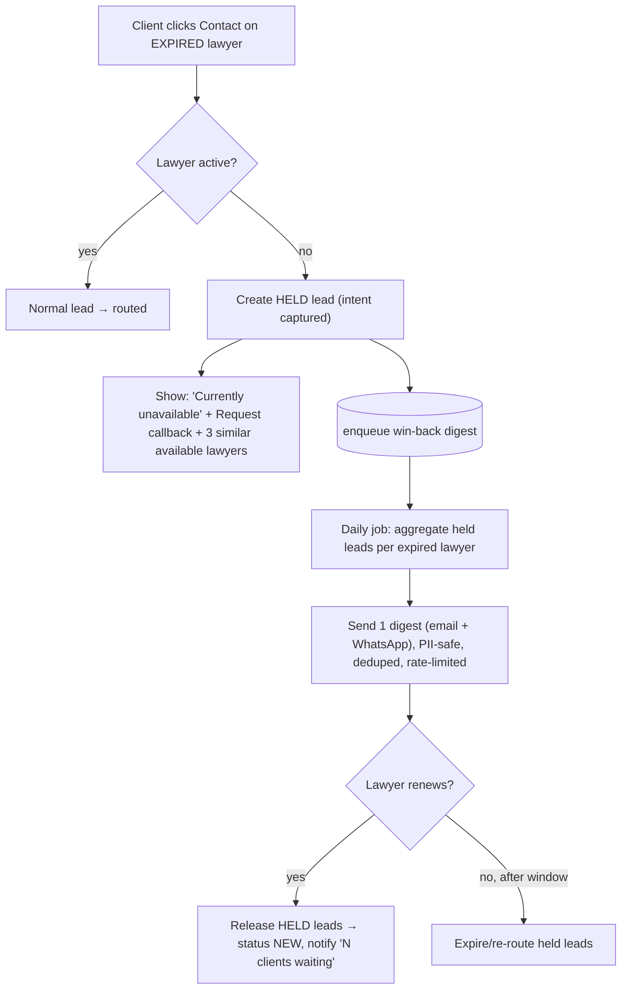

# 20 — Win-back: Contact-gating on Expired Subscriptions

**Development plan** for the renewal lever: when a lawyer's subscription expires, they stay visible in
search but their **Contact** action is gated. Clients aren't dead-ended (they get a callback option +
alternatives), the client's intent is **held as a carrot**, and the lawyer receives an **aggregated,
PII-safe digest** ("N clients tried to reach you — renew to unlock"). This drives renewals without
hurting the client side.

Builds on [13-subscription-module.md](./13-subscription-module.md) (expiry) and
[14-lead-management.md](./14-lead-management.md) (leads).

## Goals & rules

- **Expired lawyers stay listed** (SEO/credibility) but are **ranked lower** than active lawyers and
  cannot be contacted directly.
- **Never dead-end the client.** Replace "Contact" with **"Request callback"** and show **similar
  available lawyers** so the client still converts.
- **Hold the intent.** A client request to an expired lawyer creates a **HELD lead** — the carrot.
- **Digest, not spam.** The lawyer gets one **aggregated** notification (daily/weekly), never one email
  per click, and **no client PII** until they renew.
- **On renewal, release** all held leads to the lawyer ("you have N waiting clients").
- **Abuse-safe:** only OTP-verified clients count; dedupe repeat clicks; cap sends; audit everything.



## Schema changes (Prisma)

```prisma
// 1) New lead state for captured-but-withheld intent
enum LeadStatus {
  NEW
  ASSIGNED
  CONTACTED
  CLOSED
  HELD        // client reached an expired lawyer; withheld until renewal
}

// 2) Lead: hold metadata
model Lead {
  // ...existing fields...
  heldReason   String?     // e.g. "LAWYER_EXPIRED"
  heldAt       DateTime?
  releasedAt   DateTime?
  @@index([lawyerId, status])
}

// 3) De-dupe + audit of contact attempts on expired lawyers
//    (one row per distinct verified client per lawyer per window)
model ContactAttempt {
  id         String   @id @default(uuid())
  lawyerId   String
  lawyer     Lawyer   @relation(fields: [lawyerId], references: [id])
  clientId   String
  client     User     @relation(fields: [clientId], references: [id])
  practiceArea String
  notified   Boolean  @default(false)   // included in a digest yet?
  createdAt  DateTime @default(now())

  @@unique([lawyerId, clientId])         // dedupe repeat clicks (reset on renewal)
  @@index([lawyerId, notified])
}

// 4) Notification types for the digest (NotificationChannel already exists)
//    type values: WINBACK_DIGEST, LEADS_RELEASED, RENEWAL_REMINDER
```

> Add the `ContactAttempt` back-relation to `Lawyer` and `User`. `Lawyer.subscriptionStatus = EXPIRED`
> is the gate; held leads/contact attempts accumulate while expired and are cleared/released on renewal.

## API changes

| Method | Path | Behaviour |
|---|---|---|
| GET | `/api/lawyers` | Each item gains `contactDisabled: boolean` (true when `subscriptionStatus ∈ {EXPIRED, CANCELLED}`); expired lawyers ranked lower |
| GET | `/api/lawyers/:id` | Same `contactDisabled` flag; profile shows "currently unavailable" |
| POST | `/api/leads` | If target lawyer is **active** → normal lead (`NEW`). If **expired** → create **`HELD`** lead + upsert `ContactAttempt` + enqueue digest; respond `{ held:true, message, alternatives:[...] }` |
| GET | `/api/lawyers/:id/alternatives` | Returns N similar **available** lawyers (same area/city) for the client |
| GET | `/api/lawyers/me/waiting` | Lawyer dashboard: count of `HELD` leads waiting (no client PII) |
| POST | `/api/payments/verify` | On successful renewal → trigger **release-held-leads** for that lawyer |

Client response when blocked (no PII, actionable):
```json
{ "held": true,
  "message": "This lawyer is currently unavailable. We'll let them know you're interested.",
  "alternatives": [ { "id": "...", "fullName": "Adv. ...", "city": "Bengaluru", "ratingAvg": 4.7 } ] }
```

## Background jobs (BullMQ)

| Job | Trigger | Does |
|---|---|---|
| `winback-digest` | daily cron (configurable) | For each expired lawyer with un-notified `ContactAttempt`s: count distinct clients, send **one** digest via `mail` + `whatsapp`, mark `notified=true`, write `Notification` + `AuditLog`. Respects per-day cap. |
| `release-held-leads` | on renewal (`payment.verify` PAID) | Set the lawyer's `HELD` leads → `NEW` (`releasedAt=now`), clear `ContactAttempt`s, notify lawyer "N clients waiting", route as normal. |
| `held-lead-expiry` | daily sweep | `HELD` leads older than `HOLD_WINDOW_DAYS` → expire (or offer re-route to active lawyers); client may be nudged to pick an available lawyer. |
| `renewal-reminders` | daily | Dunning at T-7 / T-1 / T-0 before expiry (separate from win-back, complements it). |

All sends go through the queue (never synchronous in the request path) to keep latency low — see
[19-scalability.md](./19-scalability.md).

## Notification content (PII-safe)

- **Win-back digest (to lawyer):** *"3 clients tried to reach you this week in Family Law, Bengaluru.
  Renew your subscription to receive their details and start the conversation. [Renew]"* — **no names,
  numbers, or messages**. That detail is exactly what renewal unlocks.
- **Leads released (to lawyer, after renewal):** *"Welcome back! 3 clients are waiting for you — view
  them now."*
- **Client confirmation:** *"We've let the lawyer know you're interested. Meanwhile, here are verified
  lawyers available now."*

## Config (env)

| Key | Example | Meaning |
|---|---|---|
| `WINBACK_DIGEST_CRON` | `0 9 * * *` | when the digest runs |
| `WINBACK_DIGEST_PERIOD` | `weekly` | aggregation window shown in copy |
| `WINBACK_MAX_PER_DAY` | `1` | max digests per lawyer/day |
| `HOLD_WINDOW_DAYS` | `14` | how long held leads stay before expiry/re-route |
| `WINBACK_CHANNELS` | `email,whatsapp` | delivery channels |

## UI states

**Lawyer list / profile (client-facing):**
- Card shows a muted **"Currently unavailable"** badge instead of a green online dot.
- Primary button becomes **"Request callback"** (gold→muted); on click → `POST /api/leads` (held) →
  toast "We've let them know" + a **"Similar available lawyers"** strip appears.
- Expired lawyers sort **below** available ones.

**Lawyer dashboard:**
- Banner: **"⚠ 3 clients are waiting for you. Renew to unlock their details."** → Renew CTA.
- After renewal: **"3 leads released — view now."**

## Abuse & integrity

- Count only **OTP-verified** clients (`User.mobileVerified`) toward `ContactAttempt`.
- **Dedupe** via `@@unique([lawyerId, clientId])` — repeated clicks don't inflate counts or spam.
- Rate-limit the digest (`WINBACK_MAX_PER_DAY`); rate-limit the client endpoint (`@RateLimit`).
- A lawyer can't trigger interest in themselves (block self-contact); competitors can't fake it (auth + dedupe).
- Every send and release is written to `AuditLog`.

## Metrics to track

- Blocked-contact events (held leads created) per expired lawyer.
- Digest → renewal conversion (the key number proving this lever's value).
- Held-leads released vs expired; client fall-through to alternatives.

## Build checklist (phased)

1. **Schema + migration:** `LeadStatus.HELD`, `Lead.held*`, `ContactAttempt`. `prisma migrate dev`.
2. **Search:** add `contactDisabled` + rank expired lower.
3. **Lead submit:** branch on subscription status → held lead + `ContactAttempt` upsert + enqueue.
4. **Alternatives endpoint** + client UI (callback + similar lawyers).
5. **Jobs:** `winback-digest`, `release-held-leads`, `held-lead-expiry` (+ wire renewal to release).
6. **Notifications:** email + WhatsApp templates (PII-safe), `Notification`/`AuditLog` writes.
7. **Lawyer dashboard:** waiting-count banner + post-renewal "leads released".
8. **Config + rate limits + dedupe**, then **metrics dashboard** (admin Reports).

---
**Related:** [13-subscription-module.md](./13-subscription-module.md) · [14-lead-management.md](./14-lead-management.md) · [04-database-design.md](./04-database-design.md) · [19-scalability.md](./19-scalability.md)
