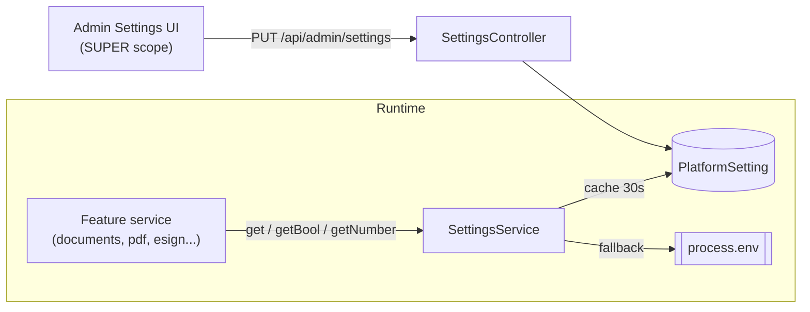

# 00 - Admin Configuration Framework

Every document-marketplace feature is gated and parameterised through the existing
database-backed settings system. This document defines the shared pattern and the
complete registry of keys the later phases add, so features can be turned on,
tuned, and turned off from the admin console without a deploy.

## How settings already work

`SettingsService` (`backend/src/modules/settings/settings.service.ts`) resolves a
key as **DB value -> `process.env[key]` -> undefined**, cached for 30 seconds.
Keys are declared in `settings.registry.ts` and rendered by the admin Settings
page (`frontend/app/(admin)/admin/settings/page.tsx`). Settings edits require the
`SUPER` admin scope; document operations require `OPS`.

Accessors:

- `get(key): Promise<string | undefined>`
- `getBool(key, fallback): Promise<boolean>` - `false`/`0`/`off`/`no` disable
- `getNumber(key, fallback): Promise<number>`



## Design rules for feature flags

1. **One master flag per feature.** Reads happen at the service boundary; when a
   flag is off the feature returns a safe no-op or a `409 Conflict` explaining it
   is disabled - never a 500.
2. **Default off.** `getBool(FLAG, false)` for every new feature so a merge is
   inert until enabled.
3. **Fail safe, not open.** For money/legal features (stamp duty strict mode,
   e-sign) a missing provider key disables the feature rather than silently
   proceeding.
4. **Group in the registry** under a new `documents` group so admins find them
   together.

## Registry additions

Add a `documents` group to `GROUPS` and the following entries to
`SETTINGS_REGISTRY` in `settings.registry.ts`. Types map to the existing
`SettingType` union (`text | secret | toggle | select | number`).

```ts
// GROUPS += 
{ id: 'documents', title: 'Document marketplace',
  description: 'Feature flags and pricing for the legal-document marketplace.' },

// SETTINGS_REGISTRY +=
// -- master + phase flags
{ key: 'DOCS_MARKETPLACE_ENABLED', group: 'documents', label: 'Enable marketplace', type: 'toggle' },
{ key: 'DOCS_PDF_ENABLED',         group: 'documents', label: 'Enable PDF downloads', type: 'toggle' },
{ key: 'DOCS_PDF_ENGINE',          group: 'documents', label: 'PDF engine', type: 'select', options: ['gotenberg', 'puppeteer'] },
{ key: 'DOCS_STAMP_DUTY_ENABLED',  group: 'documents', label: 'Enable stamp-duty calculator', type: 'toggle' },
{ key: 'DOCS_STAMP_DUTY_MODE',     group: 'documents', label: 'Stamp-duty mode', type: 'select', options: ['estimate', 'strict'] },
{ key: 'DOCS_LAWYER_REVIEW_ENABLED', group: 'documents', label: 'Enable lawyer review (Tier 3)', type: 'toggle' },
{ key: 'DOCS_ESIGN_ENABLED',       group: 'documents', label: 'Enable e-sign', type: 'toggle' },
{ key: 'DOCS_ESTAMP_ENABLED',      group: 'documents', label: 'Enable e-stamp', type: 'toggle' },
{ key: 'DOCS_SUBSCRIPTIONS_ENABLED', group: 'documents', label: 'Enable subscription bundles', type: 'toggle' },
{ key: 'DOCS_PHYSICAL_DELIVERY_ENABLED', group: 'documents', label: 'Enable physical delivery', type: 'toggle' },
// -- pricing / behaviour (consumed by the relevant phase)
{ key: 'DOCS_LAWYER_REVIEW_FEE',      group: 'documents', label: 'Default review fee (INR)', type: 'number', placeholder: '499' },
{ key: 'DOCS_LAWYER_PAYOUT_PERCENT',  group: 'documents', label: 'Lawyer payout (% of review fee)', type: 'number', placeholder: '70' },
{ key: 'DOCS_ESIGN_PROVIDER',   group: 'documents', label: 'e-sign provider', type: 'select', options: ['digio', 'leegality', 'emudhra'] },
{ key: 'DOCS_ESIGN_API_KEY',    group: 'documents', label: 'e-sign API key', type: 'secret' },
{ key: 'DOCS_ESIGN_API_SECRET', group: 'documents', label: 'e-sign API secret', type: 'secret' },
{ key: 'DOCS_ESTAMP_PROVIDER',  group: 'documents', label: 'e-stamp provider', type: 'select', options: ['shcil', 'digio', 'leegality'] },
{ key: 'DOCS_ESTAMP_API_KEY',   group: 'documents', label: 'e-stamp API key', type: 'secret' },
{ key: 'DOCS_DELIVERY_FEE',     group: 'documents', label: 'Physical delivery fee (INR)', type: 'number', placeholder: '150' },
{ key: 'DOCS_DELIVERY_PROVIDER', group: 'documents', label: 'Courier provider', type: 'text', placeholder: 'Shiprocket' },
```

`REGISTRY_KEYS` is derived automatically, so no other change is needed for
`adminSave` validation to accept these keys.

## Complete key reference

| Key | Type | Default (fallback) | Consumed by |
|---|---|---|---|
| `DOCS_MARKETPLACE_ENABLED` | toggle | off | 01 |
| `DOCS_PDF_ENABLED` | toggle | off | 02 |
| `DOCS_PDF_ENGINE` | select | `gotenberg` | 02 |
| `DOCS_STAMP_DUTY_ENABLED` | toggle | off | 03 |
| `DOCS_STAMP_DUTY_MODE` | select | `estimate` | 03 |
| `DOCS_LAWYER_REVIEW_ENABLED` | toggle | off | 04 |
| `DOCS_LAWYER_REVIEW_FEE` | number | `499` | 04 |
| `DOCS_LAWYER_PAYOUT_PERCENT` | number | `70` | 04 |
| `DOCS_ESIGN_ENABLED` | toggle | off | 05 |
| `DOCS_ESIGN_PROVIDER` | select | - | 05 |
| `DOCS_ESIGN_API_KEY` / `_SECRET` | secret | - | 05 |
| `DOCS_ESTAMP_ENABLED` | toggle | off | 05 |
| `DOCS_ESTAMP_PROVIDER` | select | - | 05 |
| `DOCS_ESTAMP_API_KEY` | secret | - | 05 |
| `DOCS_SUBSCRIPTIONS_ENABLED` | toggle | off | 06 |
| `DOCS_PHYSICAL_DELIVERY_ENABLED` | toggle | off | 07 |
| `DOCS_DELIVERY_FEE` | number | `150` | 07 |
| `DOCS_DELIVERY_PROVIDER` | text | - | 07 |

## Reusable guard helper

To keep flag checks consistent, add a small helper used by every phase service:

```ts
// documents/feature-flags.ts
import { ForbiddenException } from '@nestjs/common';
import { SettingsService } from '../settings/settings.service';

export async function assertFeature(
  settings: SettingsService, key: string, label: string,
): Promise<void> {
  if (!(await settings.getBool(key, false))) {
    throw new ForbiddenException(`${label} is currently disabled`);
  }
}
```

## Acceptance criteria

- New `documents` group appears in the admin Settings page with all keys.
- Toggling any master flag off makes the corresponding endpoint return a clear
  disabled error (not a 500) within one cache TTL (<= 30s).
- Secrets (`*_API_KEY`, `*_API_SECRET`) are never returned by `GET /admin/settings`
  (existing secret-masking behaviour in `adminList`).
- No feature activates on deploy; all default to off.
