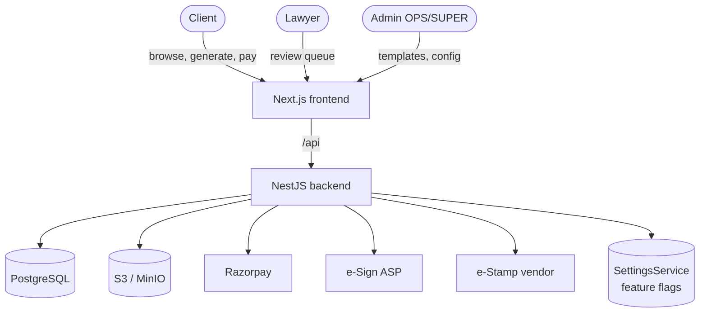

# Document Marketplace - Documentation

Production documentation for the LawMitran legal-document marketplace: the feature
that lets clients generate, pay for, download, and optionally get lawyer-reviewed,
e-stamped, and e-signed legal documents, and lets lawyers earn from reviews.

This set is written for **developers, product managers, designers, QA engineers,
and future contributors**. It documents the current baseline (Tiers 1-2 are live
in `backend/src/modules/documents`) and the implementation-ready plan for the
remaining phases. Every new capability is gated by an **admin-configurable feature
flag** - see [00-admin-configuration-framework](./00-admin-configuration-framework.md).

## Legal disclaimer

> LawMitran generates legal documents but does **not** guarantee legal
> enforceability. Requirements such as stamping, registration, notarization,
> witnessing, and statutory compliance remain the user's responsibility where
> applicable. LawMitran does not provide legal advice. See
> [compliance.md](./compliance.md).

>> **Implementation status:** Phases 1-5 are built. See
>> [IMPLEMENTATION.md](./IMPLEMENTATION.md) for exactly what's in the codebase,
>> the endpoints, feature flags, and the migration/seed runbook.

## Document index

| Document | Audience | Purpose |
|---|---|---|
| [vision.md](./vision.md) | PM, leadership | Why the marketplace exists; goals & non-goals |
| [business-flow.md](./business-flow.md) | PM, ops | Monetization tiers, revenue, actors |
| [user-flow.md](./user-flow.md) | Design, PM | End-to-end journeys, screens, wireframes |
| [architecture.md](./architecture.md) | Dev | System components, request lifecycle, modules |
| [database-design.md](./database-design.md) | Dev, DBA | Tables, ER diagram, indexes, migrations |
| [api-design.md](./api-design.md) | Dev, QA | Endpoints, auth, payloads, errors |
| [document-catalog.md](./document-catalog.md) | PM, content | Catalogue, template schema, authoring |
| [pdf-generation.md](./pdf-generation.md) | Dev | HTML->PDF, watermark, QR, hashing, storage |
| [stamp-duty.md](./stamp-duty.md) | Dev, PM | State-wise stamp-duty calculator |
| [lawyer-review.md](./lawyer-review.md) | Dev, PM | Tier-3 review workflow + revenue share |
| [esign-estamp.md](./esign-estamp.md) | Dev | e-Sign / e-Stamp vendor integration |
| [payment-flow.md](./payment-flow.md) | Dev, QA | Razorpay checkout, verification, refunds |
| [storage.md](./storage.md) | Dev, DevOps | S3/MinIO layout, signed URLs, retention |
| [security.md](./security.md) | Dev, security | OWASP, RBAC, access control, PII |
| [compliance.md](./compliance.md) | Legal, PM | IT Act, Contract Act, e-sign, stamp duty |
| [admin-panel.md](./admin-panel.md) | Dev, ops | Template/category/pricing/config admin |
| [testing.md](./testing.md) | QA, Dev | Test strategy + manual QA checklist |
| [deployment.md](./deployment.md) | DevOps | Env vars, Docker, Redis, S3, scaling, DR |
| [roadmap.md](./roadmap.md) | All | Phased delivery plan |
| [future-enhancements.md](./future-enhancements.md) | PM, Dev | AI drafting, clause suggestions, risk analysis |
| [00-admin-configuration-framework.md](./00-admin-configuration-framework.md) | Dev | Feature-flag/settings framework (supporting) |
| [IMPLEMENTATION.md](./IMPLEMENTATION.md) | All | What is built (status, endpoints, runbook) |
| [../esign-architecture.md](../esign-architecture.md) | Dev | e-Sign vendor-agnostic architecture (Phase 5) |
| [../estamp-architecture.md](../estamp-architecture.md) | Dev | e-Stamp vendor-agnostic architecture (Phase 5) |

## System context

## Status legend used throughout

| Marker | Meaning |
|---|---|
| **Live** | Implemented in the current codebase |
| **Planned** | Specified here, not yet built |
| **Config** | Behaviour controlled by an admin setting |
