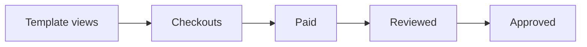
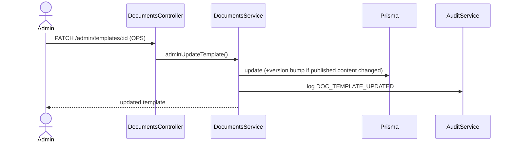

# Admin Panel

## Purpose

Document the admin surfaces for the marketplace: template & category management,
pricing, publishing/versioning, orders, reports, and the feature-flag/config
console. Admin lives under `frontend/app/(admin)/admin/documents` and the settings
page; APIs are `@Roles(ADMIN)` + scope.

## Scopes

| Scope | Can do |
|---|---|
| `OPS` | Categories, templates, pricing, publish/version, orders, stamp-duty rates |
| `FINANCE` | Refunds, payout/settlement reports |
| `SUPER` | Feature flags, provider keys, payout %, global config |

## Screens

### Templates list (`/admin/documents`)

```
+---------------------------------------------------------------+
| Templates                              [ + New template ]     |
+---------------------------------------------------------------+
| Title             Category   Price  Status     v   Sold       |
| Rental Agreement  Personal   199    PUBLISHED  3   1,204      |
| NDA               Business   149    DRAFT      1   0     [Edit]|
+---------------------------------------------------------------+
```
- Buttons: `New`, `Edit`, status toggle (Publish/Archive).
- States: filter by status/category; empty state; save toasts.

### Template editor (`/admin/documents/:id`)

```
+-------------------- Template editor --------------------------+
| Title      [Rental Agreement            ]  Category [Personal]|
| Price(INR) [199]  Language [en]  Requires stamp [x]  Basis[..]|
|--------------------------------------------------------------|
| Schema (fields)            |  Body template                  |
|  + add field               |  RENTAL AGREEMENT               |
|  landlordName (text, req)  |  ...{{landlordName}}...         |
|  monthlyRent (number, req) |  ...Rs. {{monthlyRent}}...      |
|--------------------------------------------------------------|
| [ Preview with sample ]      [ Save draft ]  [ Publish ]     |
+--------------------------------------------------------------+
```
- Validation: title/category/price required; body tokens should match schema field
  names; publishing requires at least one field.
- Versioning: editing body/schema of a `PUBLISHED` template bumps `version` on save.

### Orders (`/admin/documents` orders tab)

- Paginated list of non-draft `CustomerDocument`: buyer, template, amount, status,
  paymentId, date. FINANCE sees refund action.

### Stamp-duty rates (Planned P3)

- CRUD table keyed by `(state, documentType)`; `calcType`, values, active toggle.

### Settings / feature flags (SUPER)

- The `documents` settings group ([00-admin-configuration-framework.md](./00-admin-configuration-framework.md)):
  master + phase flags, pricing defaults, provider keys (masked).

## Reports & analytics

| Report | Content |
|---|---|
| Sales | Documents sold by template/category/period; revenue |
| Tier-3 attach | Review requests / paid documents; approval rate |
| Lawyer payouts | Accrued/settled payouts per lawyer (FINANCE) |
| Funnel | Detail views -> checkout -> paid -> reviewed (drop-off) |
| SLA | Review SLA adherence; breaches |



## Backend flow (admin action)



## Non-functional requirements

| Attribute | Approach |
|---|---|
| **Security** | Scope-gated routes; secrets masked; audit on every change |
| **Auditability** | `DOC_*` audit entries with old/new values on price/status |
| **Reliability** | Version bump preserves purchased snapshots |
| **Usability** | Live preview reduces authoring errors |

## Acceptance criteria

- OPS can author, preview, publish, and version templates; FINANCE can refund;
  SUPER can toggle flags and set provider keys.
- Publishing a content edit increments `version` and preserves prior purchases.
- Reports reflect live data; secrets never displayed.
