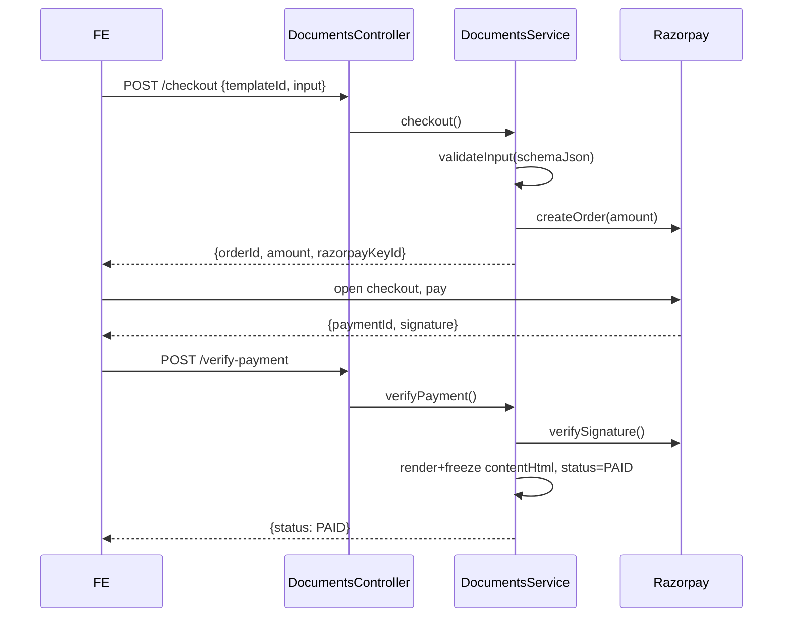

# API Design

## Purpose

Single reference for every marketplace endpoint - path, method, auth, permissions,
validation, and payloads - for frontend, QA, and integration work. Live endpoints
are marked **Live**; planned ones **Planned** and gated by a feature flag.

## Conventions

- Base path: `/api`. Controller: `@Controller('documents')`.
- Auth: global `JwtAuthGuard` + `RolesGuard`. Public routes use `@Public()`.
- Admin routes: `@Roles(Role.ADMIN)` + `@AdminScopes(AdminRole.OPS)`.
- Validation: global `ValidationPipe({ whitelist: true, transform: true })`; unknown
  fields are stripped.
- Errors use Nest exceptions -> `{ statusCode, message }`.

## Endpoint catalogue

| Method | Path | Auth | Scope | Status |
|---|---|---|---|---|
| GET | `/documents/categories` | Public | - | Live |
| GET | `/documents/templates?category=slug` | Public | - | Live |
| GET | `/documents/templates/:idOrSlug` | Public | - | Live |
| POST | `/documents/templates/:id/preview` | Public | - | Live |
| POST | `/documents/templates/:id/prefill` | Public (rate 6/min) | - | Live |
| POST | `/documents/quote` | Client | - | Planned (P3) |
| POST | `/documents/checkout` | Client | - | Live |
| POST | `/documents/verify-payment` | Client | - | Live |
| GET | `/documents/me` | Client | - | Live |
| GET | `/documents/me/:id` | Client | - | Live |
| GET | `/documents/me/:id/pdf` | Client | - | Planned (P2) |
| POST | `/documents/me/:id/request-review` | Client | - | Planned (P4) |
| POST | `/documents/me/:id/esign` | Client | - | Planned (P5) |
| POST | `/documents/me/:id/estamp` | Client | - | Planned (P6) |
| GET | `/documents/reviews/queue` | Lawyer | - | Planned (P4) |
| POST | `/documents/reviews/:id/claim` | Lawyer | - | Planned (P4) |
| POST | `/documents/reviews/:id/decision` | Lawyer | - | Planned (P4) |
| GET/POST/PATCH | `/documents/admin/categories[...]` | Admin | OPS | Live |
| GET/POST/PATCH | `/documents/admin/templates[...]` | Admin | OPS | Live |
| PATCH | `/documents/admin/templates/:id/status` | Admin | OPS | Live |
| GET | `/documents/admin/orders` | Admin | OPS | Live |
| GET/POST/PATCH | `/documents/admin/stamp-duty` | Admin | OPS | Planned (P3) |
| POST | `/documents/admin/orders/:id/refund` | Admin | FINANCE | Planned (P2) |
| POST | `/webhooks/esign` `/webhooks/estamp` | Public (HMAC) | - | Planned (P5/6) |

## Key request/response examples

### POST `/documents/checkout` (Live)

Request:
```json
{ "templateId": "e2c...", "input": { "tenantName": "A. Rao", "monthlyRent": "18000", "startDate": "2026-08-01" } }
```
Response `201`:
```json
{ "customerDocumentId": "d91...", "orderId": "order_Nb...", "amount": 19900,
  "currency": "INR", "razorpayKeyId": "rzp_test_...", "title": "Rental Agreement" }
```
Validation: each required field in the template `schemaJson` must be non-empty
(else `400 "Please fill \"<label>\""`).

### POST `/documents/verify-payment` (Live)

Request:
```json
{ "customerDocumentId": "d91...", "razorpayOrderId": "order_Nb...",
  "razorpayPaymentId": "pay_Nb...", "razorpaySignature": "9f8..." }
```
Response `200`: `{ "id": "d91...", "status": "PAID" }`
Errors: `400 "Payment signature verification failed"`, `400 "This document is
already paid"`, `400 "Order mismatch"`, `404 "Document not found"`.

### POST `/documents/quote` (Planned P3)

Request:
```json
{ "templateId": "e2c...", "state": "KA", "addons": { "review": true, "esign": false } }
```
Response `200`:
```json
{ "base": 199, "stampDuty": 500, "reviewFee": 499, "eSignFee": 0,
  "deliveryFee": 0, "total": 1198, "breakdown": [ { "label": "Base", "amount": 199 } ] }
```
Only add-on lines whose feature flag is on are returned. `checkout` recomputes the
same total server-side; the client total is advisory.

### POST `/documents/reviews/:id/decision` (Planned P4)

Request: `{ "decision": "APPROVED" | "REJECTED" | "REVISION", "comment": "..." }`
Rules: `comment` required unless `APPROVED`; caller must be the assigned lawyer;
`403` if `DOCS_LAWYER_REVIEW_ENABLED` is off.

## Standard error responses

| Code | When |
|---|---|
| 400 | Validation failure, payment mismatch, bad state transition |
| 401 | Missing/invalid JWT on a protected route |
| 403 | Wrong role/scope, or feature flag disabled |
| 404 | Template/document not found or not owned by caller |
| 409 | Idempotency conflict (already paid / already reviewed) |
| 429 | Rate limit (e.g., prefill 6/min) |

## Sequence - generate & purchase (Live)



Additional sequences (PDF, review, refund, e-sign, e-stamp) live in their feature
docs and [payment-flow.md](./payment-flow.md).
