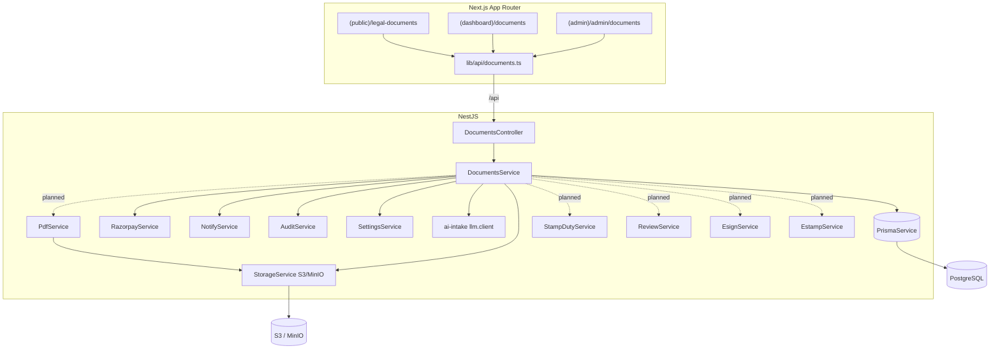
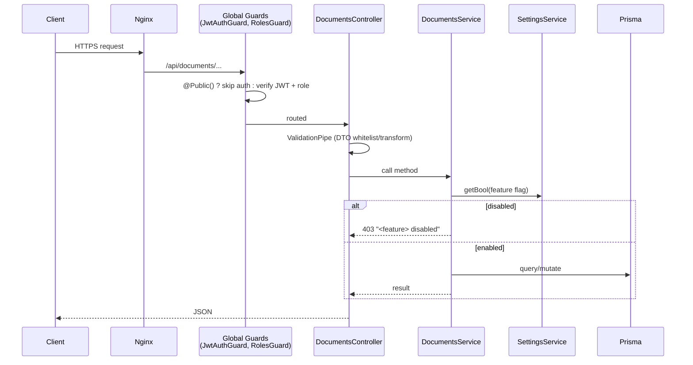

# Architecture

## Purpose

Describe the components, request lifecycle, and module boundaries of the document
marketplace so engineers can place new code correctly and reviewers can reason
about blast radius.

## Component map

Solid = live today; dashed = phases in this doc set.

## Module boundaries

| Concern | Location | Status |
|---|---|---|
| HTTP routes | `modules/documents/documents.controller.ts` | Live |
| Business logic | `modules/documents/documents.service.ts` | Live |
| DTO/validation | `modules/documents/dto/documents.dto.ts` | Live |
| Persistence | `prisma/schema.prisma` + `PrismaService` | Live |
| Payments | `common/payments/razorpay.service.ts` | Live |
| Storage | `common/storage/storage.service.ts` | Live |
| e-Sign / e-Stamp | `common/esign`, `common/estamp` | Stub |
| Feature flags | `modules/settings` | Live |
| PDF | `common/pdf` (new) | Planned |
| Stamp duty | `modules/documents/stamp-duty.service.ts` (new) | Planned |
| Review | `modules/documents/review.service.ts` (new) | Planned |

New phases add **services within the documents module** (or `common/*` for shared
infra like PDF), not new top-level modules - keeping the guard/scope wiring intact.

## Request lifecycle

Guards are global (`JwtAuthGuard` + `RolesGuard` via `APP_GUARD`); public
catalogue routes use `@Public()`, admin routes use `@Roles(ADMIN)` +
`@AdminScopes(OPS)`.

## Cross-cutting services

- **SettingsService** - feature flags & pricing (30s cache, DB->env fallback).
- **AuditService** - `audit.log(action, {...})` for every state change.
- **NotifyService** - `notifyUser` / `notifyAdmins` on purchase, review, delivery.
- **StorageService** - S3/MinIO put + presigned GET for PDFs and uploads.

## Non-functional requirements

| Attribute | Approach |
|---|---|
| **Performance** | Public catalogue cached (`next: { revalidate: 300 }` on FE, indexed queries on BE); PDF generation offloaded and async where possible |
| **Scalability** | Stateless services; PDF engine horizontally scalable (separate container); DB indexes on hot paths |
| **Security** | Global JWT/role guards, server-side pricing, signed URLs, secret-masked settings |
| **Availability** | Catalogue read path independent of Razorpay/e-sign; provider outages degrade gracefully |
| **Reliability** | Idempotent payment verification; additive migrations; frozen content snapshots |
| **Auditability** | Central audit log; document state transitions recorded |

## Queue (future)

PDF generation, e-sign polling, and lawyer-review SLA reminders are good
candidates for a background queue. The infra already ships Redis; introduce
**BullMQ** (`common/queue`) when synchronous latency becomes an issue. Until then,
PDF is generated inline on `verifyPayment` with a retry, and status reflects
progress (`PAID` -> `GENERATED`). See [deployment.md](./deployment.md).

## Configuration flow

Every planned service calls `assertFeature(settings, FLAG, label)` at entry (see
[00-admin-configuration-framework.md](./00-admin-configuration-framework.md)),
guaranteeing the admin toggle governs runtime behaviour.
