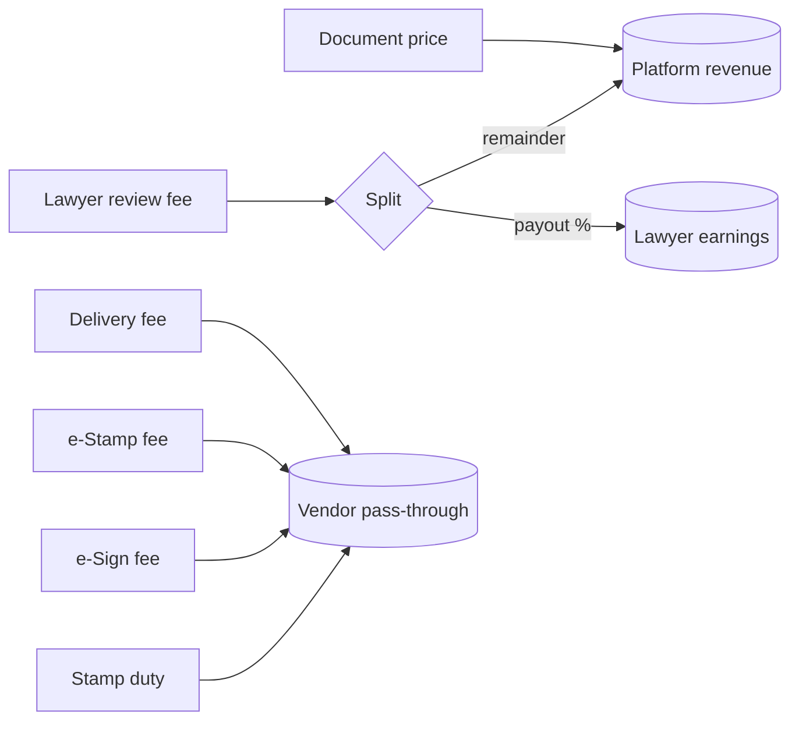
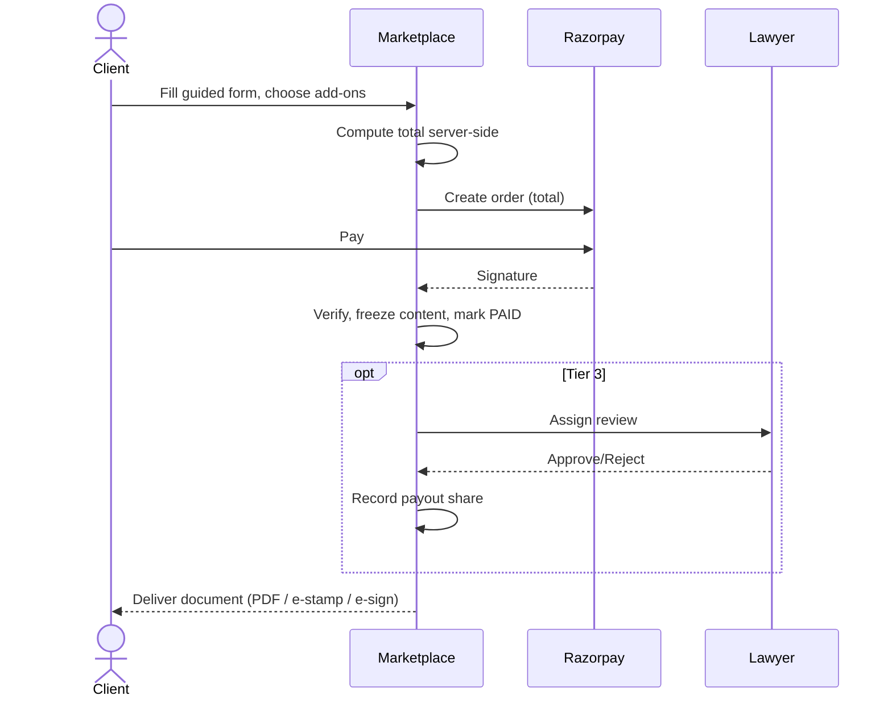

# Business Flow

## Purpose

Define how the marketplace makes money, who gets paid, and how each transaction
moves through the system - so product, ops, and finance share one model.

## Functional requirements

- Sell documents at a per-template price (`DocumentTemplate.price`).
- Optionally charge for add-ons: stamp duty, lawyer review, e-sign, e-stamp,
  physical delivery - each independently priced and **admin-toggleable**.
- Split lawyer-review revenue between platform and lawyer per
  `DOCS_LAWYER_PAYOUT_PERCENT`.
- Record every paid transaction against a `CustomerDocument` with an immutable
  content snapshot.

## Non-functional requirements

- **Reliability:** payment verification is idempotent; a document can be marked
  `PAID` at most once.
- **Auditability:** every price change, purchase, review, and payout is written to
  the audit log (`AuditService`).
- **Security:** amounts are computed server-side; the client never sets price.
- **Availability:** catalogue browsing is public and cacheable; a payment-provider
  outage never corrupts document state (order stays `DRAFT`/`PENDING_PAYMENT`).

## Revenue lines

## Order value composition

`total = price + stampDuty? + reviewFee? + eSignFee? + eStampFee? + deliveryFee?`

Each component is included only when its feature flag is on and the buyer opted in.
All components are persisted on `CustomerDocument` (`amount`, `stampDuty`,
`reviewFee`, `deliveryFee`, ...).

## Transaction lifecycle (business view)

## Refund policy (see payment-flow.md)

| Situation | Outcome |
|---|---|
| Payment captured, document never generated (system error) | Full refund |
| Lawyer rejects and no revision possible | Refund review fee, keep base doc |
| Buyer cancels before generation | Full refund |
| Document downloaded | No refund on base document (digital good) |

Refund execution and Razorpay mechanics are in [payment-flow.md](./payment-flow.md).

## Admin controls

All pricing knobs are admin-editable: per-template `price` (OPS, template editor),
and global defaults/flags (SUPER, settings) - see
[admin-panel.md](./admin-panel.md) and
[00-admin-configuration-framework.md](./00-admin-configuration-framework.md).
