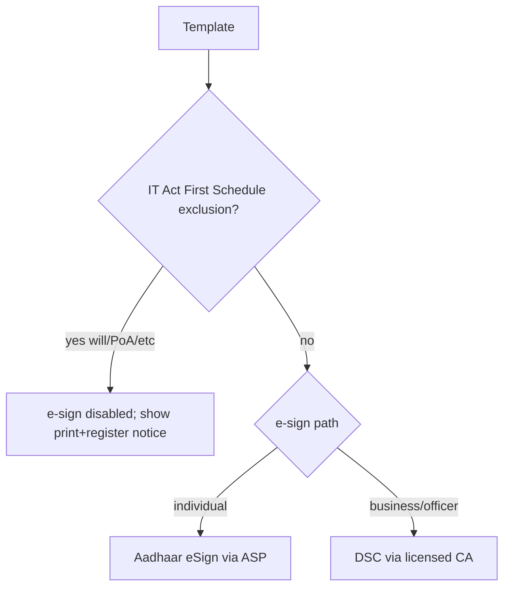

# Compliance (India)

## Purpose

Summarise the Indian legal framework relevant to generating, signing, stamping,
and storing documents, and state LawMitran's compliance posture and disclaimers.
This is engineering/product guidance, **not legal advice**; validate with counsel
before go-live and per document type.

## Core disclaimer (must be surfaced in-product)

> LawMitran generates legal documents but does **not** guarantee legal
> enforceability. Requirements such as stamping, registration, notarization,
> witnessing, and statutory compliance remain the user's responsibility where
> applicable. LawMitran does not provide legal advice.

Render this on: template detail, checkout, generated PDF footer/first page, and
anywhere stamp duty or e-sign/e-stamp is offered.

## Legal framework

| Instrument | Relevance to the marketplace |
|---|---|
| **Information Technology Act, 2000** | Recognizes electronic records and electronic signatures; governs e-sign validity and intermediary duties |
| **Indian Contract Act, 1872** | Validity of agreements (offer, acceptance, consideration, capacity) - templates must capture essentials |
| **Indian Stamp Act, 1899 + state Acts** | Stamp duty; unstamped/under-stamped instruments are inadmissible as evidence |
| **Registration Act, 1908** | Certain instruments (e.g., sale deed, lease > 11 months) require registration to be valid |
| **Aadhaar Act / eSign framework** | Aadhaar eSign via licensed ASPs; consent and OTP handled by the ASP |
| **DPDP Act, 2023** | Personal-data processing consent (already captured at signup: `consentAt`) |

## Electronic records & signatures

- **Electronic records** are valid under the IT Act, subject to exclusions in the
  First Schedule (e.g., wills, certain trusts, negotiable instruments other than
  cheques, powers of attorney for some purposes) - **flag these templates** as
  "not eligible for e-sign; print + wet sign / register".
- **Electronic signatures** recognized: (a) **Aadhaar eSign** (OTP/biometric via
  licensed ASP) and (b) **Digital Signature Certificate (DSC)** issued by a
  licensed CA. Both must go through a licensed provider ([esign-estamp.md](./esign-estamp.md)).

## Stamp duty, registration, notarization

- **Stamp duty** varies by state and instrument; the calculator gives an
  **estimate** only ([stamp-duty.md](./stamp-duty.md)). Execution on the correct
  stamp value is the user's responsibility.
- **Registration** is mandatory for some instruments (sale deed; lease > 11
  months). Templates flag this and advise sub-registrar registration; the platform
  does not register.
- **Notarization / witnesses:** some documents (affidavits, certain PoAs, wills)
  need notarization and/or witnesses. Templates include witness/notary blocks and
  a checklist; the platform can facilitate notarization as a service but does not
  substitute for it.

## Per-template compliance metadata (recommended)

Extend the template with advisory flags surfaced in the UI (config/content, not
enforcement):

| Flag | Meaning |
|---|---|
| `eSignEligible` | false for IT-Act-excluded documents |
| `requiresRegistration` | show sub-registrar guidance |
| `requiresNotary` | show notarization step/checklist |
| `witnessCount` | number of witness blocks to render |

## Data protection (DPDP)

- Consent captured at signup (`termsAcceptedAt`, `consentAt`, `marketingOptIn`).
- Purpose limitation: document PII used only to generate/deliver the document and
  for lawyer review when requested.
- Right to erasure: support account/document deletion; executed legal records may
  be retained per statutory record-keeping and flagged accordingly.

## Non-functional / governance

| Attribute | Approach |
|---|---|
| **Auditability** | Consent, generation, signing, stamping all logged |
| **Traceability** | PDF content hash + verification URL |
| **Reliability** | Compliance flags are data-driven and admin-maintained |

## Acceptance criteria

- The disclaimer appears on template detail, checkout, and the generated PDF.
- IT-Act-excluded templates disable e-sign and show print/register guidance.
- Stamp duty is always labelled an estimate with the responsibility notice.
- Registration/notary/witness requirements are shown where applicable.

> This document is informational and does not constitute legal advice. Validate
> all requirements with qualified counsel before production launch.
