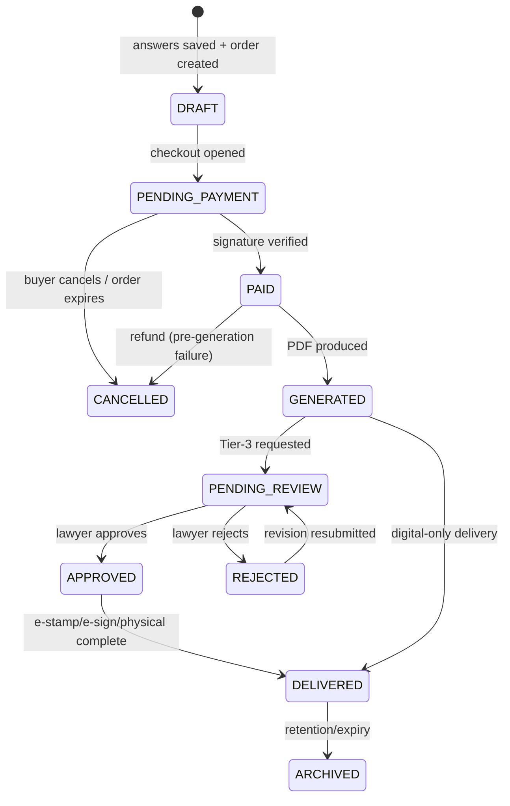

# Database Design

## Purpose

Define the data model for the marketplace: current tables, the additive changes
each phase needs, relationships, indexes, constraints, and the document state
machine. All migrations are **additive and backward-compatible**.

## Current schema (live)

From `backend/prisma/schema.prisma`:

- `DocumentCategory (id, name, slug*, description)`
- `DocumentTemplate (id, categoryId, title, slug*, keywords[], price, schemaJson,
  bodyTemplate, requiresStamp, stampBasis, status, version, language, active,
  timestamps)` - `status: TemplateStatus (DRAFT|PUBLISHED|ARCHIVED)`
- `CustomerDocument (id, userId, templateId, inputJson, contentHtml, providerOrderId,
  amount, pdfUrl, status, deliveryType, eStamped, eSigned, stampDuty, deliveryFee,
  deliveryAddress, paymentId, timestamps)` - `status: DocumentStatus
  (DRAFT|GENERATED|PAID|DELIVERED)`, `deliveryType: DeliveryType (DIGITAL|ESTAMP|PHYSICAL)`

## ER diagram (target)

```mermaid
erDiagram
    DocumentCategory ||--o{ DocumentTemplate : has
    DocumentTemplate ||--o{ CustomerDocument : generates
    User ||--o{ CustomerDocument : owns
    User ||--o{ CustomerDocument : "reviews (lawyerId)"
    CustomerDocument ||--o{ DocumentReviewEvent : "review trail"
    StampDutyRate ||..|| DocumentTemplate : "priced by stampBasis"
    Bundle ||--o{ BundleTemplate : contains
    DocumentTemplate ||--o{ BundleTemplate : "in bundles"
    User ||--o{ Entitlement : holds

    DocumentCategory { string id PK; string name; string slug UK }
    DocumentTemplate { string id PK; string categoryId FK; decimal price; json schemaJson; string bodyTemplate; bool requiresStamp; string stampBasis; enum status; int version }
    CustomerDocument { string id PK; string userId FK; string templateId FK; json inputJson; string contentHtml; string pdfUrl; decimal amount; enum status; string lawyerId FK; enum reviewStatus; decimal reviewFee; decimal lawyerPayout }
    DocumentReviewEvent { string id PK; string documentId FK; string actorId FK; string action; string comment; datetime createdAt }
    StampDutyRate { string id PK; string state; string documentType; string calcType; decimal flatAmount; decimal percent; decimal minAmount }
    Bundle { string id PK; string name; decimal price; enum period }
    BundleTemplate { string bundleId FK; string templateId FK }
    Entitlement { string id PK; string userId FK; string bundleId FK; datetime expiresAt }
```

## Additive changes by phase

### Phase 3 - Stamp duty

```prisma
model StampDutyRate {
  id           String   @id @default(uuid())
  state        String
  documentType String   // matches DocumentTemplate.stampBasis
  calcType     String   // FLAT | PERCENT | SLAB
  flatAmount   Decimal? @db.Decimal(10, 2)
  percent      Decimal? @db.Decimal(5, 2)
  minAmount    Decimal? @db.Decimal(10, 2)
  active       Boolean  @default(true)
  updatedAt    DateTime @updatedAt
  @@unique([state, documentType])
}
```
`CustomerDocument.stampDuty` already exists to store the computed value.

### Phase 4 - Lawyer review

```prisma
enum DocReviewStatus { NONE REQUESTED ASSIGNED IN_REVIEW APPROVED REJECTED }

// CustomerDocument (add columns)
//   lawyerId     String?
//   reviewStatus DocReviewStatus @default(NONE)
//   reviewFee    Decimal? @db.Decimal(10,2)
//   lawyerPayout Decimal? @db.Decimal(10,2)
//   @@index([lawyerId, reviewStatus])

model DocumentReviewEvent {
  id         String   @id @default(uuid())
  documentId String
  document   CustomerDocument @relation(fields: [documentId], references: [id])
  actorId    String            // client, lawyer, or admin user id
  action     String            // REQUESTED|ASSIGNED|COMMENT|APPROVED|REJECTED|REVISION
  comment    String?
  createdAt  DateTime @default(now())
  @@index([documentId, createdAt])
}
```

### Phase 6/7 - Bundles & entitlements

```prisma
enum BundlePeriod { ONE_TIME MONTHLY YEARLY }
model Bundle         { id String @id @default(uuid()); name String; slug String @unique; price Decimal @db.Decimal(10,2); period BundlePeriod; active Boolean @default(true) }
model BundleTemplate { bundleId String; templateId String; @@id([bundleId, templateId]) }
model Entitlement    { id String @id @default(uuid()); userId String; bundleId String; expiresAt DateTime?; createdAt DateTime @default(now()); @@index([userId]) }
```

### Enum extension - DocumentStatus

Add values (Prisma enums extend safely): `PENDING_PAYMENT`, `PENDING_REVIEW`,
`APPROVED`, `REJECTED`, `CANCELLED`, `ARCHIVED`. Existing `DRAFT|GENERATED|PAID|DELIVERED`
retain meaning.

## Indexes & constraints

| Table | Index / constraint | Reason |
|---|---|---|
| `DocumentTemplate` | `@@index([categoryId, active])` (live) | Catalogue listing |
| `DocumentTemplate` | `slug @unique` (live) | SEO URLs |
| `CustomerDocument` | `@@index([userId, status])` (live) | "My documents" |
| `CustomerDocument` | `@@index([lawyerId, reviewStatus])` (P4) | Review queue |
| `CustomerDocument` | `providerOrderId` lookup | Payment verify (add index) |
| `StampDutyRate` | `@@unique([state, documentType])` (P3) | One rate per pair |
| `DocumentReviewEvent` | `@@index([documentId, createdAt])` (P4) | Review timeline |

## State machine

Current code path: `DRAFT -> PAID` (on `verifyPayment`). Target lifecycle:



Invariants:

- `contentHtml` is frozen at the `PAID` transition and never mutated afterwards.
- A document can enter `PAID` at most once (idempotent verify - see
  [payment-flow.md](./payment-flow.md)).
- `reviewStatus` transitions only when `DOCS_LAWYER_REVIEW_ENABLED` is on.

## Migration considerations

- All changes are **additive** (new tables, nullable columns, new enum values);
  no column drops or type changes.
- Backfill: none required; new columns default to `NONE`/null.
- Apply with `npx prisma migrate deploy` (per DevOps docs); safe under
  blue-green because old code ignores new columns.
