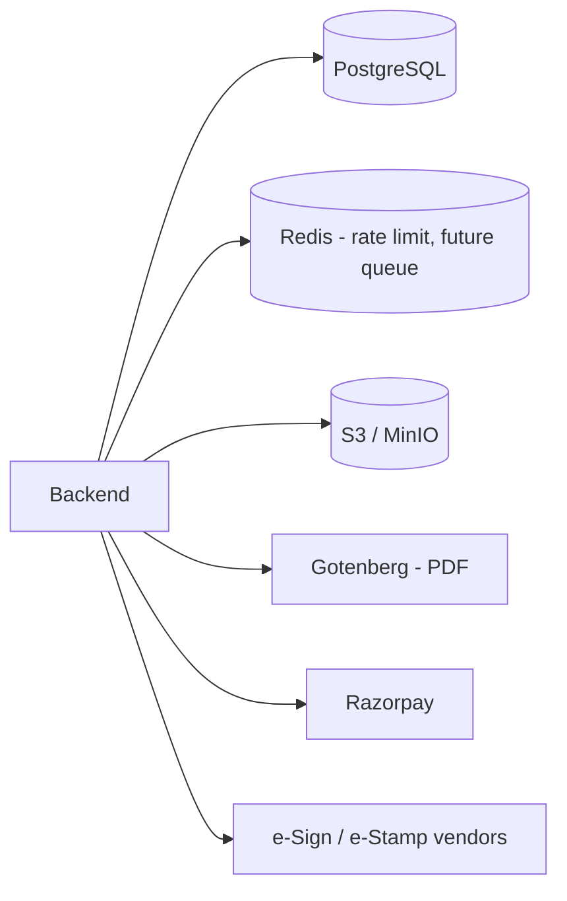

# Deployment

## Purpose

Operational guide for shipping and running the marketplace features: environment
variables/settings, Docker services (PDF engine, Redis), storage, scaling,
caching, monitoring, logging, backup, and disaster recovery. Complements the
platform DevOps set in [`../devops`](../devops/README.md).

## Configuration split

| Kind | Where | Examples |
|---|---|---|
| Infra secrets | `backend/.env` | `DATABASE_URL`, `S3_*`, `RAZORPAY_*` |
| Feature flags / behaviour | Admin settings (DB) | `DOCS_*` (see [00](./00-admin-configuration-framework.md)) |
| Build-time | frontend build | `NEXT_PUBLIC_API_URL`, `NEXT_PUBLIC_SITE_URL` |

Rule: anything an operator may want to change at runtime is a **setting**, not an
env var (so it needs no redeploy).

## New runtime dependencies

### PDF engine

- **Gotenberg** (recommended): add a service to `infra/docker/compose.yml`, reach
  it on the internal network; select via `DOCS_PDF_ENGINE=gotenberg`. No Chromium
  in the app image.
- **Puppeteer**: install Chromium + fonts in the backend image; heavier; select via
  `DOCS_PDF_ENGINE=puppeteer`.

### Redis

- Already provisioned. Used for rate limiting now; enable a BullMQ queue for PDF/
  e-sign polling/SLA reminders when moving generation off the request path.

## Scaling & caching

- Public catalogue: FE caches lists 300 s (`next: { revalidate }`); consider CDN
  (CloudFront) later. Backend queries are indexed.
- App containers are stateless -> scale horizontally behind nginx/ALB.
- PDF engine scales independently; put generation on a queue for bursts.
- Settings are cached 30 s in-process; flag changes propagate within one TTL.

## Monitoring & logging

| Signal | Tool |
|---|---|
| Uptime (catalogue, `/api/health`) | external monitor |
| PDF generation failures / latency | app metrics + logs (`DOC_PDF_*`) |
| Payment reconciliation mismatches | nightly job -> admin alert |
| Review SLA breaches | scheduled check -> admin alert |
| Errors | Sentry (recommended) + `AuditService` trail |

Follow [`../devops/19-monitoring.md`](../devops/19-monitoring.md) for the stack.

## Backup & disaster recovery

- **Database:** nightly `pg_dump` + offsite (DevOps doc 16/20). Document rows and
  frozen `contentHtml` are the source of truth; PDFs are regenerable from them.
- **Object storage:** mirror executed (e-signed/e-stamped) documents offsite -
  these are **not** regenerable and are legal records.
- **RPO/RTO:** align with platform targets (RPO <= 24h, RTO 2-4h). Executed
  documents require the stricter, immutable retention.
- Restore drill: rebuild DB, re-point S3, regenerate any missing PDFs from
  `contentHtml`.

## Rollout

- Merge behind flags (default off) -> run migration (`prisma migrate deploy`) ->
  enable per feature in admin settings -> smoke test that feature -> monitor.
- Blue-green safe: additive migrations; old code ignores new columns.

## Rollback

- Disable the feature flag in admin (instant, no deploy) for behaviour rollback.
- Code rollback: redeploy previous image (DevOps doc 18); additive migrations mean
  no DB rollback needed.

## Deploy checklist (marketplace-specific)

- [ ] `documents` settings group present; flags default off.
- [ ] PDF engine reachable; `DOCS_PDF_ENGINE` set.
- [ ] Razorpay keys valid (test vs live per env).
- [ ] e-sign/e-stamp provider keys set before enabling those flags.
- [ ] Stamp-duty rates seeded for launch states.
- [ ] S3 bucket + lifecycle rules for `documents/` prefix.
- [ ] Backups include executed-document objects offsite.
- [ ] Smoke: generate -> pay -> PDF -> verify on the target environment.
