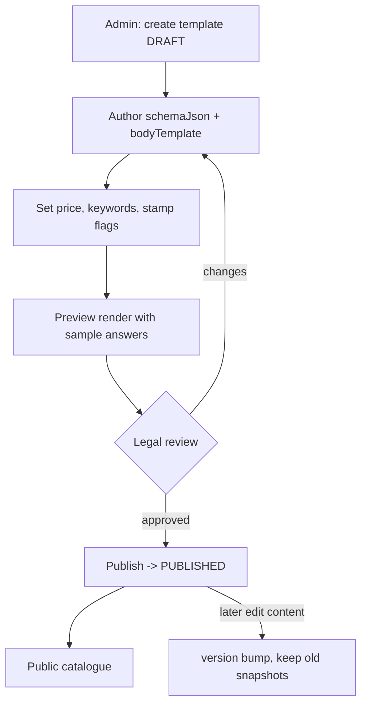

# Document Catalog

## Purpose

Define the catalogue structure, the template authoring contract (`schemaJson` +
`bodyTemplate`), and the initial content set. This is what content/legal authors
and admins use to add documents without engineering.

## Functional requirements

- Group documents into `DocumentCategory` (e.g., Personal, Property, Business,
  Notices).
- Each `DocumentTemplate` carries: guided-form schema, body template, price,
  keywords (SEO), stamp flags, language, version, publish status.
- Authors create/edit templates in the admin editor; publishing makes them public.
- Editing a published template's content **bumps `version`**; already-purchased
  documents keep their frozen snapshot.

## Template authoring contract

`schemaJson` (guided form):

```json
{
  "fields": [
    { "name": "landlordName", "label": "Landlord name", "type": "text", "required": true, "section": "Landlord" },
    { "name": "tenantName",   "label": "Tenant name",   "type": "text", "required": true, "section": "Tenant" },
    { "name": "monthlyRent",  "label": "Monthly rent (INR)", "type": "number", "required": true, "section": "Terms" },
    { "name": "startDate",    "label": "Start date", "type": "date", "required": true, "section": "Terms" },
    { "name": "term",         "label": "Duration (months)", "type": "number", "required": true, "section": "Terms" }
  ]
}
```

`bodyTemplate` (mustache-lite - `{{field}}` replaced with escaped answers; blanks
render as ruled lines):

```
RENTAL AGREEMENT

This agreement is made on {{startDate}} between {{landlordName}} ("Landlord")
and {{tenantName}} ("Tenant") for a term of {{term}} months at a monthly rent of
Rs. {{monthlyRent}}.
```

Rules:
- Field `type`: `text | textarea | date | number | select` (+ `options` for select).
- `required` defaults to true (`required !== false`).
- `section` groups fields into wizard steps on the frontend.
- Only `{{fieldName}}` tokens present in `schemaJson` should be used in the body.

```mermaid
flowchart LR
    schema[schemaJson<br/>fields] --> wizard[Guided form wizard]
    wizard --> answers[inputJson]
    body[bodyTemplate<br/>&#123;&#123;field&#125;&#125;] --> render[renderBody]
    answers --> render
    render --> html[contentHtml]
```



## Initial content set (Phase 1)

Prioritised by search volume x automatability x lead value:

| Category | Template | Price band | Stamp | AI prefill |
|---|---|---|---|---|
| Personal | Rental / lease agreement | 149-299 | Yes | Yes |
| Personal | Affidavit (name/address/income) | 99-199 | Yes | Yes |
| Personal | General Power of Attorney | 199-399 | Yes | Yes |
| Personal | Will | 299-599 | No | Yes |
| Notices | Cheque-bounce notice (S.138) | 199-399 | No | Yes |
| Notices | Legal / recovery notice | 199-399 | No | Yes |
| Business | Non-Disclosure Agreement | 99-199 | No | Yes |
| Business | Employment letters (offer/appointment/relieving) | 99-149 | No | No |
| Business | Consultant / service agreement | 149-299 | Sometimes | Yes |
| Business | Partnership deed | 299-599 | Yes | Yes |
| Money | Loan agreement / promissory note | 99-199 | Yes | Yes |
| Personal | RTI application | 49-99 | No | Yes |

Full catalogue and tiering: [../document-marketplace-catalogue.md](../document-marketplace-catalogue.md).

## Authoring workflow



## Non-functional requirements

- **Auditability:** create/update/publish/version logged (`DOC_TEMPLATE_*`).
- **Reliability:** version bump guarantees purchased documents are reproducible.
- **Performance:** catalogue queries indexed (`[categoryId, active]`), FE caches
  category/list for 300s.
- **Security:** authoring is `OPS`-scoped; body is escaped at render to prevent
  HTML injection into generated documents.

## Acceptance criteria

- A new template can be authored, previewed, and published entirely in the admin
  UI, then purchased end to end.
- Editing a published body increments `version`; a previously purchased document
  still renders its original `contentHtml`.
- Every field marked required blocks checkout until filled.
