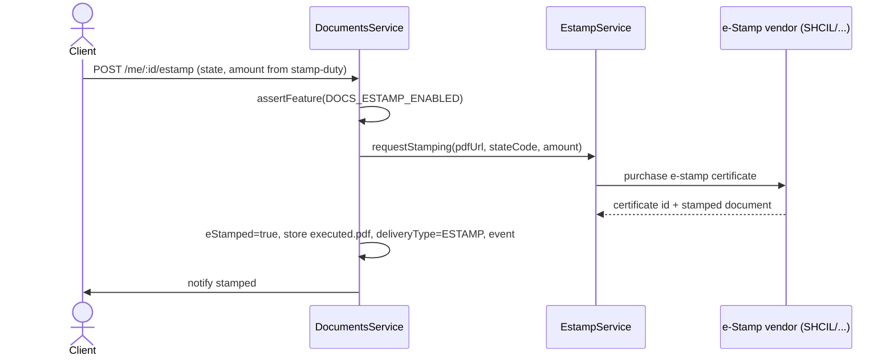

# e-Sign & e-Stamp Integration

## Purpose

Wire the existing placeholder services (`common/esign/esign.service.ts`,
`common/estamp/estamp.service.ts`) to licensed Indian providers so a paid document
can be legally e-signed and/or e-stamped, then delivered. **Config:**
`DOCS_ESIGN_ENABLED` / `DOCS_ESTAMP_ENABLED` with provider + key settings.

## Current state

Both services are explicit stubs that return a `PENDING` reference and log - no
vendor selected. They are **not yet imported** by `DocumentsService`. This phase
adds the provider calls, webhooks, status tracking, and the flags/keys.

## Provider options

| Capability | Providers | Setting |
|---|---|---|
| e-Sign (Aadhaar eSign / DSC) | Digio, Leegality, eMudhra | `DOCS_ESIGN_PROVIDER` |
| e-Stamp | SHCIL (SHCILEstamp), Digio, Leegality | `DOCS_ESTAMP_PROVIDER` |

Keys are admin secrets (`DOCS_ESIGN_API_KEY/_SECRET`, `DOCS_ESTAMP_API_KEY`).
A missing key **disables** the feature (fail safe), even if the flag is on.

## e-Sign flow

```mermaid
sequenceDiagram
    actor Client
    participant SVC as DocumentsService
    participant ES as EsignService
    participant V as ASP (Digio/Leegality/eMudhra)
    participant WH as Webhook
    Client->>SVC: POST /me/:id/esign
    SVC->>SVC: assertFeature(DOCS_ESIGN_ENABLED); doc GENERATED; signed PDF
    SVC->>ES: requestSignature(pdfUrl, signerEmail/mobile)
    ES->>V: create sign request (Aadhaar eSign / DSC)
    V-->>ES: referenceId, signing URL
    SVC-->>Client: redirect to signing URL
    Client->>V: complete Aadhaar OTP / DSC
    V-->>WH: POST /webhooks/esign (HMAC)
    WH->>SVC: mark eSigned=true, store executed.pdf, event
    SVC->>Client: notify signed
```

## e-Stamp flow



## Interface (extend the stubs)

```ts
// EsignService (target)
requestSignature(documentKey: string, signer: { email?: string; mobile?: string }):
  Promise<{ referenceId: string; signingUrl: string; status: 'PENDING' }>;
handleWebhook(payload: unknown, signature: string): Promise<{ documentId: string; status: 'SIGNED' | 'FAILED' }>;

// EstampService (target)
requestStamping(documentKey: string, stateCode: string, amountPaise: number):
  Promise<{ referenceId: string; certificateUrl?: string; status: 'PENDING' | 'DONE' }>;
```

Providers are selected at runtime from `DOCS_ESIGN_PROVIDER` /
`DOCS_ESTAMP_PROVIDER` via a small strategy switch; adding a vendor = one adapter.

## Webhooks

- `POST /webhooks/esign`, `POST /webhooks/estamp` - `@Public()`, HMAC-verified with
  the provider secret; idempotent on `referenceId`.
- On success: download the executed artifact, store as
  `.../v{version}/executed.pdf`, set `eSigned`/`eStamped`, append a
  `DocumentReviewEvent`-style trail entry, transition toward `DELIVERED`.

## Non-functional requirements

| Attribute | Approach |
|---|---|
| **Security** | HMAC-verified webhooks; secrets masked; executed docs private + signed URL |
| **Reliability** | Idempotent by `referenceId`; retries on transient vendor errors |
| **Auditability** | Request + callback + certificate id logged |
| **Availability** | Vendor outage: request stays `PENDING`, client sees status; no data loss |
| **Compliance** | Only licensed ASP/vendor; Aadhaar eSign consent captured by provider |

## Compliance notes

e-Signatures via a licensed ASP and e-stamps via a licensed vendor are recognized
under the IT Act and Indian Stamp Act. LawMitran orchestrates but does not itself
certify; enforceability still depends on correct stamping/registration for the
document type. See [compliance.md](./compliance.md). **Start vendor selection and
contracting early - this is the longest-lead item on the roadmap.**

## Acceptance criteria

- With flags/keys set, a client can e-sign and/or e-stamp a generated document and
  receive the executed PDF.
- Missing provider key disables the option even if the flag is on.
- Webhooks are idempotent and HMAC-verified; a replayed callback is a no-op.
- Executed documents are stored immutably and delivered via signed URL.
