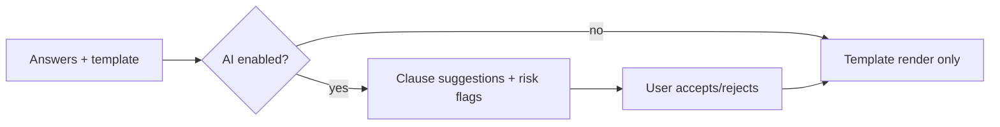

# Future Enhancements

## Purpose

Capture post-roadmap ideas (Phase 8+) so they are designed against, not bolted on.
These are intentionally not scheduled; they extend the same models and flags.

## AI-assisted drafting (Phase 8)

Build on the existing `ai-intake` LLM client (`llm.client.ts`) and the
settings-gated AI keys (`AI_ENABLED`, `AI_PROVIDER`, `AI_API_KEY`, `AI_MODEL`).

### Functional requirements

- **Clause suggestions:** given a template + answers, propose optional clauses
  (e.g., lock-in period, maintenance split) the user can accept into the document.
- **Risk analysis:** flag missing/uncommon terms ("no security-deposit clause",
  "no jurisdiction clause") with plain-language explanations.
- **Free-form assist:** convert a description into a first-draft set of clauses,
  always mapped back to an approved template - never a blank-canvas contract.

### Guardrails

- Output is **suggestion only**; the authoritative document is still the
  template-rendered body. AI text is inserted into named, reviewable slots.
- All AI features respect `AI_ENABLED` and degrade to the curated experience when
  off (same pattern as the current `prefill`).
- Risk analysis must carry the non-advice disclaimer (see
  [compliance.md](./compliance.md)).

## Other enhancements

| Idea | Extends |
|---|---|
| Multi-language documents (Hindi + regional) | `DocumentTemplate.language` (already present) |
| Template marketplace for lawyers to publish/sell their own precedents | `lawyer-review` + entitlements |
| Aadhaar-eSign flow for individuals | [esign-estamp.md](./esign-estamp.md) |
| DigiLocker issuance/verification | storage + verification QR |
| Bulk generation API for B2B (HR letters) | `api-design` + subscriptions |
| Document analytics for admins (funnels, drop-off) | [admin-panel.md](./admin-panel.md) |
| Scheduled reminders (renew rental, expiring notice) | notifications + scheduler |

## Non-functional targets for AI features

- **Latency:** prefill/suggestions p95 < 4 s; never block checkout (async, optional).
- **Cost control:** cap tokens per request; cache suggestions per (template, answers hash).
- **Auditability:** log model, prompt version, and accepted suggestions per document.
- **Safety:** no hallucinated statutory citations; extraction/suggestion only.
