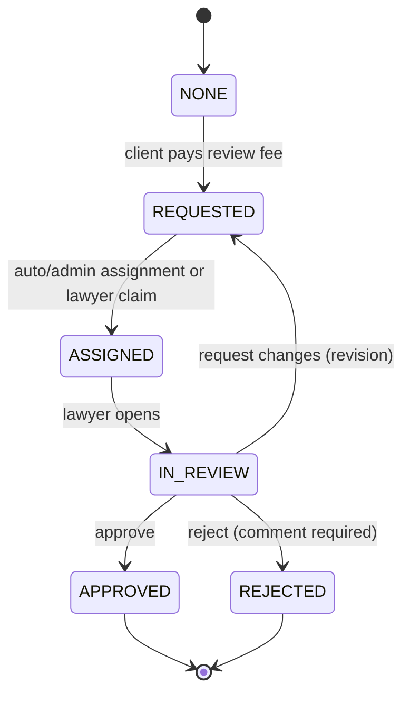
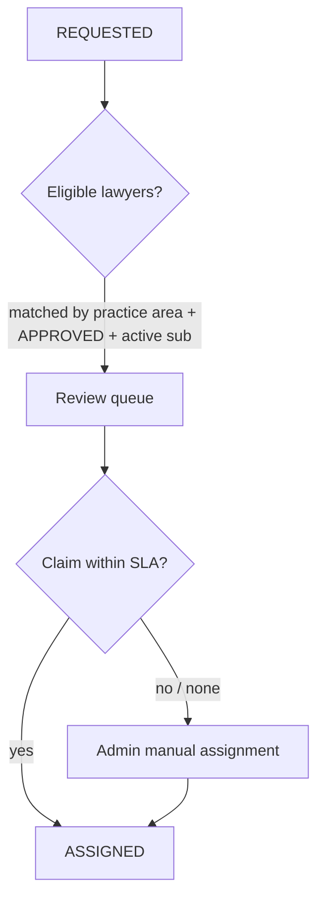
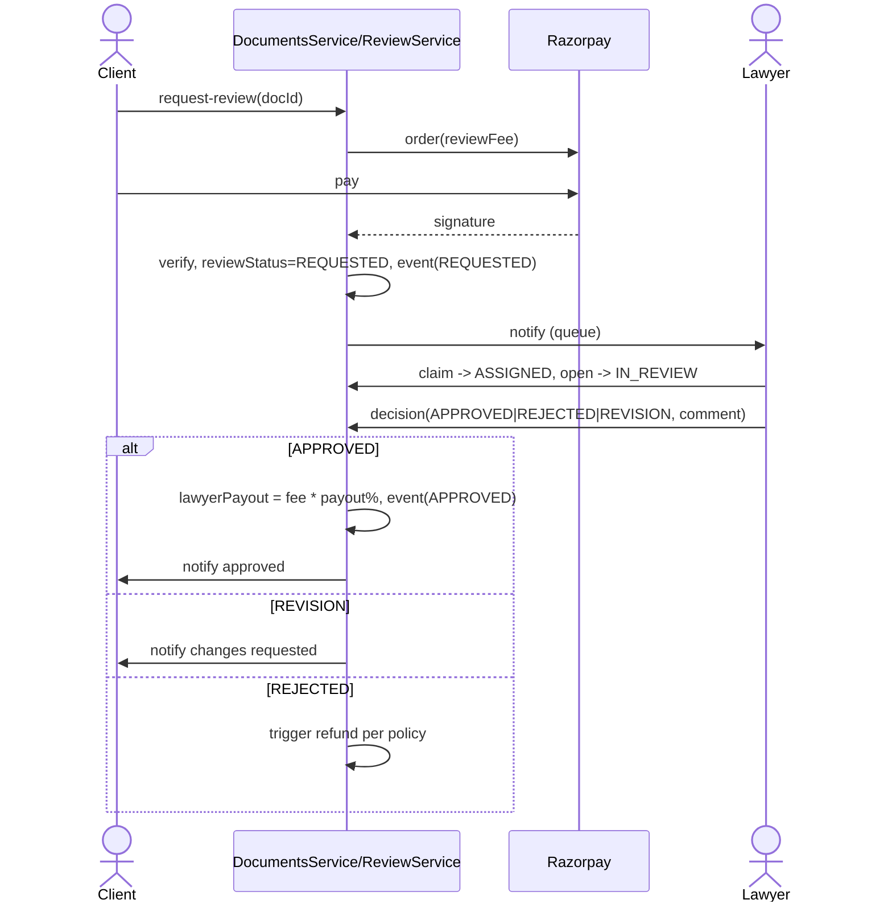

# Lawyer Review Workflow (Tier 3)

## Purpose

Let a client upgrade a generated document to a **lawyer-reviewed** document: an
`APPROVED` advocate reviews it, requests changes or approves, and earns a revenue
share. This is the differentiator that turns a document sale into a lawyer
engagement. **Config:** `DOCS_LAWYER_REVIEW_ENABLED`, `DOCS_LAWYER_REVIEW_FEE`,
`DOCS_LAWYER_PAYOUT_PERCENT`.

## Functional requirements

- Client requests review on a paid document (`POST /me/:id/request-review`),
  paying the review fee.
- The request enters a queue; an eligible lawyer (`verificationStatus = APPROVED`,
  active subscription) claims/gets assigned.
- Lawyer reads the document, adds comments, and decides: **Approve**, **Request
  changes** (revision), or **Reject**.
- On approval, record the lawyer payout (`fee * DOCS_LAWYER_PAYOUT_PERCENT%`).
- Full trail in `DocumentReviewEvent`; SLA tracked and surfaced.

## Data model

`CustomerDocument` gains `lawyerId`, `reviewStatus (DocReviewStatus)`, `reviewFee`,
`lawyerPayout`; `DocumentReviewEvent` records each action. See
[database-design.md](./database-design.md#phase-4---lawyer-review).

## State machine (review sub-flow)

## Assignment strategy

Eligibility reuses the lead-routing rules: only `APPROVED` lawyers with a
non-`EXPIRED` subscription; match on the template's category/practice area.

## Review sequence

## Revenue sharing

- `reviewFee` defaults to `DOCS_LAWYER_REVIEW_FEE` unless the template overrides.
- On approval: `lawyerPayout = round(reviewFee * DOCS_LAWYER_PAYOUT_PERCENT / 100)`,
  platform keeps the remainder.
- Payouts accrue to the lawyer's ledger (settlement is out of scope here; record
  the liability and expose it in the lawyer dashboard + admin FINANCE reports).

## UI

- **Client:** "Get it lawyer-reviewed" CTA on the document detail; review timeline
  with statuses and comments.
- **Lawyer:** `/dashboard/lawyer/reviews` queue (SLA countdown), review screen with
  document, comment box, and Approve / Request changes / Reject.
- **Admin:** reassign, monitor SLA breaches, view payouts.

## Non-functional requirements

| Attribute | Approach |
|---|---|
| **Reliability** | State transitions guarded; payout computed once at approval |
| **Auditability** | Every action -> `DocumentReviewEvent` + audit log |
| **Availability** | Queue independent of client flow; assignment retriable |
| **Security** | Only assigned lawyer can act; content access scoped |
| **Fairness** | SLA + reassignment prevents stuck documents |

## Compliance

The reviewing lawyer is a named, verified advocate; LawMitran facilitates but does
not itself advise. Rejections and revisions follow the refund policy in
[business-flow.md](./business-flow.md). See [compliance.md](./compliance.md).

## Acceptance criteria

- With the flag off, the review CTA is hidden and the API returns `403`.
- A paid review routes to an eligible lawyer and can be approved/rejected/revised.
- Approval records `lawyerPayout` = fee x payout%; a rejection triggers the correct
  refund.
- SLA breaches surface to admin for reassignment.
