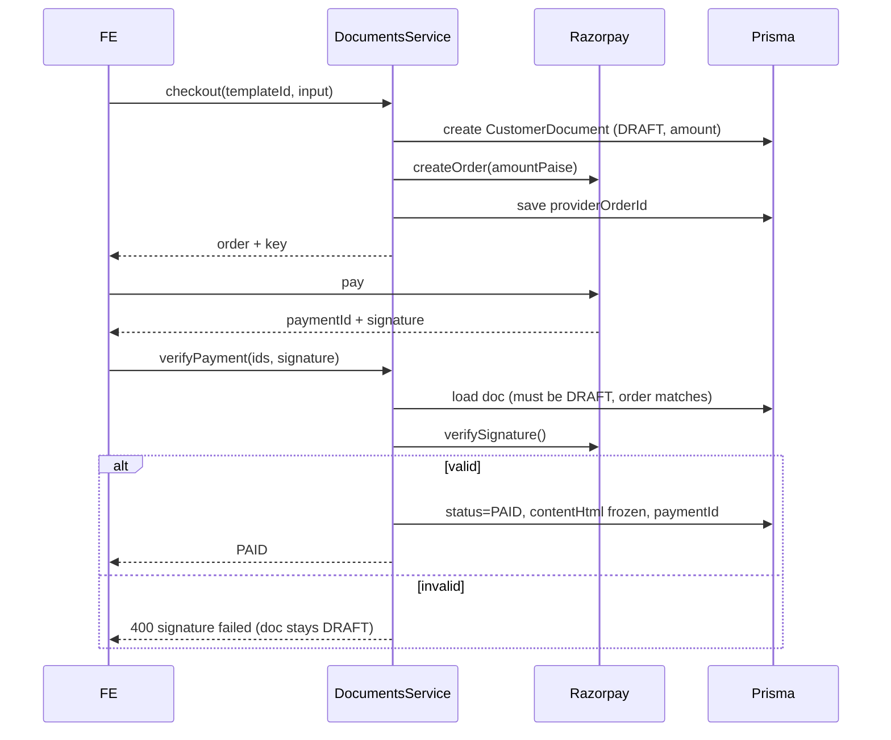
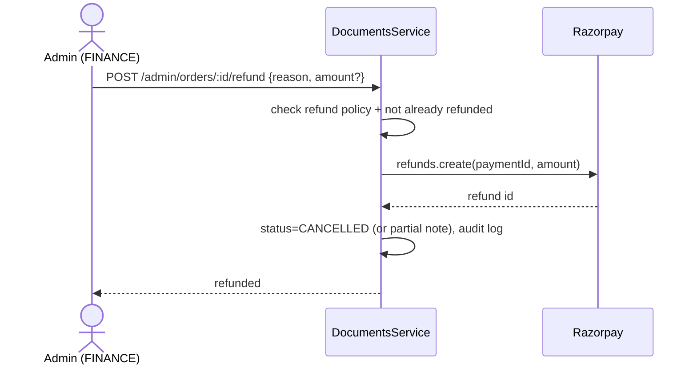

# Payment Flow

## Purpose

Document the money path end to end: order creation, verification, idempotency,
add-on composition, refunds, and reconciliation. Payments use Razorpay via
`common/payments/razorpay.service.ts` (`createOrder`, `verifySignature`,
`getKeyId`); keys are admin-managed settings (`RAZORPAY_KEY_ID/SECRET/WEBHOOK_SECRET`).

## Functional requirements

- Create a Razorpay order for the **server-computed** total (base + enabled add-ons).
- Verify the payment signature before unlocking any document content.
- Freeze `contentHtml` exactly once at successful verification (idempotent).
- Support refunds (admin, `FINANCE` scope) per the policy in
  [business-flow.md](./business-flow.md).

## Non-functional requirements

| Attribute | Approach |
|---|---|
| **Security** | Amount computed server-side; signature verified with secret; webhook HMAC-verified |
| **Reliability** | Idempotent verify (`status != DRAFT` guard); order/document mismatch rejected |
| **Auditability** | Order, payment id, amount, refunds logged |
| **Availability** | Razorpay outage leaves document in `DRAFT`/`PENDING_PAYMENT`; retriable |

## Purchase sequence (Live)



## Idempotency & integrity rules

1. `verifyPayment` rejects if `status != DRAFT` -> a document is paid at most once.
2. `providerOrderId` must equal the submitted `razorpayOrderId`.
3. Amount is never taken from the client; it is read from the template/quote.
4. A **webhook** (`POST /webhooks/payments`, HMAC via `RAZORPAY_WEBHOOK_SECRET`)
   is the backstop for missed client callbacks and marks paid orders whose client
   verify never arrived.

## Add-on composition (P3+)

At checkout, the server builds the total from enabled features only:

```
total = template.price
      + (DOCS_STAMP_DUTY_ENABLED   ? computeStampDuty(state, template) : 0)
      + (DOCS_LAWYER_REVIEW_ENABLED && wantsReview ? reviewFee : 0)
      + (DOCS_ESIGN_ENABLED  && wantsEsign  ? eSignFee  : 0)
      + (DOCS_ESTAMP_ENABLED && wantsEstamp ? eStampFee : 0)
      + (DOCS_PHYSICAL_DELIVERY_ENABLED && wantsDelivery ? deliveryFee : 0)
```

Components persist on `CustomerDocument` (`stampDuty`, `reviewFee`, `deliveryFee`,
...).

## Refund flow (Planned P2)



Refund eligibility encodes the [business-flow](./business-flow.md#refund-policy)
matrix (system failure, lawyer rejection, pre-generation cancel).

## Reconciliation

- Nightly job compares Razorpay settlements with `CustomerDocument` where
  `status in (PAID, DELIVERED)` and `paymentId not null`.
- Mismatches raise an admin notification (`NotifyService.notifyAdmins`).

## Error handling

| Error | Client UX | Server state |
|---|---|---|
| Signature invalid | "Payment could not be verified" | remains DRAFT |
| Order mismatch | generic failure | remains DRAFT |
| Already paid | idempotent success (return PAID) | unchanged |
| Razorpay down at create | "Try again" | no document created / DRAFT without order |
