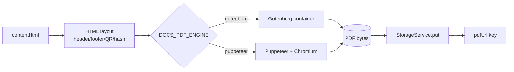
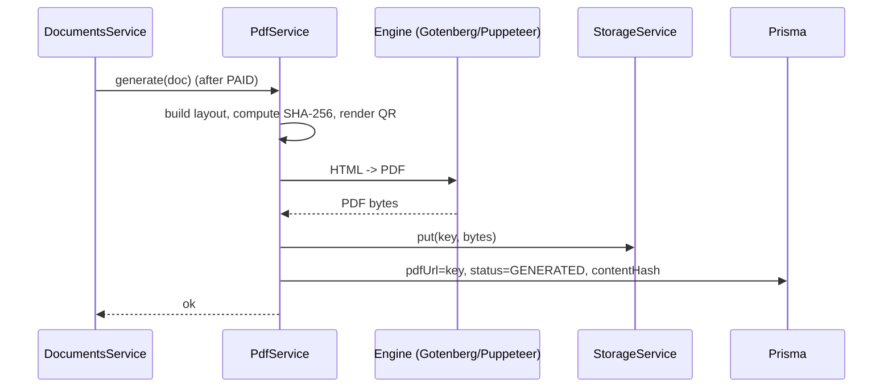

# PDF Generation

## Purpose

Turn the rendered `contentHtml` of a paid document into a professional, verifiable
PDF: branded header/footer, page numbers, watermark for unpaid previews, a
verification QR + content hash, stored versioned in S3/MinIO. **Config:**
`DOCS_PDF_ENABLED`, engine via `DOCS_PDF_ENGINE`.

## Functional requirements

- Generate a PDF from `contentHtml` after payment (`PAID` -> `GENERATED`).
- Apply an HTML layout: letterhead header, footer with page `n of m`, generation
  timestamp, and document id.
- Embed a **content hash** (SHA-256 of the frozen `contentHtml`) and a **QR code**
  linking to a public verification URL.
- Watermark preview/draft renders; final paid PDF is clean (or carries a subtle
  "Generated via LawMitran" footer only).
- Store to `documents/{userId}/{docId}/v{version}/document.pdf`; save the key on
  `pdfUrl`.

## Architecture



### Engine choice (admin-switchable)

| Engine | Pros | Cons | Deploy note |
|---|---|---|---|
| **Gotenberg** (recommended) | Isolated container, no Chromium in app image, scalable | Extra service | Add `gotenberg` to compose; call its HTTP API |
| **Puppeteer** | In-process, simple | Chromium (~300 MB) + fonts in app image; heavier | Install Chromium on the EC2/image |

`DOCS_PDF_ENGINE` lets ops switch without a code change; default `gotenberg`.

## Generation sequence



Generation runs inline after `verifyPayment` with one retry; on failure the
document stays `PAID` and a background retry (or `POST /me/:id/pdf` regenerate)
completes it. When Redis-backed queues land (see [architecture.md](./architecture.md#queue-future)),
move this to a job.

## Verification

- Public route `GET /verify/:docId` returns `{ valid, generatedAt, templateTitle,
  hashMatches }` by recomputing SHA-256 over the stored `contentHtml`.
- The QR in the footer encodes `https://lawmitran.com/verify/{docId}`.
- Verification confirms **authenticity of generation**, not legal enforceability
  (see disclaimer in [compliance.md](./compliance.md)).

## Header / footer / watermark spec

```
+------------------------------------------------------+
|  [LawMitran logo]                 Document #d91a...   |  <- header
+------------------------------------------------------+
|                                                      |
|   ...document body rendered from contentHtml...      |
|                                                      |
+------------------------------------------------------+
|  Generated 2026-07-15  |  [QR]  |  Page 1 of 3       |  <- footer
+------------------------------------------------------+
```

Preview PDFs (pre-payment) overlay a diagonal `PREVIEW - NOT VALID` watermark and
use the truncated preview text only.

## Non-functional requirements

| Attribute | Target |
|---|---|
| **Performance** | Single doc render p95 < 3 s (Gotenberg); async for bulk |
| **Scalability** | Engine scales horizontally; app stays stateless |
| **Reliability** | Idempotent by `(docId, version)`; retry on transient failure |
| **Security** | PDFs are private objects; served via signed URLs ([storage.md](./storage.md)) |
| **Auditability** | `DOC_PDF_GENERATED` logged with hash + version |

## Versioning

- PDF key includes `v{template.version}`; regenerating after a template edit
  writes a new version, preserving the original.
- `contentHash` is stored per document for tamper-evidence.

## Acceptance criteria

- Paying for a document produces a downloadable PDF with header/footer, page
  numbers, QR, and hash.
- Switching `DOCS_PDF_ENGINE` changes the engine with no redeploy.
- `/verify/:docId` returns `hashMatches: true` for an untampered document.
- With `DOCS_PDF_ENABLED` off, purchase still works and the UI shows HTML only.
