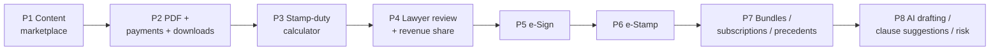

# Roadmap

## Purpose

Sequence the marketplace work into shippable phases. Each phase is independently
deployable, defaults to **off** behind a feature flag, and builds on the previous
one. Phases 1-2 (partly) are already live.

## Phase overview

## Phase 1 - Content marketplace (largely LIVE)

- Top legal templates authored via the admin template editor.
- Categories, guided-form schema, watermarked preview, AI prefill.
- Flag: `DOCS_MARKETPLACE_ENABLED`.
- Remaining work: author the top ~15 templates (content) - see
  [document-catalog.md](./document-catalog.md).

## Phase 2 - PDF, payments, downloads

- Razorpay checkout + verification are **live**; add server-side **PDF
  generation** and downloadable, versioned PDFs.
- Flag: `DOCS_PDF_ENABLED`, engine `DOCS_PDF_ENGINE`.
- Docs: [pdf-generation.md](./pdf-generation.md), [payment-flow.md](./payment-flow.md).

## Phase 3 - Stamp-duty calculator

- State-wise stamp-duty rate table + calculator; duty added to checkout.
- Flags: `DOCS_STAMP_DUTY_ENABLED`, `DOCS_STAMP_DUTY_MODE`.
- Doc: [stamp-duty.md](./stamp-duty.md).

## Phase 4 - Lawyer review marketplace

- Review request, assignment, decision, revision, revenue share.
- Flags: `DOCS_LAWYER_REVIEW_ENABLED`, `DOCS_LAWYER_REVIEW_FEE`,
  `DOCS_LAWYER_PAYOUT_PERCENT`.
- Doc: [lawyer-review.md](./lawyer-review.md).

## Phase 5 - e-Sign integration

- Wire `EsignService` to a licensed ASP (Digio / Leegality / eMudhra).
- Flags: `DOCS_ESIGN_ENABLED`, `DOCS_ESIGN_PROVIDER`, `DOCS_ESIGN_API_KEY`.
- Doc: [esign-estamp.md](./esign-estamp.md).

## Phase 6 - e-Stamp integration

- Wire `EstampService` to a licensed vendor (SHCIL / Digio / Leegality).
- Flags: `DOCS_ESTAMP_ENABLED`, `DOCS_ESTAMP_PROVIDER`, `DOCS_ESTAMP_API_KEY`.
- Doc: [esign-estamp.md](./esign-estamp.md).

## Phase 7 - Bundles, subscriptions, precedent library

- Entitlement model for template bundles and lawyer precedent-bank subscriptions.
- Flag: `DOCS_SUBSCRIPTIONS_ENABLED`.
- Doc: [future-enhancements.md](./future-enhancements.md).

## Phase 8 - AI-assisted drafting

- Clause suggestions, risk analysis, free-form drafting assist.
- Doc: [future-enhancements.md](./future-enhancements.md).

## Dependency & risk timeline

| Phase | Hard dependency | Lead-time risk |
|---|---|---|
| P2 | PDF engine on host (Chromium/Gotenberg) | Medium |
| P3 | State stamp-duty data | Medium (data sourcing) |
| P4 | Approved lawyers + payout accounting | Medium |
| P5/P6 | Licensed vendor contract + KYC | **High (start early)** |
| P8 | AI provider + prompt/eval work | Medium |

## Definition of done per phase

- Feature flag registered and default off.
- Additive migration merged; existing rows unaffected.
- API documented in [api-design.md](./api-design.md).
- Tests per [testing.md](./testing.md); deploy notes per [deployment.md](./deployment.md).
