# Stamp Duty Calculator

## Purpose

Compute an indicative stamp-duty amount for documents that require stamping, by
state and document type, and add it to the order. **Config:**
`DOCS_STAMP_DUTY_ENABLED`, `DOCS_STAMP_DUTY_MODE` (`estimate` | `strict`). Rates
are admin-editable (mirrors the existing state-keyed `PropertyChecklist` pattern).

## Functional requirements

- Maintain a `StampDutyRate` table keyed by `(state, documentType)`.
- Support calculation types: `FLAT`, `PERCENT` (of a declared value, e.g. rent x
  months or consideration), and `SLAB` (banded).
- Return duty in the checkout quote and persist it on
  `CustomerDocument.stampDuty`.
- `estimate` mode: show duty as an estimate with a disclaimer, purchase proceeds
  regardless. `strict` mode: require the state before checkout for stampable docs.

## Data model

See [database-design.md](./database-design.md#phase-3---stamp-duty). Key fields:
`state`, `documentType` (equals `DocumentTemplate.stampBasis`), `calcType`,
`flatAmount`, `percent`, `minAmount`, `active`.

## Calculation

```mermaid
flowchart TD
    A[template.requiresStamp?] -->|no| Z[duty = 0]
    A -->|yes| B[lookup StampDutyRate<br/>state + stampBasis]
    B -->|missing| M{mode}
    M -->|estimate| Z2[duty = 0 + notice: rate unavailable]
    M -->|strict| E[block: rate not configured for state]
    B -->|found| C{calcType}
    C -->|FLAT| F[duty = flatAmount]
    C -->|PERCENT| P[duty = max&#40;value * percent%, minAmount&#41;]
    C -->|SLAB| S[duty = band&#40;value&#41;]
```



`value` is derived from answers per template (e.g., rental: `monthlyRent * term`;
sale: `consideration`). The field driving `value` is declared on the template
(`stampBasis` documents which answer feeds the percent/slab base).

## APIs (Planned P3)

| Method | Path | Auth | Notes |
|---|---|---|---|
| POST | `/documents/quote` | Client | Returns duty as a line item |
| GET | `/documents/admin/stamp-duty` | Admin OPS | List rates |
| POST | `/documents/admin/stamp-duty` | Admin OPS | Upsert `(state, documentType)` |
| PATCH | `/documents/admin/stamp-duty/:id` | Admin OPS | Edit / deactivate |

Example quote fragment:
```json
{ "stampDuty": 500, "stampNote": "Estimate for Karnataka; verify at execution", "stampMode": "estimate" }
```

## Non-functional requirements

| Attribute | Approach |
|---|---|
| **Accuracy** | Admin-editable rates; `updatedAt` shown; conservative defaults |
| **Reliability** | Calculation is pure; missing rate handled by `mode`, never a crash |
| **Auditability** | Rate edits logged; computed duty stored per document |
| **Security** | Value/duty computed server-side; client cannot set duty |
| **Performance** | Single indexed lookup; cache rates in-process (short TTL) |

## Compliance & disclaimer

Stamp duty and its computation base vary by state and change over time. The
calculator returns an **estimate**; actual duty, e-stamping, and registration
remain the user's responsibility. Never present the figure as authoritative. See
[compliance.md](./compliance.md).

## Seeding & maintenance

- Seed conservatively for launch states (e.g., KA, MH, DL, TN, UP), extend via
  admin CRUD.
- Provide a seed script (`prisma/seed-stamp-duty.ts`) that upserts a starter set;
  admins refine in the console.

## Acceptance criteria

- A stampable template shows a duty line for a selected state and stores it on the
  order.
- Missing rate in `estimate` mode -> duty 0 + notice; in `strict` mode -> blocked
  with a clear message.
- Admin can add/edit a `(state, documentType)` rate and see it reflected in the
  next quote within cache TTL.
- Disclaimer is shown wherever duty appears.
