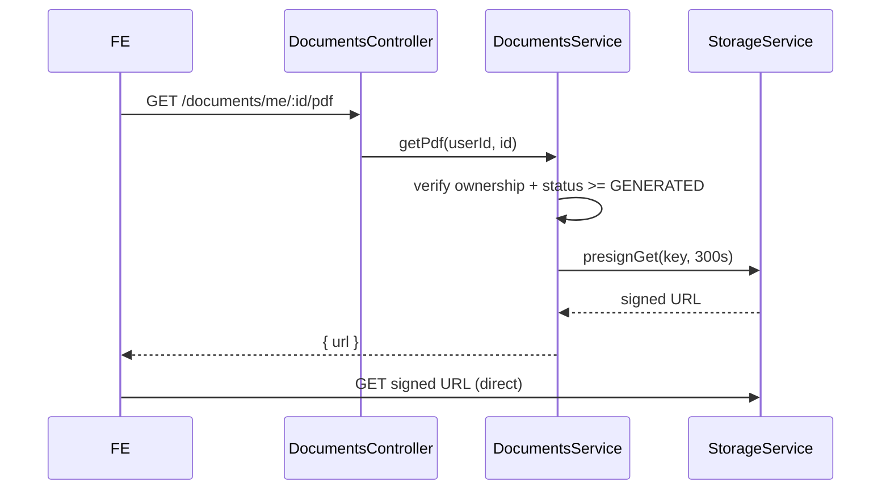

# Storage

## Purpose

Define how generated PDFs, uploaded attachments, and executed (e-signed/e-stamped)
documents are stored, addressed, secured, and retained. Storage is the existing
S3-compatible layer (`common/storage/storage.service.ts`) - MinIO in dev, AWS S3
in production - accessed via `@aws-sdk/client-s3`.

## Functional requirements

- Store the rendered PDF for each paid `CustomerDocument` and record its key on
  `pdfUrl`.
- Serve documents to their owner only, via **short-lived presigned URLs** - never
  a public object.
- Keep every version of a regenerated PDF (template version bumps).
- Store lawyer-review attachments and executed documents alongside the base PDF.

## Non-functional requirements

| Attribute | Approach |
|---|---|
| **Security** | Private buckets; presigned GET (default 5 min); server authorizes ownership before signing |
| **Reliability** | Write-then-record: object uploaded before `pdfUrl` is set; retry on failure |
| **Scalability** | Object storage scales independently; keys sharded by user/document id |
| **Availability** | Read path is a presign + redirect; independent of DB writes |
| **Auditability** | Every generate/download logged via `AuditService` |

## Bucket & key layout

Environment-scoped bucket (`S3_BUCKET`, e.g. `lawmitran-prod`) with prefixes:

```
documents/
  {userId}/
    {customerDocumentId}/
      v{version}/document.pdf          # rendered PDF
      v{version}/executed.pdf          # after e-sign/e-stamp
      review/{eventId}-{filename}      # lawyer attachments
uploads/                               # (existing) verification docs, ID cards
```

Rationale: user-then-document prefixing supports per-user listing and lifecycle
rules, and keeps executed copies immutable next to their source version.

## Access flow (signed URL)



## Configuration (existing env / settings)

| Var | Meaning |
|---|---|
| `S3_ENDPOINT` | MinIO/S3 endpoint |
| `S3_REGION` | region (default `us-east-1`) |
| `S3_BUCKET` | bucket (default `lawmitran-documents`) |
| `S3_ACCESS_KEY` / `S3_SECRET_KEY` | credentials (scoped, not root) |
| `S3_FORCE_PATH_STYLE` | `true` for MinIO |

PDF engine selection is a **setting** (`DOCS_PDF_ENGINE`), not env - so it is
admin-switchable (see [pdf-generation.md](./pdf-generation.md)).

## Retention & lifecycle

| Object | Retention |
|---|---|
| Rendered PDFs | Kept while the document is not `ARCHIVED`; lifecycle-archive to cheaper tier after 90 days |
| Executed (e-sign/e-stamp) documents | Retain per legal record-keeping (7 years suggested), never auto-deleted |
| Review attachments | Follow the parent document |
| Draft (unpaid) artifacts | None stored (drafts are DB-only until `PAID`) |

Backups/offsite copies follow the DevOps backup policy (`docs/devops/16` /
`docs/devops/20`).

## Migration to AWS S3

No application change: point `S3_ENDPOINT` at S3, drop `S3_FORCE_PATH_STYLE`, swap
keys for IAM credentials, and mirror existing objects. Presigning is identical.

## Constraints

- Objects are **never** made public-read.
- `pdfUrl` stores the **object key**, not a signed URL (URLs are minted on demand).
- Executed documents are immutable; regeneration creates a new version prefix.
