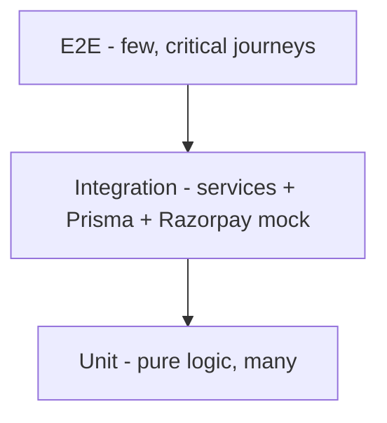

# Testing

## Purpose

Define the test strategy for the marketplace across unit, integration, E2E,
performance, security, and regression, plus a manual QA checklist. Backend uses
Jest (`npm run test --workspace backend`, e2e via `test:e2e`); frontend uses
`tsc --noEmit` + lint and Playwright for E2E (recommended).

## Test pyramid

## Unit tests

| Target | Cases |
|---|---|
| `renderBody` | token replacement, blanks -> ruled lines, HTML escaping |
| `validateInput` | required fields, type coercion, error messages |
| Stamp-duty calc | FLAT / PERCENT / SLAB, missing rate per mode, min amount |
| Payout calc | `fee * payout%` rounding |
| Feature guard | `assertFeature` throws 403 when flag off |
| Quote builder | only enabled add-ons included; server total authoritative |

## Integration tests

- `checkout` -> creates DRAFT + Razorpay order (mock) + persists `providerOrderId`.
- `verifyPayment` -> valid signature freezes `contentHtml`, sets PAID; invalid
  leaves DRAFT; **idempotent** (second call returns PAID, no double-charge).
- Admin template publish -> appears in public list; content edit bumps version.
- Review decision -> state transition + payout + audit + notification.
- Webhook (e-sign/e-stamp) -> HMAC verify, idempotent, sets flags/executed doc.

## E2E (critical journeys)

1. Browse -> fill wizard -> preview -> pay (Razorpay test) -> download PDF.
2. Request lawyer review -> lawyer approves -> client sees approved + payout logged.
3. Admin authors + publishes a template -> visible and purchasable.
4. Feature flag off -> add-on hidden; direct API call 403.

## Performance tests

| Scenario | Target |
|---|---|
| Catalogue list (cached) | p95 < 150 ms server |
| Checkout create | p95 < 400 ms (excl. Razorpay) |
| PDF generation (Gotenberg) | p95 < 3 s |
| Concurrent PDF (50 rps burst) | no error rate increase; engine scales |

Use k6 (repo already has `loadtest/`); add a documents scenario.

## Security tests

- AuthZ: user A cannot read user B's document/PDF (403/404).
- Pre-payment content is inaccessible; preview is truncated + watermarked.
- Price tamper: client-sent amount ignored; server total enforced.
- Webhook replay/invalid HMAC rejected.
- Rate limits enforced (prefill/checkout).
- Secrets never in responses/logs (`GET /admin/settings` masks).

## Regression

- Snapshot: a template `version` edit must not change previously purchased
  `contentHtml`.
- Enum/migration additions do not break existing `DRAFT/PAID` documents.
- Golden-file PDF render for a fixed template+answers (layout stability).

## Manual QA checklist

- [ ] Catalogue loads; category filter works; empty/error states render.
- [ ] Wizard validates required fields and types; AI prefill fills only stated fields.
- [ ] Preview is watermarked and truncated.
- [ ] Add-on rows appear only when their flag is on; totals correct.
- [ ] Razorpay test payment completes; document unlocks; PDF downloads.
- [ ] PDF has header/footer, page numbers, QR, hash; `/verify/:id` returns match.
- [ ] Stamp duty shows per state with disclaimer; missing rate handled per mode.
- [ ] Request review routes to a lawyer; approve/reject/revise all work.
- [ ] Payout recorded on approval; refund on rejection per policy.
- [ ] e-sign / e-stamp (sandbox) complete; executed PDF stored + delivered.
- [ ] Admin: author, preview, publish, version bump, refund (FINANCE), flags (SUPER).
- [ ] AuthZ: cross-user access blocked; secrets masked.
- [ ] Disclaimer visible on detail, checkout, and PDF.

## Acceptance criteria

- CI runs unit + integration + `tsc`/lint on every PR (see DevOps CI).
- Critical E2E journeys pass before a production deploy.
- Golden PDF and idempotency tests guard against regressions.
