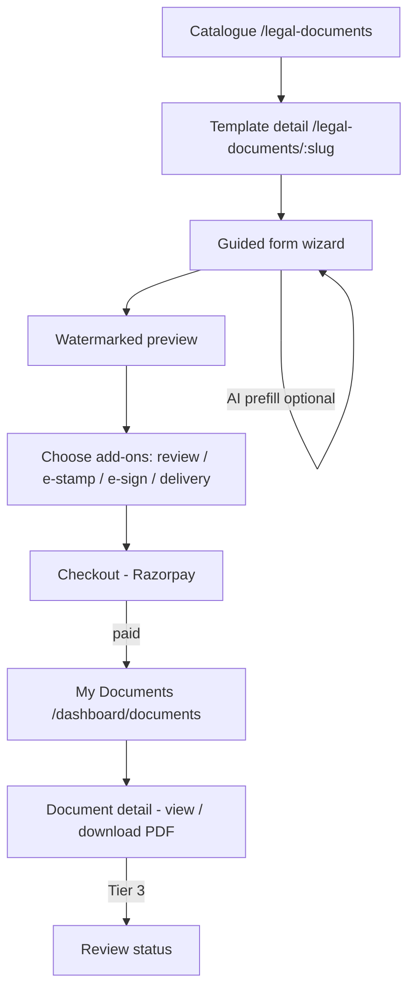
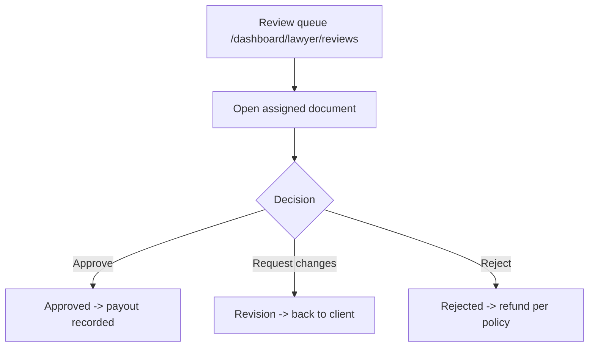

# User Flow

## Purpose

Describe every screen and state a user passes through, for design and QA. Covers
the client generation/purchase journey, the lawyer review journey, and error and
empty states.

## Client journey



### Screen 1 - Catalogue (`/legal-documents`)

```
+--------------------------------------------------------------+
| Legal Documents                          [ Search box     ]  |
+--------------------------------------------------------------+
| Categories:  [Personal] [Property] [Business] [Notices] ...  |
+--------------------------------------------------------------+
|  +----------------+  +----------------+  +----------------+   |
|  | Rental Agreement|  | NDA           |  | Cheque Bounce  |   |
|  | Rs. 199        |  | Rs. 149        |  | Notice  Rs.299 |   |
|  | [ View ]       |  | [ View ]       |  | [ View ]       |   |
|  +----------------+  +----------------+  +----------------+   |
+--------------------------------------------------------------+
```

- **Buttons:** category chips (filter), `View` (to detail), search submit.
- **States:** loading skeleton, empty (`No templates in this category`), error toast.
- **Validation:** none (read-only).

### Screen 2 - Template detail + wizard (`/legal-documents/:slug`)

```
+--------------------------------------------------------------+
| Rental Agreement                                   Rs. 199   |
| Requires stamp paper: Yes (state-dependent)                  |
+--------------------------------------------------------------+
| Step 2 of 4 - Tenant details            [====----]  50%      |
|  Tenant name*      [__________________]                      |
|  Monthly rent*     [__________________]  (number)            |
|  Start date*       [____-__-__]                              |
|                                                              |
|  [ Describe in your words -> AI prefill ]                    |
|  [ Back ]                                   [ Next ]         |
+--------------------------------------------------------------+
```

- **Buttons:** `Next` / `Back` (wizard steps grouped by field `section`),
  `AI prefill`, `Preview`, `Proceed to pay`.
- **Validation:** required fields (`schemaJson` `required !== false`), type checks
  (date/number), inline error under each field (`role="alert"`).
- **States:** per-step; disabled `Next` until step valid; AI prefill returns only
  fields it could extract; unknown fields stay empty.

### Screen 3 - Preview (watermarked)

- Shows first ~700 characters of rendered body with a `PREVIEW` watermark and a
  truncation notice. Full document is never shown pre-payment.
- **Buttons:** `Edit answers`, `Proceed to pay`.

### Screen 4 - Add-ons + checkout

```
+--------------------------------------------------------------+
| Order summary                                                |
|  Rental Agreement                         Rs. 199            |
|  [x] Stamp duty (Karnataka)               Rs. 500  (Config)  |
|  [ ] Lawyer review                        Rs. 499  (Config)  |
|  [ ] e-Sign                               Rs. 100  (Config)  |
|  ---------------------------------------------------          |
|  Total                                    Rs. 699            |
|                                        [ Pay with Razorpay ] |
+--------------------------------------------------------------+
```

- Add-on rows appear **only when their feature flag is on**.
- **Validation:** at least the base document; totals recomputed server-side.

### Screen 5 - My Documents (`/dashboard/documents`)

- List of `CustomerDocument` with status chips: `Draft`, `Paid`, `Generated`,
  `In review`, `Delivered`.
- **Buttons:** `Open`, `Download PDF` (enabled when `pdfUrl` present).
- **Empty state:** `You have not generated any documents yet`.

### Screen 6 - Document detail (`/dashboard/documents/:id`)

- Renders `contentHtml` (post-payment only), download button, review timeline if
  Tier 3, e-sign/e-stamp status badges.

## Lawyer journey



- **Queue screen:** list of `REQUESTED`/`ASSIGNED`/`IN_REVIEW` documents, SLA
  countdown, `Claim`/`Open`.
- **Review screen:** read document, add comments, choose Approve / Request changes
  / Reject; comment required on non-approve.

## Global error handling

| Error | UX |
|---|---|
| Feature disabled | Add-on hidden; direct API call returns `403 "<feature> is disabled"` |
| Payment failed | Stay on checkout, `Payment could not be verified`, order remains DRAFT |
| Validation | Inline field errors; submit blocked |
| Not found / not owner | `404`, redirect to My Documents |
| Server error | Non-blocking toast + retry; no state mutation |

State chips map to the lifecycle in [database-design.md](./database-design.md#state-machine).
