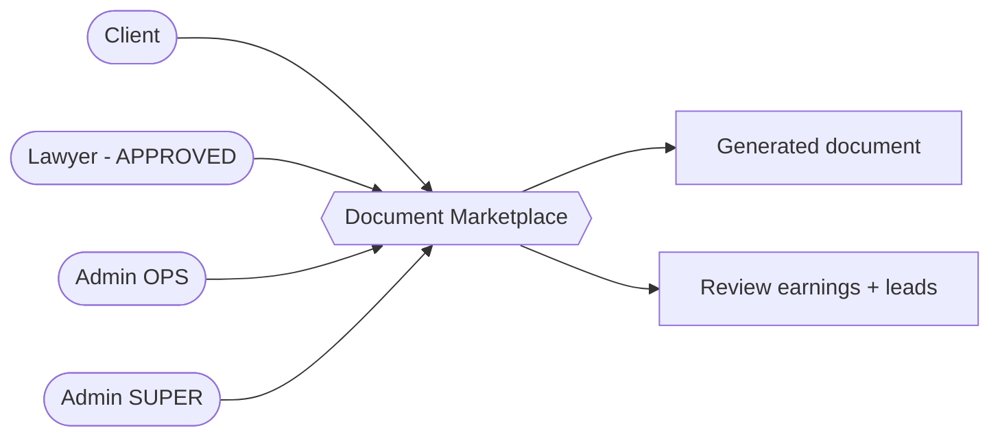

# Vision

## Purpose

The document marketplace turns LawMitran from a pure lead-generation platform into
a platform that also **fulfils a legal need directly** - generating usable legal
documents - while still funnelling higher-value work to verified lawyers. It
creates a second revenue line (document sales, reviews, e-sign/e-stamp add-ons)
and a large, SEO-friendly surface that feeds the core lead engine.

## Problem

Individuals and small businesses in India routinely need standard legal documents
(rental agreements, affidavits, notices, NDAs). Today they either overpay a lawyer
for boilerplate, use unreliable free templates, or give up. Lawyers, meanwhile,
spend billable time on low-value drafting.

## Goals

- Let a client produce a correct, ready-to-use document in minutes via a guided
  form, with optional AI prefill from their own description.
- Offer an upgrade path on every document: self-serve -> lawyer-reviewed ->
  e-stamped / e-signed.
- Give lawyers a paid review queue (revenue share) that also surfaces new leads.
- Give admins full control of catalogue, pricing, and feature availability without
  code deploys.
- Rank for high-intent "<document> format India" searches (SEO).

## Non-goals

- Not a substitute for legal advice or representation.
- Not a court-filing or e-filing system.
- Not a DIY contract builder from a blank canvas (documents are template-driven).
- Does not guarantee enforceability, registration, or stamping compliance - those
  remain the user's responsibility (see [compliance.md](./compliance.md)).

## Actors

| Actor | Role |
|---|---|
| Client | Browses, generates, pays, downloads, optionally requests review/e-sign |
| Lawyer (`verificationStatus = APPROVED`) | Reviews Tier-3 documents for a fee share |
| Admin (`OPS`) | Manages categories, templates, pricing, orders |
| Admin (`SUPER`) | Controls feature flags, provider keys, payout rules |

## Success metrics

| Metric | Definition |
|---|---|
| Document conversion | Paid documents / template detail views |
| Tier-3 attach rate | Reviewed documents / paid documents |
| Lead spillover | Leads created from document flows |
| Lawyer review SLA | Median time from review request to decision |
| Catalogue coverage | Published templates across categories |

## Tier model (summary)

| Tier | Buyer gets | Fulfilment | Pricing |
|---|---|---|---|
| T1 Template | Downloadable filled document | Automated | Low flat fee |
| T2 Smart doc | Guided form + AI prefill | Automated | Per document |
| T3 Vetted/executed | Lawyer review + e-stamp/e-sign | Verified lawyer | Premium, revenue-shared |

Full economics in [business-flow.md](./business-flow.md).
