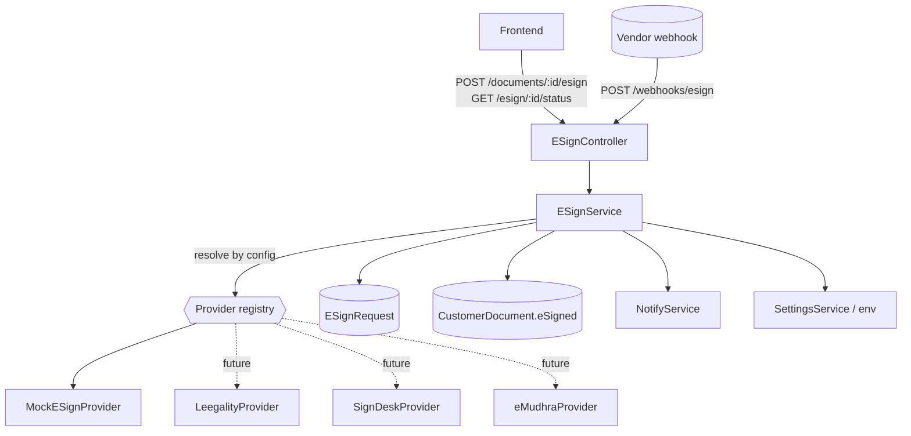
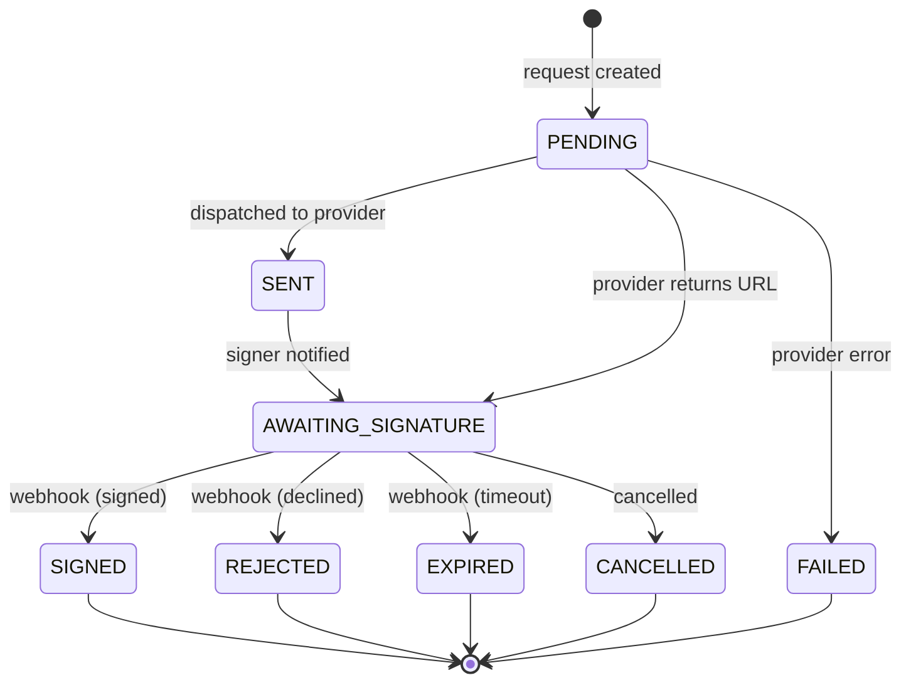
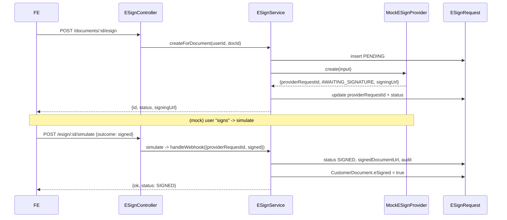
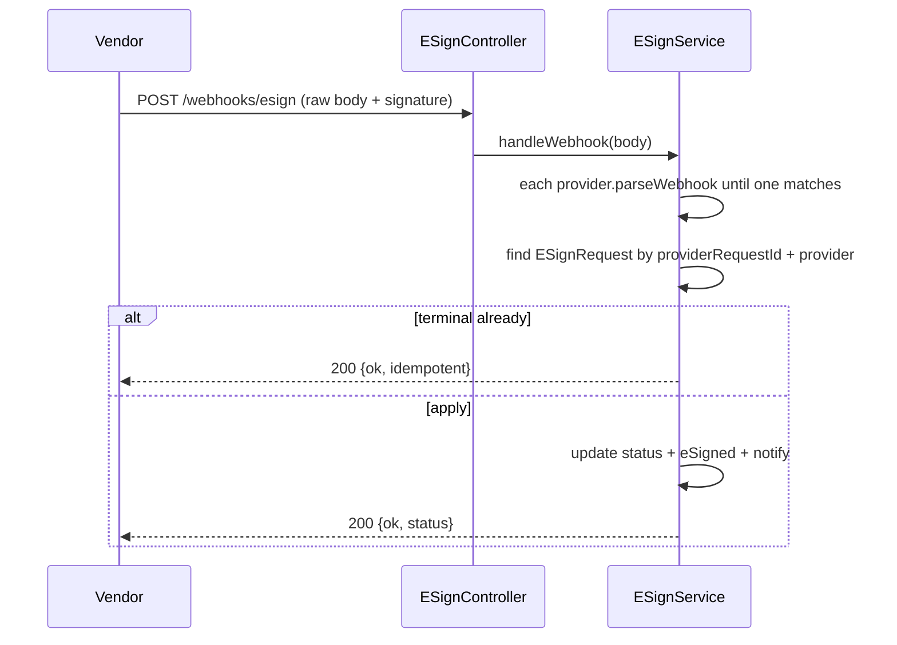

# e-Sign Architecture (Vendor-Agnostic)

Provider-independent electronic-signature subsystem. The application talks to a
single `ESignService`; concrete vendors (Leegality, SignDesk, eMudhra, DigiLocker
eSign, ...) are plugged in as **strategy adapters**. Only the **mock** provider is
implemented today - no external API is ever called.

> Legal note: e-signatures gain legal validity through a **licensed ASP**; this
> architecture is the integration seam, not a certification. See
> [document-marketplace/compliance.md](./document-marketplace/compliance.md).

## Goals

- Add a new provider by implementing **one adapter** and registering it - no other
  code changes.
- The frontend never knows which vendor is used (provider-independent APIs).
- Full end-to-end testing via the mock provider (success / rejection / timeout /
  webhook callbacks) with zero external calls.

## Component diagram



## Strategy pattern

- **Interface** `ESignProvider` (`common/esign/esign-provider.interface.ts`):
  `name`, `create(input)`, `parseWebhook(payload)`.
- **Service** `ESignService` - orchestrates persistence, provider dispatch, and
  webhook application. Never contains vendor-specific code.
- **Adapters** under `common/esign/providers/<vendor>/`. Registered via the
  `ESIGN_PROVIDERS` factory in `esign.module.ts`:

```ts
{ provide: ESIGN_PROVIDERS, useFactory: (mock) => [mock], inject: [MockESignProvider] }
```

The service builds a `Map<name, provider>` and resolves the active one at runtime.

## Configuration

Active provider = `DOCS_ESIGN_PROVIDER` (admin setting) -> `ESIGN_PROVIDER` (env)
-> `'mock'`. Enablement gate = `DOCS_ESIGN_ENABLED` (admin, default off). Switching
providers needs no redeploy.

## Database schema

`ESignRequest` (provider-independent):

| Column | Type | Notes |
|---|---|---|
| `id` | uuid PK | our reference / idempotency key |
| `provider` | string | owning adapter (routes late webhooks) |
| `providerRequestId` | string? | vendor's id |
| `documentId` | string | -> CustomerDocument |
| `userId` | string | owner |
| `status` | `ESignStatus` | state machine |
| `signerEmail` | string? | |
| `callbackPayload` | json? | last normalized webhook event |
| `signedDocumentUrl` | string? | set on SIGNED |
| `auditLog` | json | append-only `[{ at, event, status }]` |
| `createdAt` / `updatedAt` | datetime | |

Indexes: `documentId`, `providerRequestId`, `status`.

## State machine



Terminal states (`SIGNED, REJECTED, EXPIRED, FAILED, CANCELLED`) are never
re-applied (idempotency).

## APIs

| Method | Path | Auth | Body / Result |
|---|---|---|---|
| POST | `/documents/:id/esign` | Client | -> `{ id, provider, status, signingUrl }` |
| GET | `/esign/:id/status` | Client (owner) | -> `{ id, provider, status, signedDocumentUrl }` |
| POST | `/webhooks/esign` | Public (verify) | vendor payload -> `{ ok, status }` |
| POST | `/esign/:id/simulate` | Client (mock only) | `{ outcome }` fires a mock webhook |

Responses expose only normalized fields - never vendor internals.

### Sequence - create + sign (mock)



### Sequence - vendor webhook (future)



## Adding a new provider (onboarding guide)

1. Create `common/esign/providers/<vendor>/<vendor>-esign.provider.ts`
   implementing `ESignProvider` (`name`, `create`, `parseWebhook`). Map the
   vendor's webhook body to a normalized `ESignWebhookEvent`; return `null` for
   unrecognized payloads.
2. Add HMAC/signature verification of the vendor's webhook inside `parseWebhook`
   (or a guard) using the vendor secret (`DOCS_ESIGN_API_SECRET`).
3. Register it in `esign.module.ts` (`providers` + `ESIGN_PROVIDERS` inject list).
4. Set `DOCS_ESIGN_PROVIDER=<vendor>` (admin) or `ESIGN_PROVIDER=<vendor>` (env).

No controller, service, DB, or frontend change is required.

## Error handling

- Provider `create` failure -> request set `FAILED`, audited, `400` to caller; the
  base document is unaffected.
- Unrecognized webhook -> `{ ok: false, reason: 'unrecognized payload' }` (200 so
  vendors don't retry forever on genuinely foreign events).
- Unknown `providerRequestId` -> `{ ok: false, reason: 'unknown request' }`.

## Retry strategy

- Webhook handling is idempotent, so vendors may retry safely.
- Outbound `create` is a single attempt today; wrap with a bounded retry
  (exponential backoff) or move to a Redis/BullMQ job when volume warrants (see
  [document-marketplace/architecture.md](./document-marketplace/architecture.md)).
- A reconciliation job can poll `GET status` for requests stuck in
  `AWAITING_SIGNATURE` past an SLA.

## Idempotency

- `providerRequestId` uniquely identifies a request; terminal states are never
  re-applied, so duplicate/replayed webhooks are no-ops.
- Our `ESignRequest.id` is passed to the provider as the client reference, giving
  end-to-end correlation.

## Security considerations

- **Webhook authenticity**: verify the vendor's HMAC/signature before trusting a
  payload (per-adapter). The endpoint is `@Public()` but must reject unsigned
  bodies once a real vendor is wired.
- **Least exposure**: status APIs return only normalized fields; vendor ids and
  raw payloads stay server-side.
- **Access control**: create/status are owner-scoped; `simulate` is mock-only.
- **Secrets**: vendor keys are admin-managed settings (`DOCS_ESIGN_API_KEY/_SECRET`),
  masked in responses.
- **Signed documents** are private objects served via the storage layer, never
  public URLs.
