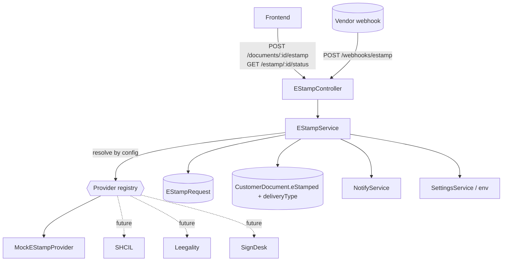
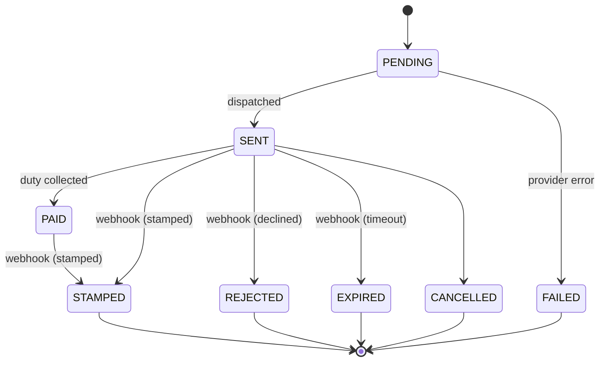
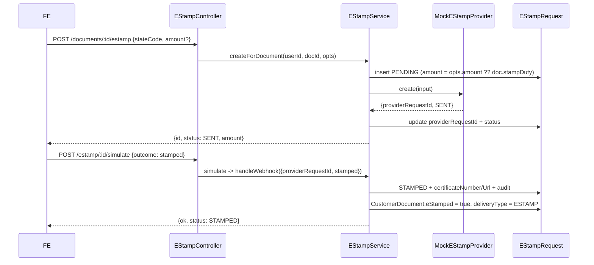

# e-Stamp Architecture (Vendor-Agnostic)

Provider-independent e-stamping subsystem, structurally identical to
[e-Sign](./esign-architecture.md). The application talks to a single
`EStampService`; vendors (SHCIL, Leegality, SignDesk, ...) are strategy adapters.
Only the **mock** provider is implemented - no external API is called.

> Legal note: e-stamping requires a **licensed vendor**; stamp duty and its
> computation remain the user's responsibility. See
> [document-marketplace/compliance.md](./document-marketplace/compliance.md) and
> [document-marketplace/stamp-duty.md](./document-marketplace/stamp-duty.md).

## Component diagram

## Strategy pattern

- **Interface** `EStampProvider` (`common/estamp/estamp-provider.interface.ts`):
  `name`, `create(input)`, `parseWebhook(payload)`.
- **Service** `EStampService` - persistence + dispatch + webhook application.
- **Adapters** under `common/estamp/providers/<vendor>/`, registered via the
  `ESTAMP_PROVIDERS` factory in `estamp.module.ts`.

## Configuration

Active provider = `DOCS_ESTAMP_PROVIDER` (admin) -> `ESTAMP_PROVIDER` (env) ->
`'mock'`. Enablement gate = `DOCS_ESTAMP_ENABLED` (admin, default off).

## Database schema

`EStampRequest`:

| Column | Type | Notes |
|---|---|---|
| `id` | uuid PK | reference / idempotency key |
| `provider` | string | owning adapter |
| `stateCode` | string | e.g. KA, MH |
| `documentId` | string | -> CustomerDocument |
| `userId` | string | owner |
| `amount` | decimal | duty (defaults to `CustomerDocument.stampDuty`) |
| `status` | `EStampStatus` | state machine |
| `providerRequestId` | string? | vendor id |
| `certificateNumber` | string? | set on STAMPED |
| `certificateUrl` | string? | set on STAMPED |
| `callbackPayload` | json? | last event |
| `auditLog` | json | append-only trail |
| `createdAt` / `updatedAt` | datetime | |

Indexes: `documentId`, `providerRequestId`, `status`.

## State machine

Terminal: `STAMPED, REJECTED, EXPIRED, FAILED, CANCELLED` (idempotent).

## APIs

| Method | Path | Auth | Body / Result |
|---|---|---|---|
| POST | `/documents/:id/estamp` | Client | `{ stateCode, amount? }` -> `{ id, provider, status, amount }` |
| GET | `/estamp/:id/status` | Client (owner) | -> `{ id, status, certificateNumber, certificateUrl }` |
| POST | `/webhooks/estamp` | Public (verify) | vendor payload -> `{ ok, status }` |
| POST | `/estamp/:id/simulate` | Client (mock only) | `{ outcome }` fires a mock webhook |

### Sequence - create + stamp (mock)

## Adding a new provider

1. Implement `common/estamp/providers/<vendor>/<vendor>-estamp.provider.ts`
   against `EStampProvider`.
2. Verify the vendor's webhook signature in `parseWebhook`.
3. Register it in `estamp.module.ts` (`providers` + `ESTAMP_PROVIDERS` inject).
4. Set `DOCS_ESTAMP_PROVIDER=<vendor>` (admin) or `ESTAMP_PROVIDER=<vendor>` (env).

## Error handling, retry, idempotency

Identical model to e-Sign: `create` failure -> `FAILED` + `400`; unrecognized or
unknown webhooks return `{ ok: false }`; terminal states are never re-applied so
vendor retries are safe; wrap `create` in bounded retries / a queue as volume
grows; reconcile requests stuck in `SENT`/`PAID` past an SLA.

## Security considerations

- Verify vendor webhook HMAC/signature before trusting a payload.
- Owner-scoped create/status; `simulate` is mock-only.
- Certificate URLs are private objects served via the storage layer.
- Vendor secrets are admin-managed settings (`DOCS_ESTAMP_API_KEY`), masked.
- On STAMPED, the executed certificate is stored immutably as a legal record
  (see [document-marketplace/storage.md](./document-marketplace/storage.md)).
